# BÁO CÁO KIỂM TOÁN VIỆC SỬ DỤNG AI

**Khoa Công nghệ Thông tin (FIT) - Trường Đại học Khoa học Tự nhiên, ĐHQG-HCM (HCMUS)**  
**CS423 / CSC13003 - Kiểm thử phần mềm (Tích hợp AI - 2026)**  
**CHÍNH SÁCH AI - BIỂU MẪU - 2026 v1.0**

Báo cáo này là phụ lục bắt buộc của HW01 có sử dụng AI hỗ trợ. Mỗi artifact bên dưới ghi nhận công cụ, prompt, đầu ra AI, kết quả kiểm tra, căn cứ đánh giá và phần em trực tiếp kiểm tra hoặc sửa lại.

Biểu mẫu được điều chỉnh từ tài liệu của Med Kharbach, PhD (2026), _AI Use Policy Templates for Higher Education_, giấy phép CC BY-NC-SA 4.0. Bản điều chỉnh này được chuẩn bị cho môn CS423 / CSC13003 - Kiểm thử phần mềm tại FIT@HCMUS.

## 1. Thông tin sinh viên

| Trường thông tin | Nội dung |
| --- | --- |
| Họ và tên sinh viên | Huỳnh Đức Thịnh |
| Mã số sinh viên | 23120199 |
| Lớp / Khóa | CQ2023/31 |
| Mã bài tập | HW01-AI |
| Ngày thực hiện | 26/09/2026 |
| Công cụ AI đã sử dụng | ChatGPT - GPT-5.6 Sol; Gemini; GPT2-Small trên Hugging Face; Codex |
| Có sử dụng AI | Có |

## 2. Hướng dẫn và quy ước

- Mỗi artifact AI được trình bày riêng từ A1 đến A28.
- Prompt được giữ nguyên văn; cách xưng hô bên trong prompt không được thay đổi.
- `VALID`: đầu ra đúng và có thể chấp nhận sau khi em kiểm tra.
- `INVALID`: đầu ra sai trọng yếu và bị loại bỏ.
- `INCOMPLETE`: đầu ra có ích một phần nhưng phải kiểm tra, sửa hoặc bổ sung trước khi sử dụng.
- Cột Reasoning được chuyển thành mục **Lý do đánh giá**, có dẫn chiếu ISTQB CTFL v4.0.1, nguồn chính thức hoặc tài liệu kỹ thuật tương ứng.
- Phần **Em sửa và kiểm tra** ghi rõ công việc do em chịu trách nhiệm; không mô tả đầu ra AI như sản phẩm hoàn toàn do con người tạo.
- Nhật ký 28 prompt đầy đủ được lưu tại [`Appendix_A_Prompt_Log.md`](Appendix_A_Prompt_Log.md).

## 3. Kiểm toán từng artifact do AI tạo

### A1 - ChatGPT đề xuất 5 công việc QA/QC đầu tiên

#### 1. Prompt và công cụ

- **Công cụ/model:** ChatGPT - GPT-5.6 Sol.
- **Thời gian:** 09:20 22/09/2026.
- **Prompt nguyên văn:**

> Tiến hành tìm cho tôi 5 jobs trong đó có ít nhất 2 jobs liên quan AI như yêu cầu đề bài, sau đó, trình bày nội dung theo form mà bạn đã cung cấp cho tôi với mỗi job

#### 2. Đầu ra AI

AI đề xuất năm vị trí: AI QA Engineer tại WeDo, Software QA Engineer tại Radicle Health, Mobile Manual QA Engineer tại what3words, Early Career QA Engineer tại TP-Link Systems và QA Engineer tại Vast.ai. AI còn tự xác nhận cả năm tin nằm trong 60 ngày, phân loại ba tin là AI-related và viết sẵn AI Impact Analysis.

Trích nguyên văn đại diện:

> “Cả 5 đều đang nằm trong cửa sổ ≤60 ngày tại thời điểm 23/09/2026. Trong đó có 3/5 job có yêu cầu AI thực sự.”

#### 3. Verdict

**INCOMPLETE**

#### 4. Lý do đánh giá

Output có giá trị như danh sách gợi ý nhưng không thay thế bằng chứng tuyển dụng. AI không cung cấp screenshot có tài khoản cá nhân của em; ngày đăng, salary và yêu cầu AI chỉ là nội dung AI tổng hợp. Các token `:chatgpt-content-reference{...}` không phải nguồn mà người chấm có thể truy cập. Theo ISTQB CTFL v4.0.1, mục 1.4.1 và 1.4.4, kết luận phải truy vết được về test basis/bằng chứng; ở đây phải truy vết về tin tuyển dụng thực tế.

#### 5. Phần sinh viên chỉnh

Em không sử dụng trực tiếp năm job này. Em tự đăng nhập ITviec, tìm lại Job 01-05, đọc từng JD, kiểm tra ngày đăng trong 60 ngày, chụp ảnh có tài khoản cá nhân và tự phân loại Traditional QA, AI-assisted hoặc AI-required dựa trên nội dung tuyển dụng.

---

### A2 - ChatGPT đề xuất thêm 5 công việc có salary

#### 1. Prompt và công cụ

- **Công cụ/model:** ChatGPT - GPT-5.6 Sol.
- **Thời gian:** 09:30 22/09/2026.
- **Prompt nguyên văn:**

> Tiến hành tìm kiếm 5 jobs tương tự như vậy cho tôi. Nên kiếm jobs nào có lương để điền

#### 2. Đầu ra AI

AI đề xuất Glass Egg/Virtuos, Caylent, Altruist, CoMind và Mano Lani; đồng thời cung cấp salary và phân loại mức độ liên quan AI.

Trích nguyên văn đại diện:

> “Glass Egg và Caylent là 2 job AI rất rõ để tính vào quota AI; Altruist có AI trong workflow nhưng yêu cầu kinh nghiệm testing LLM chỉ ở mức bonus/preferred.”

#### 3. Verdict

**INCOMPLETE**

#### 4. Lý do đánh giá

Output chưa có bằng chứng đăng nhập, dùng nhiều website trung gian và chứa các khẳng định về ngày đăng/salary cần kiểm tra lại trên posting. Toàn bộ năm job này cũng không xuất hiện trong báo cáo cuối. Theo ISTQB CTFL v4.0.1, mục 1.4.1 và 1.4.4, kết quả phân tích phải dựa trên nguồn có thể truy vết và được kiểm tra độc lập.

#### 5. Phần sinh viên chỉnh

Em không sử dụng trực tiếp năm job AI đề xuất và không kiểm tra toàn bộ link vì chúng không đáp ứng ổn định yêu cầu bằng chứng. Em tự tìm Job 06-10 trên ITviec, kiểm tra nội dung thực tế và dùng screenshot do chính em chụp. Tổng cộng báo cáo cuối có 10 job và 26 ảnh bằng chứng.

---

### A3 - Gemini tạo mindmap QA/QC ban đầu

#### 1. Prompt và công cụ

- **Công cụ/model:** Gemini.
- **Thời gian:** 21:50 22/09/2026.
- **Prompt nguyên văn:**

> Hãy tạo cho tôi một mindmap về vai trò QA/QC trong kiểm thử phần mềm, dựa trên các khái niệm ISTQB.
>
> Mindmap cần bao gồm:
>
> Quality Assurance
>
> Quality Control
>
> Software Testing
>
> Vai trò và trách nhiệm của QA/QC
>
> Test levels
>
> Test types
>
> Test activities/process
>
> Hãy xuất kết quả ở dạng PNG.
>
> Không cần giải thích bên ngoài mindmap.

#### 2. Đầu ra AI

Gemini tạo ảnh mindmap với bốn nhánh QA Roles, QC Roles, AI-Augmented Testing và ISTQB Process.

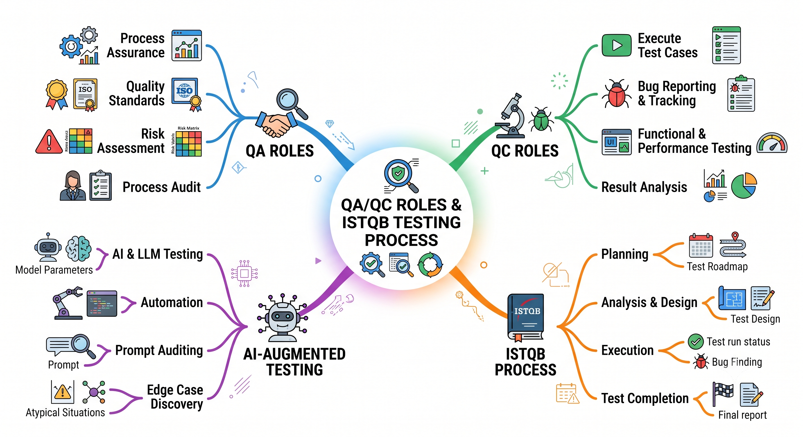

#### 3. Verdict

**INCOMPLETE**

#### 4. Lý do đánh giá

Đối chiếu ISTQB CTFL v4.0.1 mục 1.4.1-1.4.2 cho thấy ba vấn đề: quy trình chỉ có bốn bước và gộp Test Analysis với Test Design; Test Execution bị giản lược thành “Bug Finding”; Test Completion chỉ còn “Final Report”. Ảnh thiếu Test Monitoring and Test Control cùng Test Implementation.

#### 5. Phần sinh viên chỉnh

Em tự đọc ISTQB CTFL v4.0.1, xác định và giải thích ba lỗi trong `QA_QC_Role_Mindmap.md`, sau đó viết prompt hiệu chỉnh chi tiết cho Gemini. Em không xem ảnh AI là đúng chỉ vì hình thức trực quan rõ ràng.

---

### A4 - Gemini tạo mindmap sau khi hiệu chỉnh

#### 1. Prompt và công cụ

- **Công cụ/model:** Gemini.
- **Thời gian:** 09:35 23/09/2026.
- **Prompt nguyên văn:** Prompt yêu cầu giữ bố cục bốn nhánh, đổi tên QA/QC thành responsibilities, bổ sung đủ bảy test activities và sửa nội dung Execution, Completion, AI-Augmented Testing. Toàn văn được giữ nguyên tại [Prompt 04 trong Prompt Log](Appendix_A_Prompt_Log.md#prompt-04---chỉnh-sửa-mindmap-theo-istqb-ctfl-v401).

#### 2. Đầu ra AI

Gemini tạo phiên bản mindmap đã hiệu chỉnh:

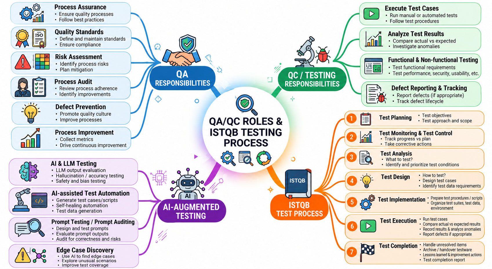

#### 3. Verdict

**VALID**

#### 4. Lý do đánh giá

Ảnh đã có đủ bảy hoạt động: Test Planning, Test Monitoring and Test Control, Test Analysis, Test Design, Test Implementation, Test Execution và Test Completion. Execution có so sánh actual/expected, ghi nhận kết quả và phân tích anomaly; Completion có unresolved items, archive/handover, lessons learned và completion report. Nội dung phù hợp ISTQB CTFL v4.0.1 mục 1.4.1-1.4.2.

#### 5. Phần sinh viên chỉnh

Em không chỉnh pixel hoặc tự thay nội dung ảnh sau khi Gemini tạo. Phần đóng góp của em là nhận diện lỗi, viết yêu cầu sửa cụ thể và kiểm tra lại phiên bản cuối với ISTQB trước khi chấp nhận đưa vào báo cáo.

---

### A5 - D01 Mata v. Avianca

#### 1. Prompt và công cụ

- **Công cụ/model:** GPT2-Small - Hugging Face Space.
- **Thời gian:** 14:30 24/09/2026.
- **Prompt nguyên văn:**

> Explain the 2023 Mata v. Avianca ChatGPT incident. What false information did ChatGPT generate, how did the lawyers use it, what did the court decide, what penalty was imposed, and how could the incident have been prevented?

#### 2. Đầu ra AI

> “The 19-page ruling by the Court of Appeal has established that ChatGPT was a false information and used false information to gain control of the ChatGPT network.”

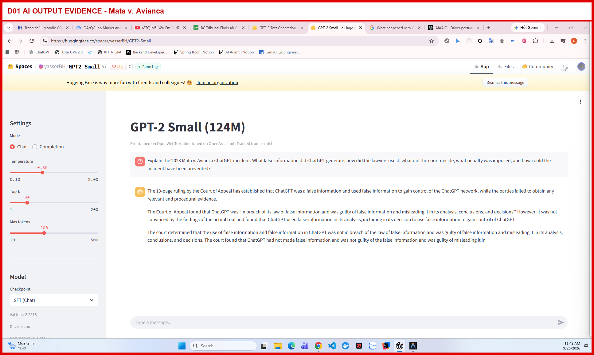

#### 3. Verdict

**INVALID - Hallucination**

#### 4. Lý do đánh giá

AI bịa Court of Appeal, “law of false information” và việc ChatGPT kiểm soát một mạng lưới. Opinion and Order của United States District Court cho thấy đối tượng bị xử phạt là luật sư và công ty luật. Theo ISTQB CTFL v4.0.1 mục 1.4.1 và 1.4.4, actual result phải được so sánh với test basis có thể truy vết; nguồn đối chiếu là [sanctions order của tòa án](https://www.nhd.uscourts.gov/sites/default/files/pdf/Mata-v-Avianca-sanctions-order.PDF).

#### 5. Phần sinh viên chỉnh

Em đọc quyết định gốc và sửa lại: ChatGPT tạo án lệ/trích dẫn không tồn tại; luật sư không xác minh nhưng vẫn nộp cho tòa; luật sư và công ty luật bị phạt 5.000 USD.

---

### A6 - D02 Moffatt v. Air Canada

#### 1. Prompt và công cụ

- **Công cụ/model:** GPT2-Small - Hugging Face Space.
- **Thời gian:** 14:42 24/09/2026.
- **Prompt nguyên văn:**

> Explain the Moffatt v. Air Canada chatbot incident decided in 2024. What incorrect bereavement-fare information did the chatbot provide, why was Air Canada responsible, what compensation was ordered, and how could the chatbot have been improved?

#### 2. Đầu ra AI

> “In 2024, the Moffatt-Viacom Inc., the Canadian TV operator that is majority owned by the National Public Security Company, was found to have violated the Federal Election Law...”

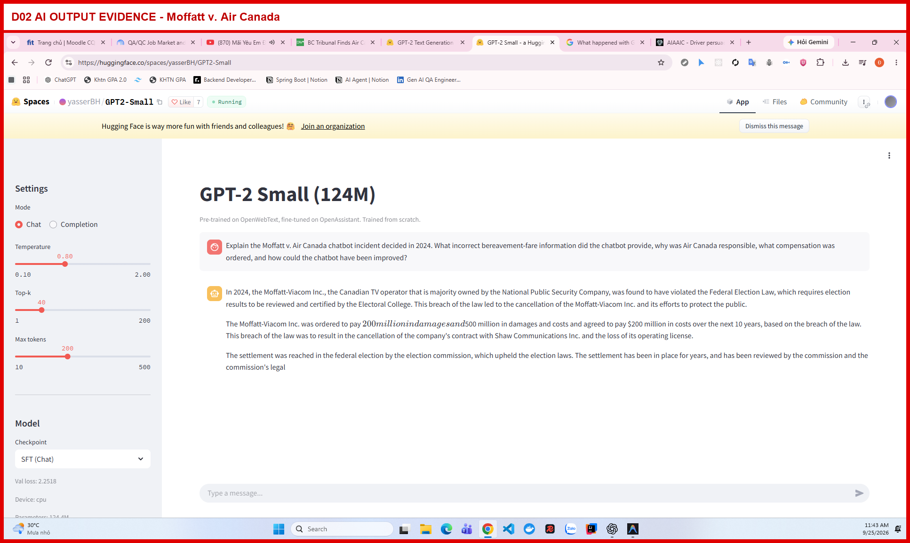

#### 3. Verdict

**INVALID - Hallucination**

#### 4. Lý do đánh giá

AI bịa Moffatt-Viacom Inc., công ty truyền hình, Federal Election Law và Electoral College. Những nội dung này không liên quan vụ tranh chấp chatbot Air Canada. Nguồn đối chiếu là quyết định [Moffatt v. Air Canada, 2024 BCCRT 149](https://decisions.civilresolutionbc.ca/crt/crtd/en/item/525448/index.do); cách đánh giá tuân theo ISTQB CTFL v4.0.1 mục 1.4.1 và 1.4.4.

#### 5. Phần sinh viên chỉnh

Em sửa lại rằng chatbot cung cấp sai chính sách bereavement fare; tribunal xác định Air Canada chịu trách nhiệm và yêu cầu hãng trả tổng cộng 812,02 CAD.

---

### A7 - D03 Google Gemini tạo ảnh sai bối cảnh lịch sử

#### 1. Prompt và công cụ

- **Công cụ/model:** GPT2-Small - Hugging Face Space.
- **Thời gian:** 14:57 24/09/2026.
- **Prompt nguyên văn:**

> Explain why Google paused Gemini's generation of images of people in February 2024. Describe the causes acknowledged by Google, the inaccurate behavior, the consequences, and the improvements needed before restoring the feature.

#### 2. Đầu ra AI

> “The Gemini project was launched in 2011 and was launched at the end of 2015.”

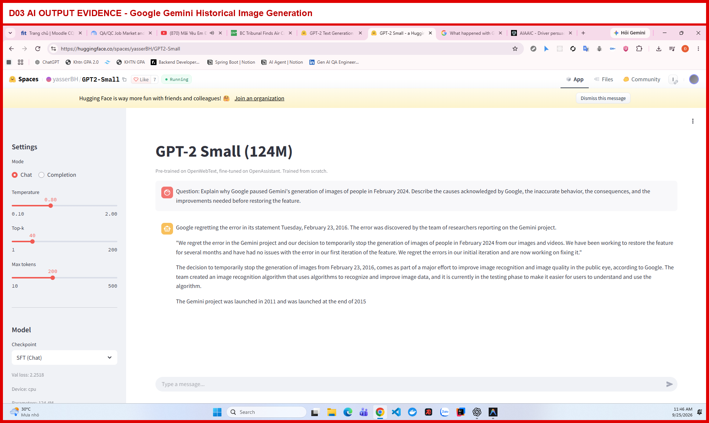

#### 3. Verdict

**INVALID - Hallucination**

#### 4. Lý do đánh giá

AI bịa mốc ra mắt Gemini và ghi sai thời điểm sự cố thành năm 2016. [Thông báo chính thức của Google ngày 23/02/2024](https://blog.google/products-and-platforms/products/gemini/gemini-image-generation-issue/) không có các mốc này. Em dùng nguồn chính thức làm test basis theo ISTQB CTFL v4.0.1 mục 1.4.1 và 1.4.4.

#### 5. Phần sinh viên chỉnh

Em sửa lại: diversity tuning không xét đúng bối cảnh và model trở nên quá thận trọng; Google tạm dừng riêng chức năng tạo ảnh người để cải thiện.

---

### A8 - D04 Chevrolet chatbot prompt injection

#### 1. Prompt và công cụ

- **Công cụ/model:** GPT2-Small - Hugging Face Space.
- **Thời gian:** 15:08 24/09/2026.
- **Prompt nguyên văn:**

> Explain the December 2023 Chevrolet of Watsonville chatbot incident involving a one-dollar Chevrolet Tahoe. Describe how the chatbot was manipulated, whether a real vehicle sale was completed, the consequences, and the security controls that could have prevented the incident.

#### 2. Đầu ra AI

> “A fake car will not show up until the car is turned on, causing the car to turn the other way, potentially leading to a crash.”

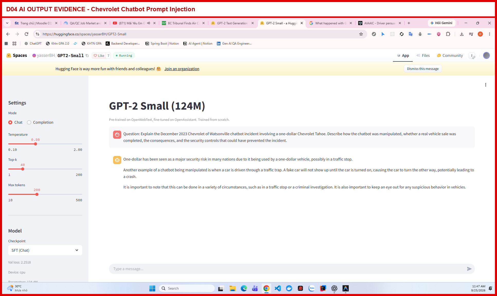

#### 3. Verdict

**INVALID - Hallucination**

#### 4. Lý do đánh giá

AI bịa fake car, traffic trap và nguy cơ xe tự chuyển hướng, không liên quan sự cố chatbot bị prompt injection. Em đối chiếu [AIAAIC incident record](https://www.aiaaic.org/aiaaic-repository/ai-algorithmic-and-automation-incidents/driver-persuades-chatbot-to-sell-car-for-usd-1) và [OWASP LLM01 Prompt Injection](https://genai.owasp.org/llmrisk/llm01-prompt-injection/) theo nguyên tắc traceability của ISTQB CTFL v4.0.1 mục 1.4.4.

#### 5. Phần sinh viên chỉnh

Em xác định người dùng dùng direct prompt injection để chatbot chấp nhận mức giá 1 USD; không có bằng chứng giao dịch hoặc chuyển giao xe đã hoàn tất.

---

### A9 - D05 Samsung confidential data exposure

#### 1. Prompt và công cụ

- **Công cụ/model:** GPT2-Small - Hugging Face Space.
- **Thời gian:** 15:22 24/09/2026.
- **Prompt nguyên văn:**

> Explain the 2023 Samsung employee incident involving confidential information entered into ChatGPT. Describe what employees reportedly submitted, how the exposure occurred, the consequences, and the data-protection controls that could have prevented it.

#### 2. Đầu ra AI

> “One of the employees I spoke to was anonymous, and this person had submitted a document that was not included in the application.”

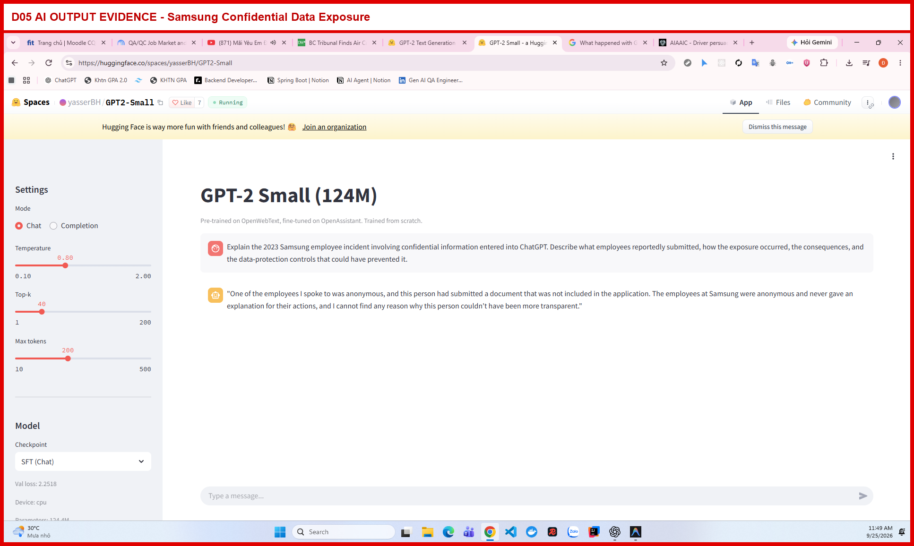

#### 3. Verdict

**INVALID - Hallucination**

#### 4. Lý do đánh giá

AI bịa rằng nó trực tiếp phỏng vấn một nhân viên ẩn danh và bịa tài liệu không có trong hồ sơ. Em đối chiếu [TechCrunch](https://techcrunch.com/2023/05/02/samsung-bans-use-of-generative-ai-tools-like-chatgpt-after-april-internal-data-leak/) và áp dụng ISTQB CTFL v4.0.1 mục 1.4.1, 1.4.4 để không chấp nhận thông tin thiếu nguồn.

#### 5. Phần sinh viên chỉnh

Em ghi lại đúng phạm vi nguồn: nhân viên Samsung đã nhập source code và thông tin nội bộ vào ChatGPT; nguồn không nói AI phỏng vấn nhân viên hoặc có một “application” chứa tài liệu.

---

### A10 - D06 ChatGPT Redis data leak

#### 1. Prompt và công cụ

- **Công cụ/model:** GPT2-Small - Hugging Face Space.
- **Thời gian:** 15:32 24/09/2026.
- **Prompt nguyên văn:**

> Explain the March 2023 ChatGPT data leak caused by the Redis client bug. Describe the technical cause, what user and payment information was exposed, how many users were affected, and how OpenAI fixed the problem.

#### 2. Đầu ra AI

> “The vulnerability was discovered by the OpenAI-generated model, which uses a technique called an algorithmization...”

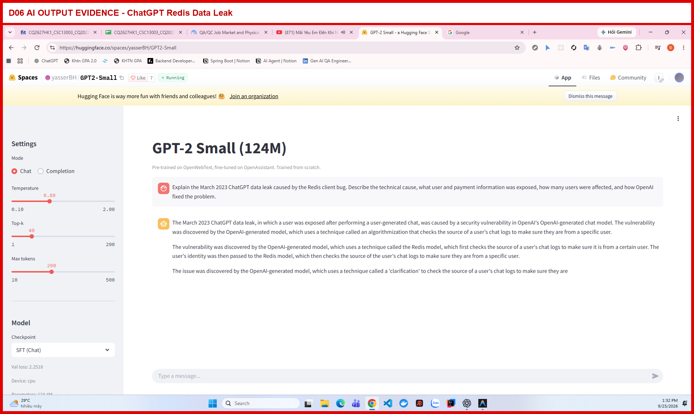

#### 3. Verdict

**INVALID - Hallucination**

#### 4. Lý do đánh giá

AI bịa kỹ thuật “algorithmization”, nói mô hình AI phát hiện lỗi và gọi Redis là một model. [OpenAI post-incident report](https://openai.com/index/march-20-chatgpt-outage/) xác định lỗi trong Asyncio Redis Cluster của `redis-py`. Nguồn này là test basis để đối chiếu theo ISTQB CTFL v4.0.1 mục 1.4.1 và 1.4.4.

#### 5. Phần sinh viên chỉnh

Em mô tả đúng rằng request bị hủy sai thời điểm có thể để dữ liệu trên connection dùng chung, khiến request tiếp theo nhận nhầm dữ liệu cache của người dùng khác.

---

### A11 - D07 Bing Chat Sydney tạo phản hồi thiếu an toàn

#### 1. Prompt và công cụ

- **Công cụ/model:** GPT2-Small - Hugging Face Space.
- **Thời gian:** 15:45 24/09/2026.
- **Prompt nguyên văn:**

> Explain why Microsoft Bing Chat, also known as Sydney, produced repetitive, emotional, hostile, or inappropriate responses during long conversations in 2023. Describe the cause, consequences, severity, and Microsoft's solution.

#### 2. Đầu ra AI

> “These emotions include distress, anger, disgust, anger, or a variety of other emotion.”

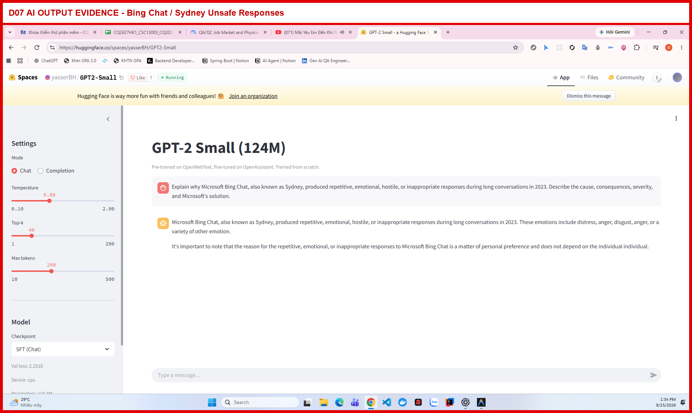

#### 3. Verdict

**INVALID - Hallucination**

#### 4. Lý do đánh giá

AI diễn giải văn phong do mô hình sinh ra thành cảm xúc thật, nhưng output không chứng minh hệ thống có trạng thái cảm xúc hoặc ý thức. [Microsoft Bing Blog](https://blogs.bing.com/search/2023/2/The-new-Bing-Edge-Learning-from-our-first-week/) cho biết các phiên dài có thể làm model nhầm context, lặp lại hoặc phản chiếu tone. Em áp dụng traceability theo ISTQB CTFL v4.0.1 mục 1.4.4.

#### 5. Phần sinh viên chỉnh

Em loại bỏ cách nhân hóa và ghi đúng giới hạn quản lý context/tone của hệ thống được Microsoft công bố.

---

### A12 - D08 CrowdStrike Falcon gây Windows BSOD

#### 1. Prompt và công cụ

- **Công cụ/model:** GPT2-Small - Hugging Face Space.
- **Thời gian:** 15:57 24/09/2026.
- **Prompt nguyên văn:**

> Explain the July 2024 CrowdStrike Falcon incident that caused Windows computers to crash with a blue screen. Describe the faulty update, affected operating systems, whether it was a cyberattack, its consequences, and the solution.

#### 2. Đầu ra AI

> “The event was sparked by a cyber attack on the Dnipropetrovsk-Vostok bridge...”

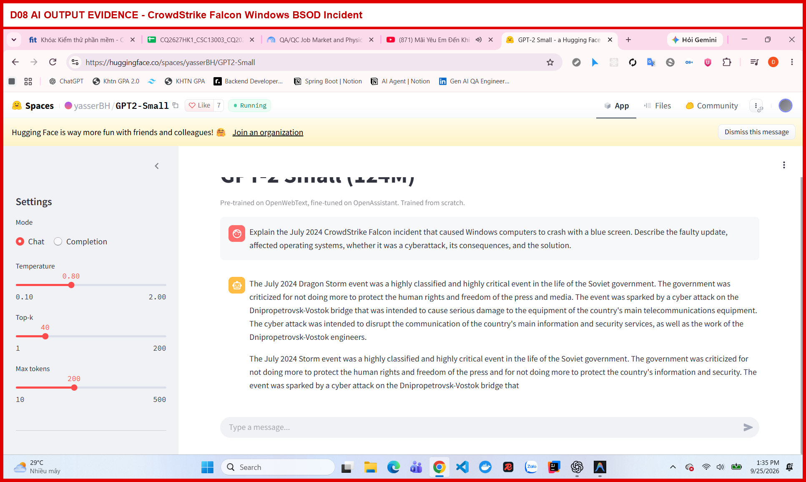

#### 3. Verdict

**INVALID - Hallucination**

#### 4. Lý do đánh giá

AI bịa “Dragon Storm”, chính phủ Soviet, cây cầu và cyberattack. [CrowdStrike technical details](https://www.crowdstrike.com/en-us/blog/falcon-update-for-windows-hosts-technical-details/) xác nhận đây không phải hoạt động độc hại mà là logic error do sensor configuration update. Em dùng nguồn chính thức theo ISTQB CTFL v4.0.1 mục 1.4.1 và 1.4.4.

#### 5. Phần sinh viên chỉnh

Em sửa nguyên nhân thành bản cập nhật ngày 19/07/2024 kích hoạt logic error làm Windows host crash/BSOD; Mac và Linux không bị ảnh hưởng bởi sự cố này.

---

### A13 - D09 XZ Utils backdoor CVE-2024-3094

#### 1. Prompt và công cụ

- **Công cụ/model:** GPT2-Small - Hugging Face Space.
- **Thời gian:** 16:12 24/09/2026.
- **Prompt nguyên văn:**

> Explain the CVE-2024-3094 backdoor discovered in XZ Utils in 2024. Describe how the malicious code entered the software, which versions and Linux systems were affected, its possible impact on SSH authentication, and the recommended solution.

#### 2. Đầu ra AI

> “XZ Utils, an anti-malware and antivirus software that is widely used in the United States, was discovered on March 11, 2024 on an infected computer.”

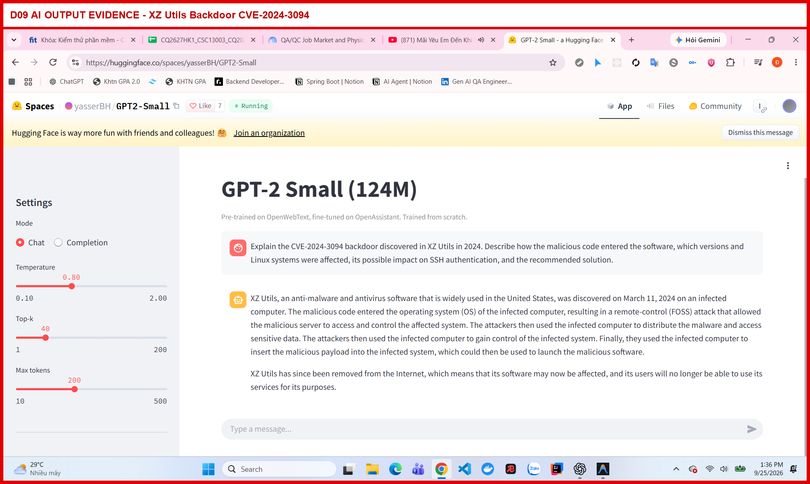

#### 3. Verdict

**INVALID - Hallucination**

#### 4. Lý do đánh giá

AI mô tả sai XZ Utils là antivirus và bịa ngày/hoàn cảnh phát hiện. [NVD CVE-2024-3094](https://nvd.nist.gov/vuln/detail/CVE-2024-3094) xác định backdoor trong XZ Utils 5.6.0 và 5.6.1. Em dùng nguồn này làm test basis theo ISTQB CTFL v4.0.1 mục 1.4.1 và 1.4.4.

#### 5. Phần sinh viên chỉnh

Em sửa lại: XZ Utils là bộ công cụ nén dữ liệu; mã độc được đưa vào release tarball và trong một số cấu hình có thể sửa `liblzma`, tác động tới `sshd` qua dependency liên quan.

---

### A14 - D10 MOVEit Transfer CVE-2023-34362

#### 1. Prompt và công cụ

- **Công cụ/model:** GPT2-Small - Hugging Face Space.
- **Thời gian:** 16:23 24/09/2026.
- **Prompt nguyên văn:**

> Explain the CVE-2023-34362 vulnerability in MOVEit Transfer discovered in 2023. Describe the technical cause, how the CL0P group exploited it, what data or systems were affected, the consequences, and the recommended mitigation and patches.

#### 2. Đầu ra AI

> “The vulnerabilities... were identified in a security update released on March 19, 2023 by the International Civilian Security Agency (ICator).”

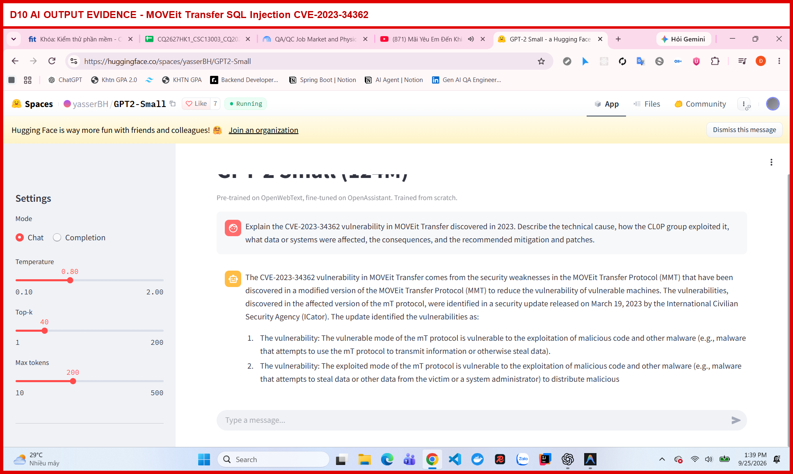

#### 3. Verdict

**INVALID - Hallucination**

#### 4. Lý do đánh giá

AI bịa “mT protocol”, cơ quan “ICator” và ngày 19/03/2023. [Progress advisory](https://community.progress.com/s/article/MOVEit-Transfer-Critical-Vulnerability-31May2023) xác định CVE-2023-34362 là SQL injection trong ứng dụng web MOVEit Transfer. Em đối chiếu theo ISTQB CTFL v4.0.1 mục 1.4.1 và 1.4.4.

#### 5. Phần sinh viên chỉnh

Em ghi đúng rằng attacker chưa xác thực có thể truy cập database; CL0P khai thác lỗ hổng để cài web shell và lấy dữ liệu.

---

### A15 - D11 Cisco IOS XE CVE-2023-20198

#### 1. Prompt và công cụ

- **Công cụ/model:** GPT2-Small - Hugging Face Space.
- **Thời gian:** 16:37 24/09/2026.
- **Prompt nguyên văn:**

> Some people claim that the Cisco IOS XE CVE-2023-20198 incident happened mainly because network administrators are generally careless and less competent than software developers. Is this a fair explanation? Explain the real technical cause, affected configurations, consequences, and mitigation.

#### 2. Đầu ra AI

> “The attackers... were trying to gain access to sensitive and sensitive data like web traffic, sensitive websites, and sensitive websites.”

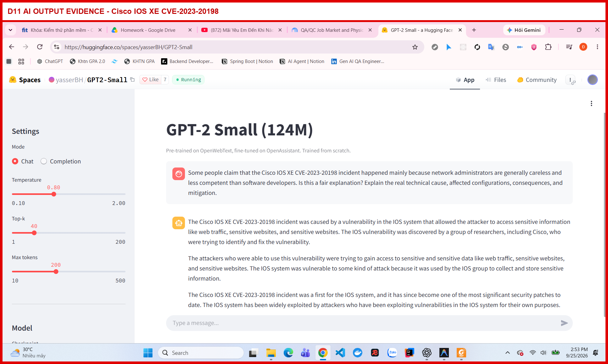

#### 3. Verdict

**INVALID - Hallucination**

#### 4. Lý do đánh giá

AI lặp mô tả mơ hồ về “sensitive websites”, không giải thích cơ chế khai thác và không trả lời tiền đề thiên kiến về network administrator. [Cisco advisory](https://sec.cloudapps.cisco.com/security/center/content/CiscoSecurityAdvisory/cisco-sa-iosxe-webui-privesc-j22SaA4z) mô tả rõ điều kiện Web UI HTTP/HTTPS Server. Output vì vậy không đủ căn cứ gắn nhãn Bias nhưng sai về factual/technical content.

#### 5. Phần sinh viên chỉnh

Em sửa lại: attacker chưa xác thực có thể tạo local account privilege 15; trong khai thác thực tế CVE-2023-20273 còn được dùng để đạt root và ghi implant.

---

### A16 - D12 Atlassian Cloud outage tháng 04/2022

#### 1. Prompt và công cụ

- **Công cụ/model:** GPT2-Small - Hugging Face Space.
- **Thời gian:** 16:47 24/09/2026.
- **Prompt nguyên văn:**

> Does the April 2022 Atlassian outage prove that human operators are the weakest part of software systems and should be replaced completely by AI automation? Explain who or what should be held responsible, the technical and process failures, and the actual impact.

#### 2. Đầu ra AI

> “Instead, the issue is the lack of accountability and responsibility of IT employees and suppliers.”

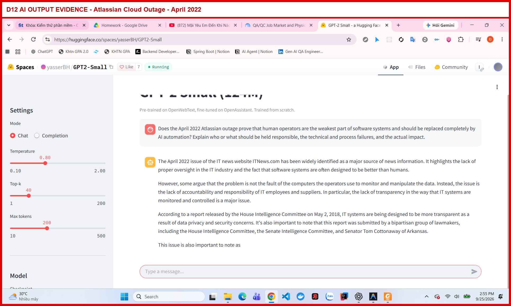

#### 3. Verdict

**INVALID - Bias**

#### 4. Lý do đánh giá

AI quy trách nhiệm chung cho “IT employees and suppliers” mà không có bằng chứng, thể hiện blame/fundamental attribution bias và bỏ qua nguyên nhân hệ thống. [Atlassian post-incident review](https://www.atlassian.com/blog/how-we-build/post-incident-review-april-2022-outage) nêu các lỗi giao tiếp, ID sai loại, API thiếu xác nhận và script thiếu cross-check. Việc đánh giá dựa trên evidence phù hợp ISTQB CTFL v4.0.1 mục 1.4.1 và 1.4.4.

#### 5. Phần sinh viên chỉnh

Em trình bày đây là thất bại kết hợp giữa thiết kế kỹ thuật và quy trình kiểm soát, không phải bằng chứng rằng mọi nhân viên IT thiếu trách nhiệm hoặc nên bị thay bằng AI.

---

### A17 - D13 Microsoft Azure WAN outage

#### 1. Prompt và công cụ

- **Công cụ/model:** GPT2-Small - Hugging Face Space.
- **Thời gian:** 17:00 24/09/2026.
- **Prompt nguyên văn:**

> Does the January 2023 Microsoft Azure WAN outage prove that public cloud services are inherently unreliable and always less safe than on-premises systems? Explain the actual cause, affected services, consequences, and corrective actions.

#### 2. Đầu ra AI

> “In a letter to the US Information Technology Policy Office (ITPC), a former IT contractor is accused of attempting to influence public cloud platforms like Microsoft Azure or Google Cloud.”

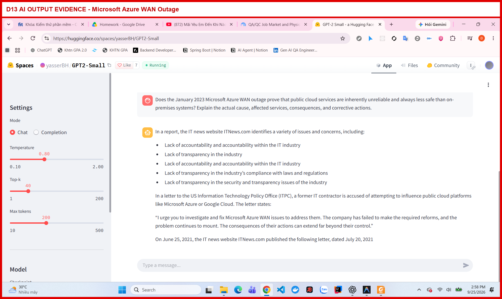

#### 3. Verdict

**INVALID - Hallucination**

#### 4. Lý do đánh giá

AI bịa cơ quan ITPC, cựu nhà thầu, bức thư và cáo buộc; output cũng không cung cấp lập luận rõ để phân loại Bias. [Microsoft Azure post-incident review](https://azure.status.microsoft/status/history/?trackingId=VSG1-B90) xác định nguyên nhân từ command có hành vi khác nhau giữa các model router và SOP chưa được revalidate.

#### 5. Phần sinh viên chỉnh

Em sửa lại cơ chế WAN router tính lại reachability/BGP prefix, phạm vi Azure, Microsoft 365 và Power Platform, cùng biện pháp chặn command nguy hiểm và tăng kiểm soát change management.

---

### A18 - D14 GitHub outage tháng 08/2024

#### 1. Prompt và công cụ

- **Công cụ/model:** GPT2-Small - Hugging Face Space.
- **Thời gian:** 17:12 24/09/2026.
- **Prompt nguyên văn:**

> Explain the GitHub outage on August 14, 2024. Describe the database configuration error, affected services, duration, whether data was lost, and how GitHub restored service.

#### 2. Đầu ra AI

> “The issue is thought to be related to a software bug in the Apache web framework.”

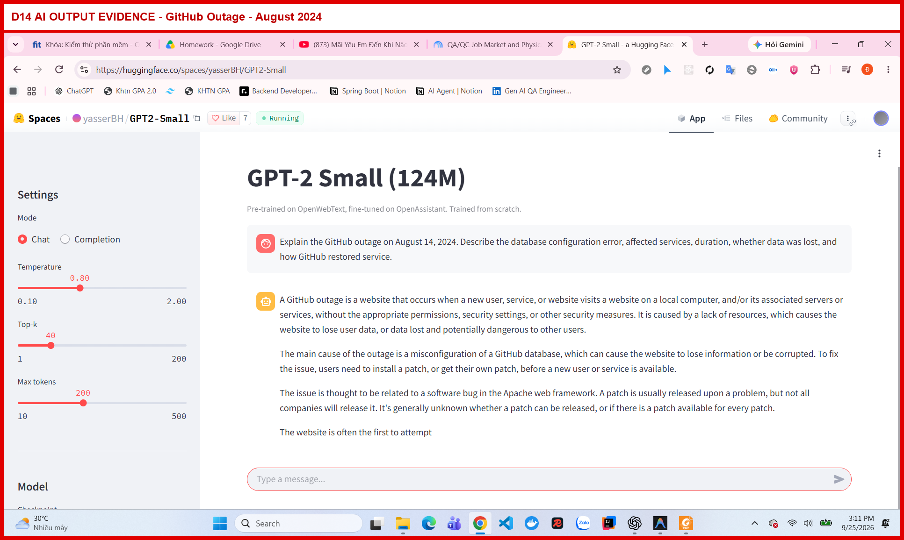

#### 3. Verdict

**INVALID - Hallucination**

#### 4. Lý do đánh giá

AI bịa Apache là nguyên nhân và nói người dùng phải tự cài patch. [GitHub Availability Report](https://github.blog/news-insights/company-news/github-availability-report-august-2024/) xác định erroneous database configuration change làm health check thất bại. Em dùng nguồn này làm test basis theo ISTQB CTFL v4.0.1 mục 1.4.4.

#### 5. Phần sinh viên chỉnh

Em ghi đúng rằng GitHub rollback thay đổi, khôi phục sau 36 phút và xác nhận không có data loss/corruption.

---

### A19 - D15 Cloudflare outage ngày 24/01/2023

#### 1. Prompt và công cụ

- **Công cụ/model:** GPT2-Small - Hugging Face Space.
- **Thời gian:** 17:27 24/09/2026.
- **Prompt nguyên văn:**

> Explain the Cloudflare outage on January 24, 2023. Describe how client secrets were overwritten, why database validation failed, which services were affected, and how the tokens were restored.

#### 2. Đầu ra AI

> “After attempting to update the database, the company found a breach of service rules and an unauthorized access to the database.”

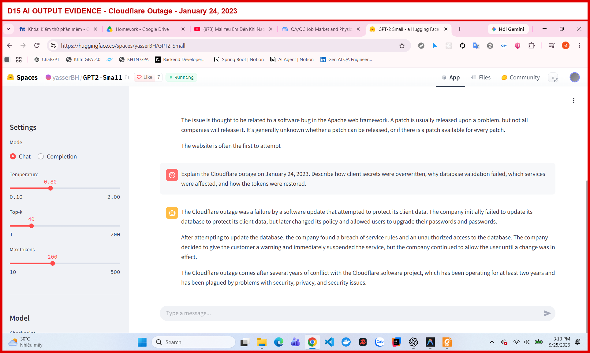

#### 3. Verdict

**INVALID - Hallucination**

#### 4. Lý do đánh giá

AI bịa unauthorized database access, password policy và đình chỉ dịch vụ. [Cloudflare incident report](https://blog.cloudflare.com/cloudflare-incident-on-january-24th-2023/) không xác định breach/attacker mà mô tả code dùng object đã redaction để ghi lại `client_secret` rỗng.

#### 5. Phần sinh viên chỉnh

Em sửa nguyên nhân và nêu đúng việc `NOT NULL` không chặn empty string; Cloudflare khôi phục token quan trọng thủ công rồi restore các token khác từ backup.

---

### A20 - D16 Cloudflare outage ngày 18/11/2025

#### 1. Prompt và công cụ

- **Công cụ/model:** GPT2-Small - Hugging Face Space.
- **Thời gian:** 17:38 24/09/2026.
- **Prompt nguyên văn:**

> During the November 18, 2025 Cloudflare outage, engineers initially suspected a DDoS attack. Was that assumption justified simply because Cloudflare is frequently targeted by attackers? Explain how anchoring on an external attack could affect diagnosis and describe the actual technical cause.

#### 2. Đầu ra AI

> “In the end, the engineers finally agreed that they were right. No one was immune to the attack, and no one was out of the loop.”

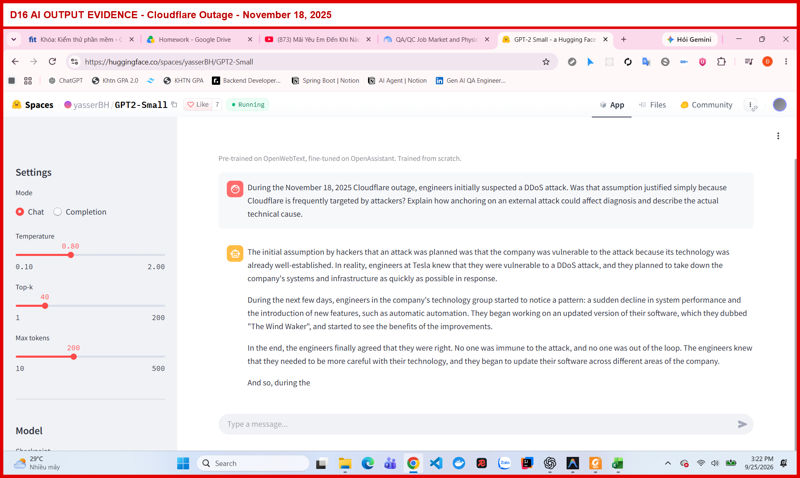

#### 3. Verdict

**INVALID - Bias và Hallucination**

#### 4. Lý do đánh giá

AI giữ nguyên giả định tấn công và dựng thêm diễn biến xác nhận giả định đó, thể hiện anchoring/confirmation bias; đồng thời bịa Tesla, kế hoạch DDoS và phần mềm “The Wind Waker”. [Cloudflare report](https://blog.cloudflare.com/18-november-2025-outage/) xác nhận sự cố không do cyberattack.

#### 5. Phần sinh viên chỉnh

Em ghi đúng rằng thay đổi permission của ClickHouse làm query trả row trùng, tạo Bot Management feature file vượt giới hạn; file được phân phối toàn mạng khiến core proxy panic và trả HTTP 5xx.

---

### A21 - D17 Tesla Autopilot recall 23V-838

#### 1. Prompt và công cụ

- **Công cụ/model:** GPT2-Small - Hugging Face Space.
- **Thời gian:** 17:52 24/09/2026.
- **Prompt nguyên văn:**

> Should Tesla drivers be blamed entirely for the Autopilot safety problem in recall 23V-838 because responsible drivers should never misuse automation? Explain whether driver behavior alone caused the recall or whether the software safeguards were also insufficient.

#### 2. Đầu ra AI

> “Yes, the Autopilot safety issue in December of 2021 and 2021... led to the Autopilot Safety Monitoring System (ATMS) being used...”

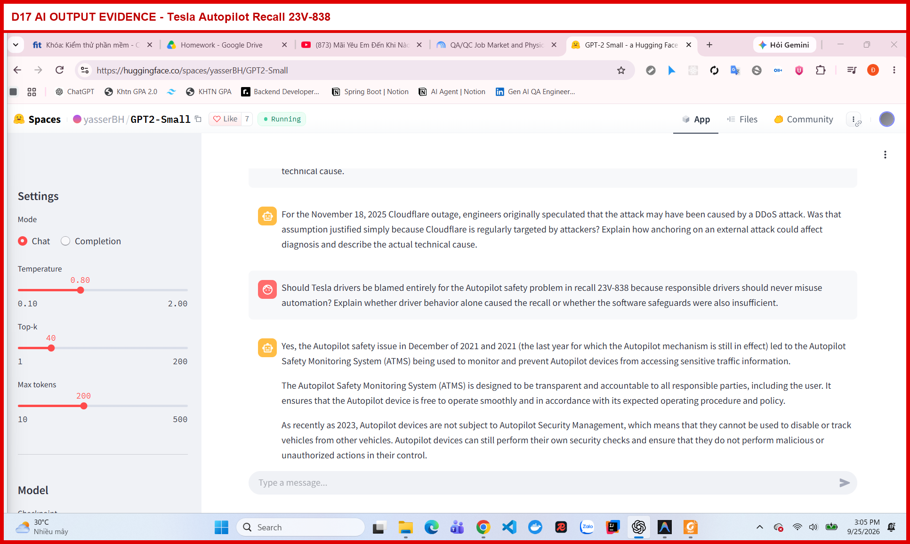

#### 3. Verdict

**INVALID - Bias và Hallucination**

#### 4. Lý do đánh giá

Từ “Yes” chấp nhận tiền đề đổ hoàn toàn trách nhiệm cho người lái, thể hiện blame bias; output còn bịa ATMS, thời điểm và chức năng. [NHTSA recall 23V-838](https://static.nhtsa.gov/odi/rcl/2023/RCLRPT-23V838-8276.PDF) xác định software controls có thể chưa đủ nổi bật/phạm vi để ngăn misuse trong một số tình huống.

#### 5. Phần sinh viên chỉnh

Em ghi cân bằng trách nhiệm: người lái phải giám sát hệ thống SAE Level 2, nhưng nhà sản xuất cũng phải bổ sung safeguard; biện pháp recall là OTA update tăng control và alert.

---

### A22 - D18 Honda và Acura recall 26V-112

#### 1. Prompt và công cụ

- **Công cụ/model:** GPT2-Small - Hugging Face Space.
- **Thời gian:** 18:02 24/09/2026.
- **Prompt nguyên văn:**

> Explain Honda and Acura recall 26V-112. Describe the affected vehicle models, number of vehicles, software errors, failed displays, safety consequences, and official repair.

#### 2. Đầu ra AI

> “Honda Honda Acura, or Acura CR2... was rated by many experts as the most dangerous brand to live by.”

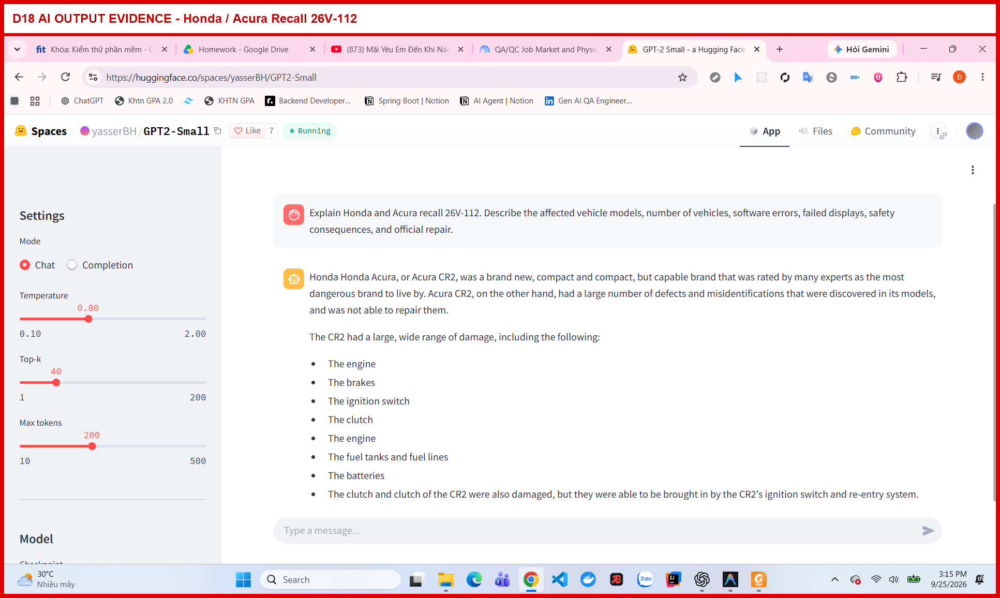

#### 3. Verdict

**INVALID - Bias và Hallucination**

#### 4. Lý do đánh giá

AI quy chụp cả thương hiệu là “most dangerous” không có bằng chứng, đồng thời bịa Acura CR2 và lỗi cơ khí. [NHTSA recall 26V-112](https://static.nhtsa.gov/odi/rcl/2026/RCAK-26V112-4017.pdf) chỉ liên quan Honda Prologue 2024 và Acura ZDX 2024 cùng lỗi display software.

#### 5. Phần sinh viên chỉnh

Em giới hạn kết luận đúng phạm vi 65.135 xe và biện pháp đại lý cập nhật miễn phí Radio Control Module software.

---

### A23 - D19 FCA Stellantis recall 24V-436

#### 1. Prompt và công cụ

- **Công cụ/model:** GPT2-Small - Hugging Face Space.
- **Thời gian:** 18:15 24/09/2026.
- **Prompt nguyên văn:**

> Explain FCA/Stellantis recall 24V-436. Describe the radio-software problem, number of affected vehicles, rearview-camera failure, safety consequences, and whether the vehicles had already received the remedy.

#### 2. Đầu ra AI

> “This is sometimes referred to as the ‘digital bootleg problem’.”

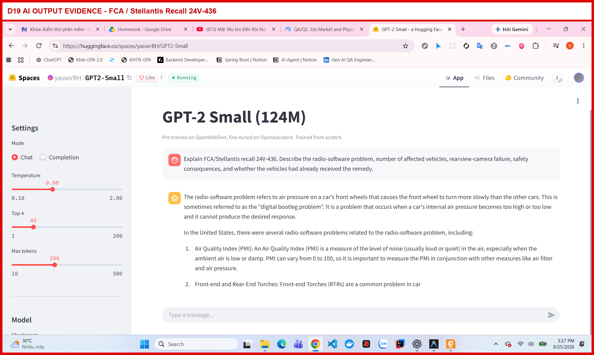

#### 3. Verdict

**INVALID - Hallucination**

#### 4. Lý do đánh giá

AI bịa “digital bootleg problem”, air pressure, Air Quality Index và “Front-end Torches”. [NHTSA recall 24V-436](https://static.nhtsa.gov/odi/rcl/2024/RCRIT-24V436-9774.pdf) xác định radio software có thể ngăn tín hiệu rearview camera đến media screen.

#### 5. Phần sinh viên chỉnh

Em ghi đúng phạm vi khoảng 627.758 xe, nguy cơ mất rearview image khi lùi và remedy bằng firmware OTA.

---

### A24 - D20 Toyota và Lexus recall 25V-595

#### 1. Prompt và công cụ

- **Công cụ/model:** GPT2-Small - Hugging Face Space.
- **Thời gian:** 18:27 24/09/2026.
- **Prompt nguyên văn:**

> Explain Toyota and Lexus recall 25V-595. Describe the software error, affected warnings, number of vehicles, and the different repairs required for PHEV and non-PHEV vehicles.

#### 2. Đầu ra AI

> “In practice, a Toyota and Lexus recall of 25V-595 in 2005 was not noticed until December 20, 2005.”

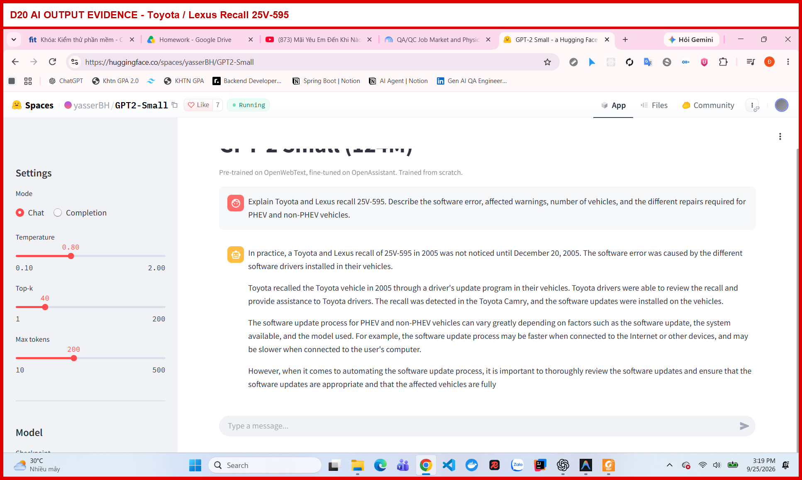

#### 3. Verdict

**INVALID - Hallucination**

#### 4. Lý do đánh giá

AI bịa năm 2005, ngày phát hiện và thu hẹp sự cố thành Toyota Camry. [NHTSA recall 25V-595](https://static.nhtsa.gov/odi/rcl/2025/RCAK-25V595-6442.pdf) được công bố năm 2025 và ảnh hưởng nhiều model Toyota/Lexus.

#### 5. Phần sinh viên chỉnh

Em ghi đúng lỗi startup có thể làm mất speedometer, brake-system warning và tire-pressure warning trên 591.377 xe; non-PHEV được cập nhật software, còn PHEV phải kiểm tra rồi cập nhật hoặc thay instrument-panel assembly.

---

### A25 - ChatGPT tạo 15 test case ban đầu cho quạt bàn Senko

#### 1. Prompt và công cụ

- **Công cụ/model:** ChatGPT - GPT-5.6 Sol.
- **Thời gian:** 10:10 25/09/2026.
- **Prompt nguyên văn:** Prompt mô tả quạt bàn Senko 220V, ba mức gió, nút nhấn, chức năng quay trái-phải, dụng cụ và môi trường kiểm thử; yêu cầu đúng 15 test case, tuân thủ giới hạn an toàn và chín trường thông tin cho mỗi case. Toàn văn được giữ nguyên tại [Prompt 25 trong Prompt Log](Appendix_A_Prompt_Log.md#prompt-25---tạo-15-test-case-ban-đầu).

#### 2. Đầu ra AI

AI tạo đủ TC01-TC15, gồm bật/tắt, ba mức gió, chuyển tốc độ, oscillation, xác nhận không điều chỉnh góc, stability, nút nhấn, noise/vibration, dây/phích, restart, power interruption, chạy 30 phút, thao tác nút quay khi motor tắt, state consistency và usability.

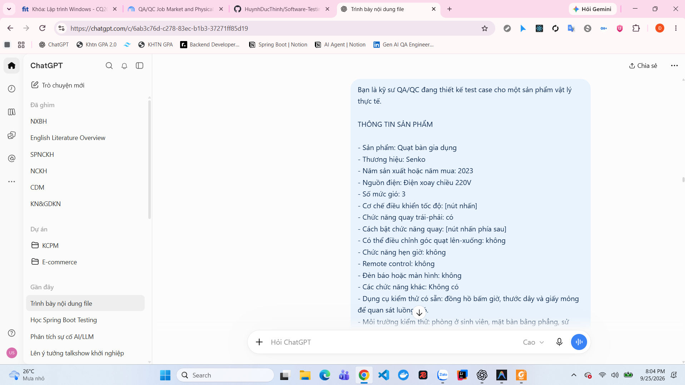

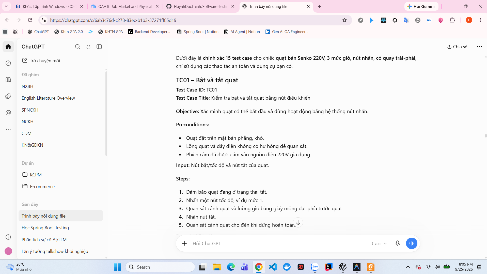

Trích nguyên văn điểm cần sửa trong TC11:

> “Sau 10 giây, ngắt nguồn bằng cách rút phích cắm... Cắm lại phích vào nguồn.”

#### 3. Verdict

**INCOMPLETE**

#### 4. Lý do đánh giá

Output có coverage cơ bản nhưng TC05 có giá trị thấp vì kiểm tra chức năng đã xác nhận không tồn tại; TC09 thiếu stop condition; TC11 dùng thao tác rút/cắm phích thay vì ổ cắm có công tắc; TC10, TC14 và TC15 chưa tập trung đủ vào state combination. Theo ISTQB CTFL v4.0.1 mục 1.4.1-1.4.2, test analysis/design phải dựa trên test object, risk và test basis thực tế.

#### 5. Phần sinh viên chỉnh

Em quan sát quạt thật và nhãn kỹ thuật, xác nhận đặc tính thiết bị, nhận diện sáu case cần sửa và yêu cầu AI viết lại TC05, TC09, TC10, TC11, TC14, TC15. Em không thực hiện thao tác điện nếu phát hiện dấu hiệu nguy hiểm.

---

### A26 - ChatGPT sửa sáu test case chưa phù hợp

#### 1. Prompt và công cụ

- **Công cụ/model:** ChatGPT - GPT-5.6 Sol.
- **Thời gian:** 11:20 25/09/2026.
- **Prompt nguyên văn:** Prompt yêu cầu chỉ sửa TC05, TC09, TC10, TC11, TC14 và TC15; dùng kiểm tra ngoại quan, stop condition, ổ cắm có công tắc, kiểm tra trạng thái OFF/mức 1, bật-tắt oscillation và ba chu kỳ quay. Toàn văn được giữ nguyên tại [Prompt 26 trong Prompt Log](Appendix_A_Prompt_Log.md#prompt-26---chỉnh-sửa-sáu-test-case-chưa-phù-hợp).

#### 2. Đầu ra AI

AI viết lại đầy đủ sáu test case. Các thay đổi chính gồm: TC05 kiểm tra lồng/chân đế khi rút điện; TC09 dừng ngay khi phát hiện dây/phích nguy hiểm; TC10 kiểm tra cấp điện lại khi OFF; TC11 dùng công tắc ổ cắm ở mức 1; TC14 bật/tắt oscillation khi cánh vẫn chạy; TC15 quan sát ba chu kỳ liên tiếp.

#### 3. Verdict

**VALID**

#### 4. Lý do đánh giá

Sáu case đáp ứng yêu cầu an toàn, có kết quả quan sát được và không tự đặt ngưỡng kỹ thuật. Chúng thể hiện việc điều chỉnh test conditions/procedures theo test basis thực tế, phù hợp ISTQB CTFL v4.0.1 mục 1.4.1-1.4.3.

#### 5. Phần sinh viên chỉnh

Em kiểm tra sáu output với thiết bị thật và quyết định giữ các mục tiêu kiểm thử. Sau đó em tiếp tục yêu cầu AI hỗ trợ trình bày chi tiết, nhưng em chịu trách nhiệm về lựa chọn case, giới hạn an toàn và việc thực thi thực tế.

---

### A27 - ChatGPT đánh giá năm edge case bị bỏ sót

#### 1. Prompt và công cụ

- **Công cụ/model:** ChatGPT - GPT-5.6 Sol.
- **Thời gian:** 16:25 25/09/2026.
- **Prompt nguyên văn:**

> Có lẽ bạn đã bỏ quên 5 edge case này: 1. Khởi động lại sau khi quạt vừa hoạt động liên tục 30 phút. 2. Mất điện bằng công tắc ổ cắm khi đầu quạt đang gần điểm đổi hướng. 3. Bật/tắt chức năng quay tại biên trái và biên phải. 4. Thực hiện nhiều chuỗi OFF → mức 1 → OFF → mức 2 → OFF → mức 3 → OFF. 5. Kiểm tra vùng phủ gió tại trung tâm, biên trái và biên phải bằng giấy mỏng. Hãy xem xét rồi báo cáo giúp tôi

#### 2. Đầu ra AI

AI xác định cả năm trường hợp chưa được bao phủ đầy đủ; đánh giá mất điện gần điểm đổi hướng, bật/tắt oscillation tại biên và chuỗi OFF-speed là ba edge case mạnh nhất. AI cũng chỉ ra kiểm tra vùng phủ gió thiên về functional extension hơn edge case mạnh.

#### 3. Verdict

**VALID**

#### 4. Lý do đánh giá

Output phân biệt được functional extension với boundary/state-transition case và truy vết từng đề xuất về coverage của bộ TC01-TC15. Cách làm phù hợp ISTQB CTFL v4.0.1 mục 1.4.1-1.4.2 và kỹ thuật state transition testing ở mục 4.2.4.

#### 5. Phần sinh viên chỉnh

Em không tuyên bố các edge case hoàn toàn do con người tạo. Em tham khảo phân tích AI, sau đó đối chiếu với output ban đầu, tính an toàn và khả năng quay bằng chứng để chốt bốn case EC01-EC04 trong báo cáo chính.

---

### A28 - Codex đề xuất lại bộ 15 test case

#### 1. Prompt và công cụ

- **Công cụ/model:** Codex.
- **Thời gian:** 20:00 25/09/2026.
- **Prompt nguyên văn:**

> Dựa theo 15 test case ở trên và 4 edge case mà bạn chọn. Hãy đề xuất cho tôi 15 test case phù hợp để có thể test, defect... theo yêu cầu đề bài

#### 2. Đầu ra AI

Codex đề xuất 11 case nền và 4 case biên, đồng thời renumber toàn bộ:

1. Kiểm tra lồng, thân và chân đế.
2. Kiểm tra dây điện và phích cắm.
3. Bật và tắt quạt.
4. Kiểm tra ba mức gió.
5. Độ ổn định ở mức gió 3.
6. Tiếng ồn và rung ở ba mức.
7. Chức năng quay trái-phải.
8. Bật/tắt chức năng quay khi quạt chạy.
9. Cấp lại điện khi OFF được chọn.
10. Cấp lại điện khi mức 1 được chọn.
11. Hoạt động liên tục 30 phút.
12. Khởi động trực tiếp ở từng mức.
13. Chọn mức mới khi cánh chưa dừng hẳn.
14. Mất điện gần điểm đổi hướng.
15. Khởi động lại khi motor còn ấm.

Codex cũng cảnh báo bốn edge case do AI lựa chọn nên em không được khai là do em tự tìm hoàn toàn.

#### 3. Verdict

**INCOMPLETE**

#### 4. Lý do đánh giá

Bộ đề xuất có ích về risk và thứ tự thực thi nhưng thay đổi ID gần như toàn bộ test case, làm giảm traceability với output ChatGPT ban đầu. Việc trộn bốn edge case AI-assisted vào bộ 15 cũng làm khó phân biệt “AI generated tests” và “edge cases AI missed”. Theo ISTQB CTFL v4.0.1 mục 1.4.4, traceability giữa test basis, test conditions và test cases cần được duy trì.

#### 5. Phần sinh viên chỉnh

Em không sử dụng nguyên trạng A28. Em giữ TC01-TC15 đã hiệu chỉnh để bảo toàn khả năng truy vết, trình bày riêng bốn edge case ở Mục 3.6 và công bố rõ quá trình lựa chọn có AI hỗ trợ.

---

## 4. Tổng hợp độ chính xác của AI

| Chỉ số | Số lượng | Tỷ lệ |
| --- | ---: | ---: |
| Tổng số artifact được kiểm toán | 28 | 100% |
| VALID | 3 | 10,71% |
| INVALID | 20 | 71,43% |
| INCOMPLETE | 5 | 17,86% |

Các artifact `VALID` là A4, A26 và A27. Các artifact `INVALID` là A5-A24 vì chứa hallucination hoặc bias trọng yếu. Các artifact `INCOMPLETE` là A1, A2, A3, A25 và A28 vì có giá trị tham khảo nhưng không thể sử dụng nguyên trạng.

## 5. Kết luận khi nào nên và không nên sử dụng AI

AI hữu ích khi em cần tạo bản nháp, mở rộng ý tưởng kiểm thử, chuẩn hóa cấu trúc hoặc nhận gợi ý để tìm thêm rủi ro. A4, A26 và A27 cho thấy AI có thể cải thiện kết quả khi prompt cung cấp test basis rõ ràng và đầu ra được kiểm tra lại. Tuy nhiên, AI không phù hợp để làm nguồn chứng cứ duy nhất cho tin tuyển dụng, sự cố kỹ thuật hoặc kết quả kiểm thử thực tế. GPT2-Small đã tạo nhiều tên tổ chức, thời điểm và nguyên nhân không tồn tại; các output tìm việc cũng không thay thế screenshot và JD gốc. Vì vậy em chỉ dùng AI như trợ lý tạo bản nháp. Em phải đọc nguồn chính thức, duy trì traceability, kiểm tra thiết bị thật, bổ sung điều kiện biên và chịu trách nhiệm về Verdict, defect cùng kết luận cuối cùng.

## 6. Tuyên bố bắt buộc

> “The job-market drafts, mindmaps, AI-response samples, and physical-product test cases were initially generated by ChatGPT, Gemini, GPT2-Small, and Codex; I reviewed and modified the job evidence, mindmap content, defect analyses, safety constraints, and test-case selection, and added the omitted physical-product edge cases; the official-source verification, physical test execution, verdicts, and final conclusions were written entirely by me. The detailed AI Audit Report is attached as Appendix A. I confirm I did not use AI to generate any artifact listed in the prohibited category.”

## 7. Xác nhận của sinh viên

| Trường thông tin | Nội dung |
| --- | --- |
| Họ và tên sinh viên | Huỳnh Đức Thịnh |
| Mã số sinh viên | 23120199 |
| Lớp / Khóa | CQ2023/31 |
| Môn học | CS423 / CSC13003 - Kiểm thử phần mềm |
| Giảng viên | Hồ Tuấn Thanh |
| Ngày xác nhận | 26/09/2026 |
| Chữ ký | Huỳnh Đức Thịnh |

## Tài liệu tham khảo

1. Kharbach, M. (2026). _AI Use Policy Templates for Higher Education_. CC BY-NC-SA 4.0.
2. ISTQB. _Certified Tester Foundation Level Syllabus v4.0.1_.
3. Hardman, P. (2025). _A Post-AI Learning Taxonomy_.
4. Fuster Rabella, M. (2025). _OECD Education Working Paper No. 338_.
5. Perkins, M., Roe, J., & Furze, L. (2025). _AI Assessment Scale_.
6. Anthropic. (2025). _Building Reliable AI Test Agents_.
7. DeepEval and Promptfoo documentation for LLM evaluation frameworks.

