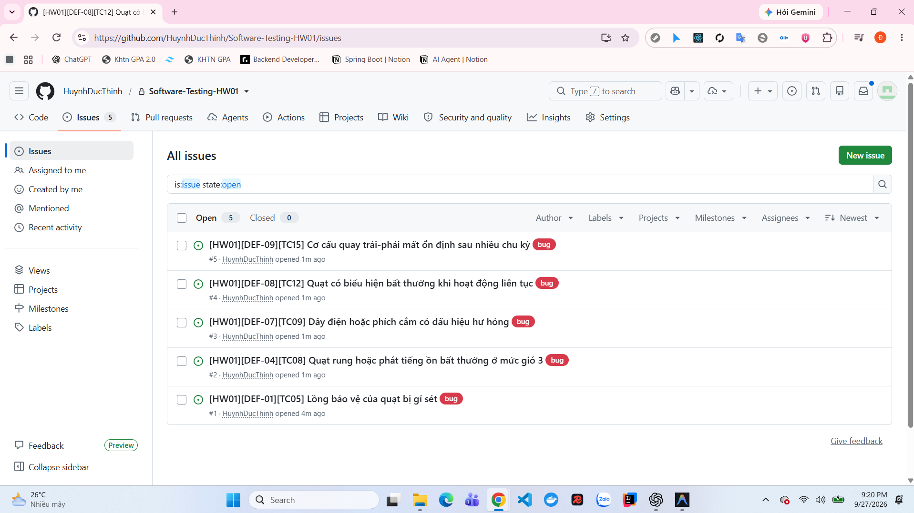

# Link GitHub repository và GitHub Issues cho HW01

## 1. Thông tin repository

- **Sinh viên:** Huỳnh Đức Thịnh
- **MSSV:** 23120199
- **GitHub username:** `HuynhDucThinh`
- **Repository:** [Software-Testing-HW01](https://github.com/HuynhDucThinh/Software-Testing-HW01)
- **Trang GitHub Issues:** [Danh sách Issues](https://github.com/HuynhDucThinh/Software-Testing-HW01/issues)
- **Trạng thái repository tại thời điểm chụp ảnh:** Private (biểu tượng ổ khóa xuất hiện cạnh tên repository).
- **Trạng thái Issues:** 5 Open, 0 Closed.

## 2. Danh sách năm GitHub Issues đã tạo

| Issue | Defect ID | Test case | Tiêu đề | Severity | Video bằng chứng | Trạng thái |
| :---: | :---: | :---: | :--- | :---: | :---: | :---: |
| [#1](https://github.com/HuynhDucThinh/Software-Testing-HW01/issues/1) | DEF-01 | TC05 | Lồng bảo vệ của quạt bị gỉ sét | Medium | [VID-06](https://youtube.com/shorts/G0JCx2u7Lpk?feature=share) | Open |
| [#2](https://github.com/HuynhDucThinh/Software-Testing-HW01/issues/2) | DEF-04 | TC08 | Quạt rung hoặc phát tiếng ồn bất thường ở mức gió 3 | Medium | [VID-07](https://youtube.com/shorts/fBDMChyDsWY?feature=share) | Open |
| [#3](https://github.com/HuynhDucThinh/Software-Testing-HW01/issues/3) | DEF-07 | TC09 | Dây điện hoặc phích cắm có dấu hiệu hư hỏng | High | [VID-08](https://youtube.com/shorts/z15npKrBLaQ) | Open |
| [#4](https://github.com/HuynhDucThinh/Software-Testing-HW01/issues/4) | DEF-08 | TC12 | Quạt có biểu hiện bất thường khi hoạt động liên tục | Medium | [VID-09](https://youtube.com/shorts/2jg-haqA_Wk) | Open |
| [#5](https://github.com/HuynhDucThinh/Software-Testing-HW01/issues/5) | DEF-09 | TC15 | Cơ cấu quay trái-phải mất ổn định sau nhiều chu kỳ | Medium | [VID-10](https://youtube.com/shorts/xI9108mpsqs?feature=share) | Open |

## 3. Minh chứng trang GitHub Issues

**Hình GI-01:** Trang Issues của repository `Software-Testing-HW01` hiển thị đủ năm issue đang mở, từ Issue #1 đến Issue #5. Ảnh cũng hiển thị GitHub username `HuynhDucThinh` tại từng dòng issue.

Ảnh minh chứng xác nhận:

- Repository thuộc tài khoản `HuynhDucThinh`.
- Có đúng năm issue tương ứng với năm defect thực tế.
- Cả năm issue đang ở trạng thái **Open**.
- Tất cả issue được gắn label `bug`.
- Mỗi issue có Defect ID và Test Case ID trong tiêu đề để duy trì khả năng truy vết.

## 4. Ma trận truy vết

| Test case | Kết quả | Defect | GitHub Issue | Video |
| :---: | :---: | :---: | :---: | :---: |
| TC05 | Fail | DEF-01 | [Issue #1](https://github.com/HuynhDucThinh/Software-Testing-HW01/issues/1) | VID-06 |
| TC08 | Fail | DEF-04 | [Issue #2](https://github.com/HuynhDucThinh/Software-Testing-HW01/issues/2) | VID-07 |
| TC09 | Fail | DEF-07 | [Issue #3](https://github.com/HuynhDucThinh/Software-Testing-HW01/issues/3) | VID-08 |
| TC12 | Fail | DEF-08 | [Issue #4](https://github.com/HuynhDucThinh/Software-Testing-HW01/issues/4) | VID-09 |
| TC15 | Fail | DEF-09 | [Issue #5](https://github.com/HuynhDucThinh/Software-Testing-HW01/issues/5) | VID-10 |

## 5. Trạng thái đáp ứng yêu cầu

| Nội dung kiểm tra | Trạng thái | Bằng chứng |
| :--- | :---: | :--- |
| Có repository GitHub cho artifacts của HW01 | Đạt | Repository `HuynhDucThinh/Software-Testing-HW01` |
| Mỗi defect thực tế có một GitHub Issue riêng | Đạt | Issue #1 đến Issue #5 |
| Issue có liên kết với Test Case ID và Defect ID | Đạt | Tiêu đề và ma trận truy vết ở trên |
| Có screenshot trang Issues hiển thị GitHub username | Đạt | Hình GI-01 |
| Có link video bằng chứng cho từng defect | Đạt | VID-06 đến VID-10 |

