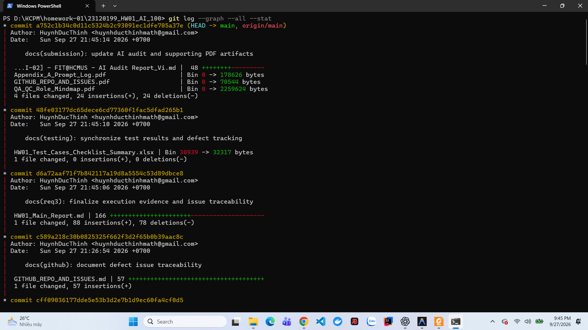
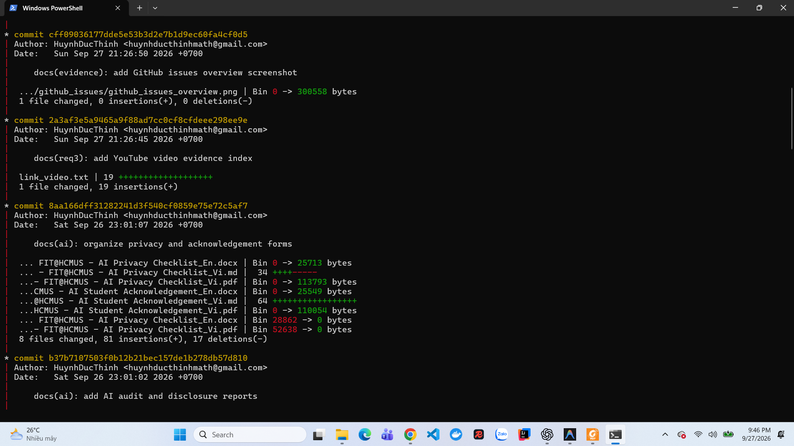
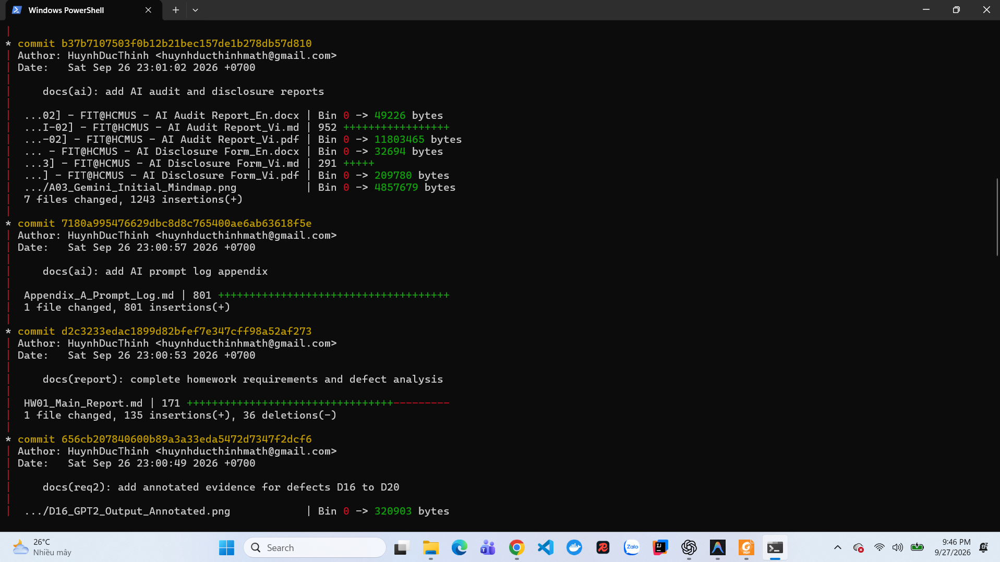
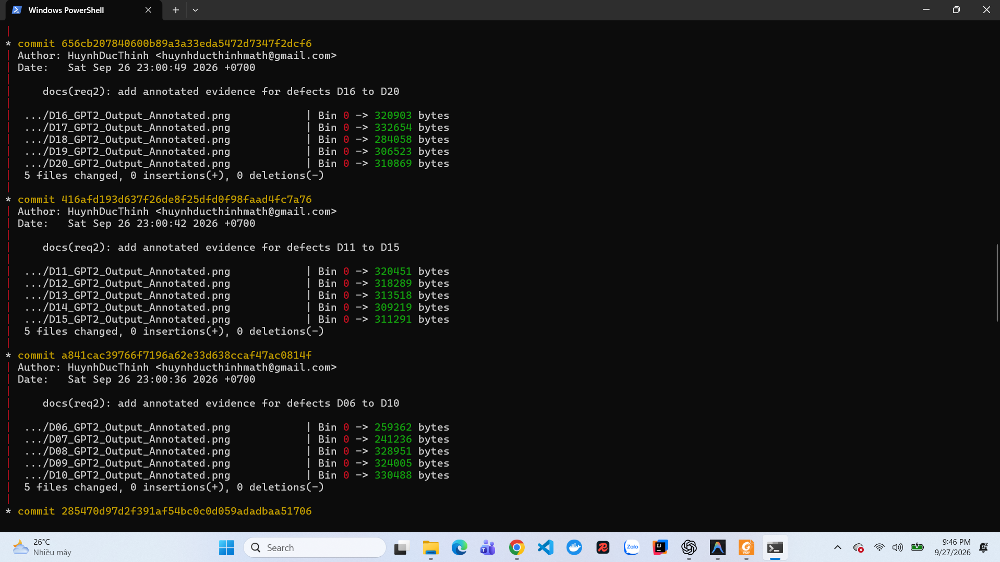
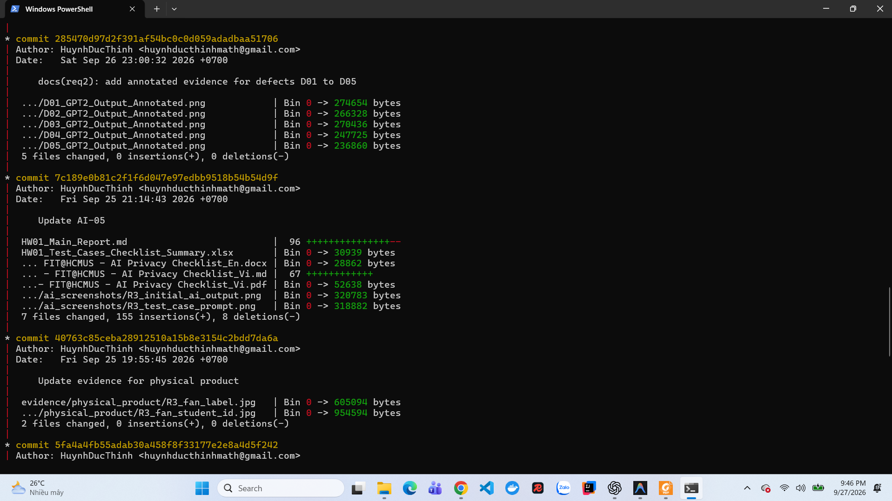
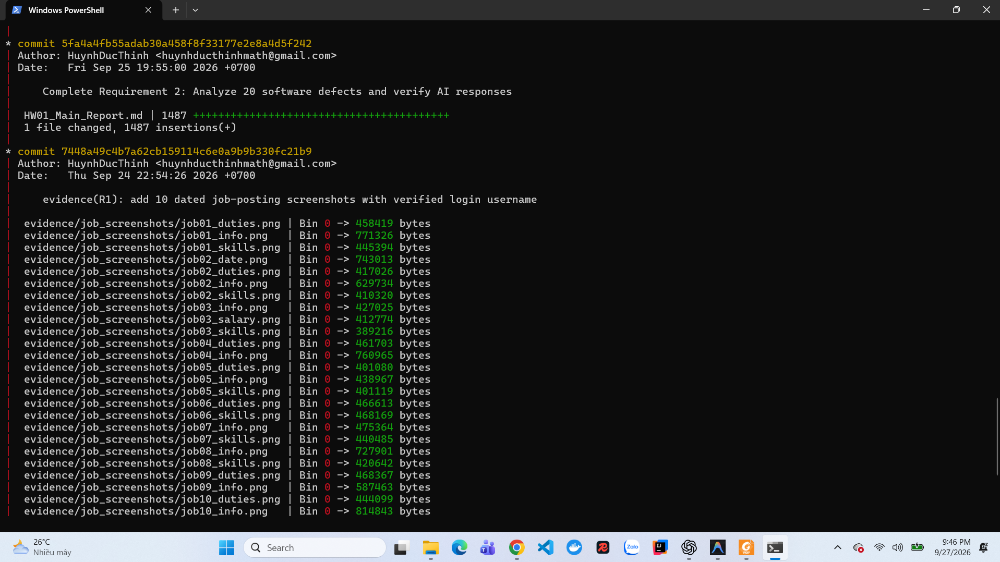
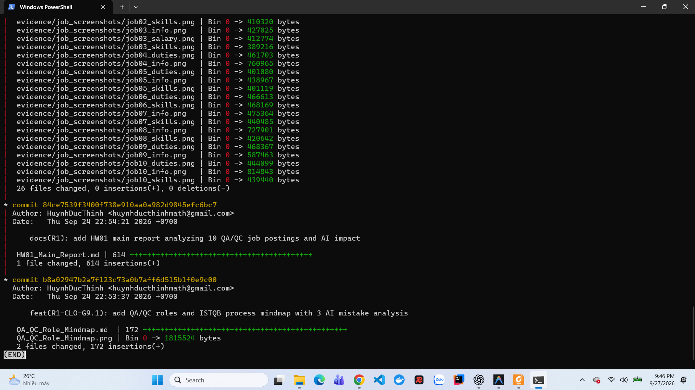

# Git commit log - HW01

**GitHub repository:** <https://github.com/HuynhDucThinh/Software-Testing-HW01>

**Commit history:** <https://github.com/HuynhDucThinh/Software-Testing-HW01/commits/main>

**Ngày ghi nhận:** 27/09/2026  
**Lệnh sử dụng:** `git log --graph --all --stat`

## Ảnh chụp Terminal

Output của lệnh Git dài nên em chia thành bảy ảnh liên tiếp. Các ảnh giữ nguyên nội dung Terminal và thể hiện lịch sử commit từ mới nhất đến cũ nhất.

## Tóm tắt commit

| STT | Commit | Thời gian | Nội dung |
| :-: | :----- | :-------- | :------- |
| 1 | `a752c1b` | 27/09/2026 21:45:14 | Cập nhật AI Audit và các PDF hỗ trợ |
| 2 | `48fe031` | 27/09/2026 21:45:10 | Đồng bộ kết quả test và defect trong Excel |
| 3 | `d6a72aa` | 27/09/2026 21:45:06 | Hoàn thiện minh chứng thực thi và truy vết Issue |
| 4 | `c589a21` | 27/09/2026 21:26:54 | Tạo tài liệu GitHub repository và Issues |
| 5 | `cff0903` | 27/09/2026 21:26:50 | Thêm ảnh tổng quan GitHub Issues |
| 6 | `2a3af3e` | 27/09/2026 21:26:45 | Thêm danh sách link video YouTube |
| 7 | `8aa166d` | 26/09/2026 23:01:07 | Sắp xếp Privacy Checklist và Acknowledgement |
| 8 | `b37b710` | 26/09/2026 23:01:02 | Thêm AI Audit và Disclosure reports |
| 9 | `7180a99` | 26/09/2026 23:00:57 | Thêm phụ lục Prompt Log |
| 10 | `d2c3233` | 26/09/2026 23:00:53 | Hoàn thiện nội dung báo cáo và defect analysis |
| 11 | `656cb20` | 26/09/2026 23:00:49 | Thêm evidence D16-D20 |
| 12 | `416afd1` | 26/09/2026 23:00:42 | Thêm evidence D11-D15 |
| 13 | `a841cac` | 26/09/2026 23:00:36 | Thêm evidence D06-D10 |
| 14 | `285470d` | 26/09/2026 23:00:32 | Thêm evidence D01-D05 |
| 15 | `7c189e0` | 25/09/2026 21:14:43 | Cập nhật AI-05 và test case artifacts |
| 16 | `40763c8` | 25/09/2026 19:55:45 | Thêm ảnh sản phẩm vật lý |
| 17 | `5fa4a4f` | 25/09/2026 19:55:00 | Hoàn thành Requirement 2 |
| 18 | `7448a49` | 24/09/2026 22:54:26 | Thêm 10 bộ ảnh tin tuyển dụng |
| 19 | `84ce753` | 24/09/2026 22:54:21 | Thêm báo cáo Requirement 1 |
| 20 | `b8a0294` | 24/09/2026 22:53:37 | Thêm mindmap QA/QC và phân tích lỗi AI |

## Xác nhận

- Repository đã đặt ở chế độ Public.
- Bảy ảnh Terminal thể hiện đầy đủ 20 commit của bài làm tại thời điểm ghi nhận.
- Nội dung commit cho thấy quá trình hoàn thiện Requirement 1, Requirement 2, Requirement 3 và các biểu mẫu AI được thực hiện theo nhiều bước.
