# HW01 - Báo cáo thị trường việc làm QA/QC 2026+

## Thông tin sinh viên

| Trường thông tin                                        | Giá trị                                                |
| :------------------------------------------------------ | :----------------------------------------------------- |
| **MSSV**                                                | 23120199                                               |
| **Họ và tên**                                           | Huỳnh Đức Thịnh                                        |
| **Lớp**                                                 | 23KTPM                                                 |
| **Ngày thực hiện**                                      | 24/09/2026                                             |
| **Ngày nộp trên Moodle**                                | 24/09/2026                                             |
| **Kho GitHub**                                          | https://github.com/HuynhDucThinh/Software-Testing-HW01 |
| **Tài khoản / display name xuất hiện trong screenshot** | Thịnh Huỳnh (hdtkhtn2005@gmail.com)                    |
| **Điểm tự đánh giá (Self-Assessed Grade)**              | 100                                                    |

---

## Sơ đồ tư duy QA/QC và phân tích 3 lỗi sai của AI

- **File chi tiết nộp kèm:** [`QA_QC_Role_Mindmap.md`](QA_QC_Role_Mindmap.md)
- **Hình ảnh sơ đồ:** [`QA_QC_Role_Mindmap.png`](QA_QC_Role_Mindmap.png)

<strong>Hình: Sơ đồ tư duy QA/QC Roles & ISTQB Testing Process do AI tạo ra.</strong>

### Bảng tổng hợp 3 lỗi sai phát hiện theo chuẩn ISTQB CTFL v4.0.1

|  STT   | Tên lỗi sai của AI                                            | Vị trí trên sơ đồ           | Loại lỗi                             | Chuẩn đối chiếu ISTQB CTFL v4.0.1 & Cách khắc phục                                                                                                                                                                                                                                                                                                                                                                                                                                                                    |
| :----: | :------------------------------------------------------------ | :-------------------------- | :----------------------------------- | :-------------------------------------------------------------------------------------------------------------------------------------------------------------------------------------------------------------------------------------------------------------------------------------------------------------------------------------------------------------------------------------------------------------------------------------------------------------------------------------------------------------------- |
| **01** | **ISTQB Test Process bị thiếu và gộp sai các nhóm hoạt động** | Nhánh `ISTQB PROCESS`       | **INCOMPLETE / INCORRECT STRUCTURE** | **Mục 1.4.1:** Quy trình kiểm thử chuẩn gồm 7 nhóm hoạt động riêng biệt. AI đã bỏ sót `Test Monitoring & Test Control`, bỏ sót `Test Implementation`, đồng thời gộp sai `Analysis & Design`. $\rightarrow$ **Sửa lại:** Phân tách đủ 7 giai đoạn: _Planning $\rightarrow$ Monitoring & Control $\rightarrow$ Analysis $\rightarrow$ Design $\rightarrow$ Implementation $\rightarrow$ Execution $\rightarrow$ Completion_.                                                                                         |
| **02** | **Test Execution bị giản lược thành "Bug Finding"**           | Nhánh con `Execution`       | **MISLEADING / OVERSIMPLIFIED**      | **Mục 1.4.2:** Thực thi kiểm thử là chạy kịch bản, so sánh kết quả thực tế với mong đợi, log kết quả và phân tích bất thường (_anomaly_). Việc tìm bug chỉ là kết quả phát sinh khi test fail, không phải là định nghĩa hay mục tiêu duy nhất của Execution. $\rightarrow$ **Sửa lại:** Đổi thành các hoạt động kỹ thuật chuẩn: _Run Test Cases $\rightarrow$ Compare Actual vs Expected $\rightarrow$ Record Results $\rightarrow$ Analyze Anomalies $\rightarrow$ Report Defects_.                               |
| **03** | **Test Completion bị thu hẹp chỉ còn là "Final Report"**      | Nhánh con `Test Completion` | **INCOMPLETE**                       | **Mục 1.4.2:** Hoạt động kết thúc kiểm thử gồm 6 nhiệm vụ cốt lõi: xử lý defect tồn đọng, lập báo cáo tổng kết, lưu trữ testware, bàn giao testware, hoàn trả/dọn dẹp môi trường kiểm thử, và họp rút ra bài học kinh nghiệm (_lessons learned_). Báo cáo chỉ là một trong các artifact bàn giao. $\rightarrow$ **Sửa lại:** Mở rộng nhánh Completion gồm đủ 5 nhánh con: _Handle Unresolved Defects, Test Completion Report, Archive & Handover Testware, Clean Test Environment, Lessons Learned & Improvement_. |

---

## Yêu cầu 1 - Thị trường việc làm QA/QC 2026+

### Việc làm 01: QA Lead (Automation Test, Java, Python, SQL, JMeter) - Unity Sport JSC

#### 1. Thông tin chung

| Trường          | Nội dung                                                                                           |
| --------------- | -------------------------------------------------------------------------------------------------- |
| Company         | Unity Sport JSC                                                                                    |
| Platform        | ITviec                                                                                             |
| Location/Model  | Tầng 5, Lumiere Building, 628A Võ Nguyên Giáp, phường An Khánh, Thành phố Hồ Chí Minh; At office   |
| Employment Type | Full-time; Test Coordinator / QAQC Coordinator theo phân loại của ITviec                           |
| Published Date  | ITviec hiển thị `Posted 7 hours ago` khi kiểm tra ngày 24/09/2026, tương ứng ngày đăng 24/09/2026. |
| Accessed Date   | 24/09/2026                                                                                         |
| Salary          | Không công khai.                                                                                   |
| AI-required?    | Không                                                                                              |
| Source          | https://itviec.com/it-jobs/qa-lead-automation-test-java-python-sql-jmeter-unity-sport-jsc-0025     |

#### 2. Bằng chứng tin tuyển dụng

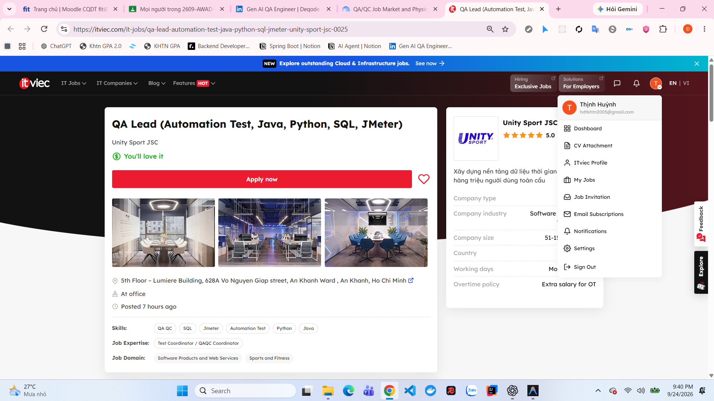

<strong>Ảnh J01-1: Thông tin chung của tin tuyển dụng.</strong>

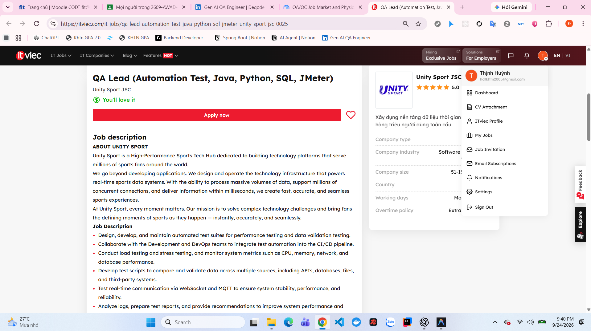

<strong>Ảnh J01-2: Mô tả công việc và trách nhiệm Automation Testing.</strong>

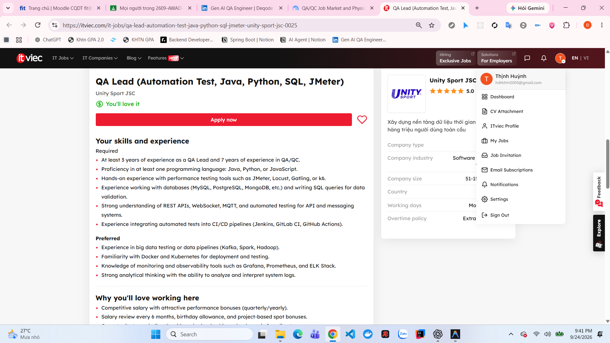

<strong>Ảnh J01-3: Kỹ năng và kinh nghiệm bắt buộc.</strong>

#### 3. Tóm tắt Job Description

- Thiết kế, phát triển và duy trì bộ automation test phục vụ performance testing và data validation testing cho nền tảng dữ liệu thể thao thời gian thực.
- Thực hiện load testing và stress testing; theo dõi CPU, bộ nhớ, mạng và hiệu năng cơ sở dữ liệu để đánh giá khả năng chịu tải, độ ổn định và độ tin cậy của hệ thống.
- Viết test script để so sánh, đối chiếu dữ liệu giữa API, cơ sở dữ liệu, tệp và hệ thống bên thứ ba.
- Kiểm thử giao tiếp thời gian thực qua WebSocket và MQTT, đồng thời phân tích log và lập báo cáo chất lượng, hiệu năng dữ liệu.
- Phối hợp với Development và DevOps để tích hợp automation test vào CI/CD; chuẩn hóa và cải tiến quy trình automation testing.
- Lãnh đạo nhóm QA, phân công công việc, review test case và automation code, đồng thời hướng dẫn các thành viên junior.

#### 4. Required Skills

- Có ít nhất 7 năm kinh nghiệm QA/QC và tối thiểu 3 năm làm QA Lead.
- Thành thạo ít nhất một ngôn ngữ Java, Python hoặc JavaScript để phát triển và review automation test.
- Có kinh nghiệm thực hành với JMeter, Locust, Gatling hoặc k6 trong performance, load và stress testing.
- Có kinh nghiệm MySQL, PostgreSQL hoặc MongoDB và viết SQL để xác minh dữ liệu.
- Hiểu rõ REST API, WebSocket, MQTT và phương pháp tự động hóa kiểm thử API hoặc messaging system.
- Có kinh nghiệm tích hợp automation test vào Jenkins, GitLab CI hoặc GitHub Actions.
- Kinh nghiệm big-data/data-pipeline testing với Kafka, Spark hoặc Hadoop; Docker, Kubernetes, Grafana, Prometheus hoặc ELK là lợi thế.

#### 5. Phân loại yêu cầu AI/LLM

**Traditional QA, không tính quota AI.** JD yêu cầu năng lực QA Lead, automation, performance, data validation, API, WebSocket, MQTT và CI/CD nhưng không yêu cầu kiểm thử AI/LLM, prompt engineering, model evaluation hoặc sử dụng công cụ GenAI.

#### 6. Phân tích tác động của AI

AI có thể hỗ trợ phân tích log, gợi ý kịch bản tải, phát hiện bất thường trong dữ liệu và tạo bản nháp test script, giúp QA Lead mở rộng phạm vi kiểm thử cho hệ thống thời gian thực. Tuy nhiên, các kết luận về hiệu năng, tính nhất quán dữ liệu và độ ổn định của WebSocket/MQTT vẫn phải dựa trên số liệu đo thực tế, truy vấn SQL và kết quả từ môi trường kiểm thử có kiểm soát.

---

### Việc làm 02: AI/Data Quality Engineer (QA) - MONEY FORWARD VIETNAM CO.,LTD

#### 1. Thông tin chung

| Trường          | Nội dung                                                                                          |
| --------------- | ------------------------------------------------------------------------------------------------- |
| Company         | MONEY FORWARD VIETNAM CO.,LTD                                                                     |
| Platform        | ITviec                                                                                            |
| Location/Model  | Thành phố Hồ Chí Minh hoặc Hà Nội; Hybrid, làm việc tại văn phòng 2 ngày mỗi tuần                 |
| Employment Type | Full-time; Software Engineer in Test (SDET) theo phân loại của ITviec                             |
| Published Date  | ITviec hiển thị `Posted 14 days ago` trong ảnh chụp ngày 24/09/2026, tương ứng khoảng 10/09/2026. |
| Accessed Date   | 24/09/2026                                                                                        |
| Salary          | Không công khai.                                                                                  |
| AI-required?    | Có                                                                                                |
| Source          | https://itviec.com/it-jobs/ai-data-quality-engineer-qa-money-forward-vietnam-co-ltd-3125          |

#### 2. Bằng chứng tin tuyển dụng

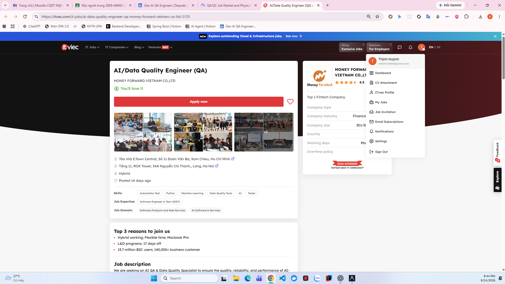

<strong>Ảnh J02-1: Thông tin chung của tin tuyển dụng.</strong>

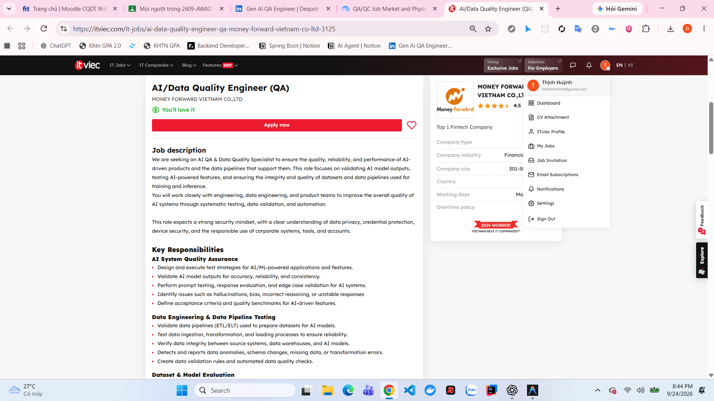

<strong>Ảnh J02-2: Mô tả công việc và trách nhiệm kiểm thử AI/Data.</strong>

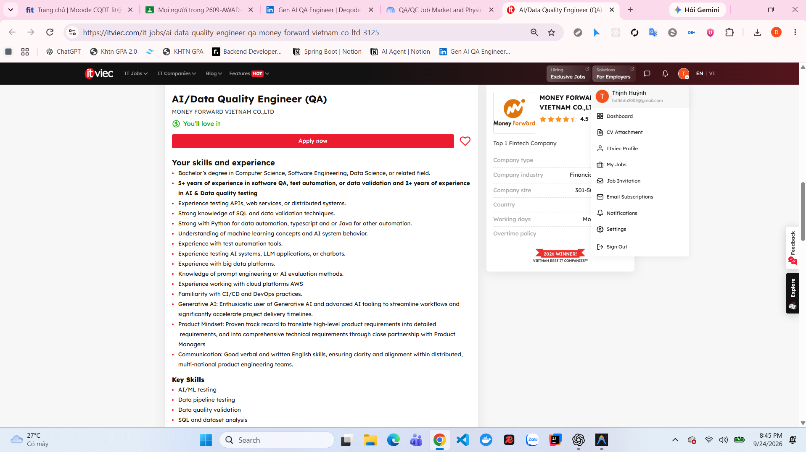

<strong>Ảnh J02-3: Kỹ năng bắt buộc và AI-Specific Skills.</strong>

<strong>Ảnh J02-4: Ngày đăng của tin tuyển dụng.</strong>

#### 3. Tóm tắt Job Description

- Xây dựng và thực thi chiến lược kiểm thử cho ứng dụng, tính năng và quy trình nghiệp vụ sử dụng AI/ML.
- Xác minh đầu ra của mô hình theo các tiêu chí accuracy, reliability, consistency và response quality; kiểm tra prompt, edge cases và các phản hồi không ổn định.
- Phát hiện các vấn đề đặc thù của AI như hallucination, bias, incorrect reasoning và câu trả lời không đáp ứng acceptance criteria.
- Kiểm thử quy trình ETL/ELT, data ingestion, transformation và loading; đối chiếu tính toàn vẹn dữ liệu giữa nguồn, data warehouse và mô hình AI.
- Kiểm tra chất lượng training dataset, feature-engineering pipeline và theo dõi các bất thường như missing data, schema change hoặc data drift.
- Xây dựng automated tests cho AI API, workflow và data pipeline, sau đó tích hợp các kiểm tra này vào CI/CD.
- Phối hợp với engineering, data engineering, data science và product team để thiết lập quality benchmark, phân tích model performance và giảm lỗi AI trên production.

#### 4. Required Skills

- Có bằng đại học về Computer Science, Software Engineering, Data Science hoặc lĩnh vực liên quan.
- Có ít nhất 5 năm kinh nghiệm software QA, test automation hoặc data validation; trong đó có ít nhất 2 năm kinh nghiệm AI và Data Quality Testing.
- Có kinh nghiệm kiểm thử API, web service hoặc distributed system; hiểu kỹ thuật data validation và sử dụng SQL tốt.
- Thành thạo Python cho data automation; có khả năng sử dụng TypeScript hoặc Java cho các bài toán automation khác.
- Hiểu machine learning concepts, hành vi hệ thống AI và phương pháp đánh giá model output.
- Có kinh nghiệm với test automation tools, big-data platform, AWS, CI/CD và DevOps practices.
- Có khả năng chuyển product requirements thành yêu cầu kiểm thử chi tiết; giao tiếp tiếng Anh nói và viết tốt trong môi trường đa quốc gia.

#### 5. AI-Specific Skills và phân loại yêu cầu AI/LLM

- Có kinh nghiệm kiểm thử AI system, LLM application hoặc chatbot và tối thiểu 2 năm làm AI/Data Quality Testing.
- Thiết kế prompt test, đánh giá response và kiểm tra edge case cho hệ thống AI.
- Xác minh hallucination, bias, incorrect reasoning, unstable response và mức độ đáp ứng acceptance criteria.
- Xây dựng, quản lý và đánh giá dataset; theo dõi data drift, schema change, missing data và các lỗi trong data pipeline.
- Xác định model evaluation metrics như accuracy, precision, recall, latency, token usage, cost và response quality.
- Tự động hóa kiểm thử AI API, output regression và data-quality rules; tích hợp quá trình đánh giá vào CI/CD.
- Hiểu data privacy, credential protection, device security và nguyên tắc sử dụng công cụ Generative AI có trách nhiệm trong môi trường doanh nghiệp.

**Phân loại: AI-required.** AI/ML, LLM và dữ liệu là các đối tượng kiểm thử trực tiếp; JD bắt buộc ứng viên có kinh nghiệm AI/Data Quality Testing, đánh giá đầu ra mô hình, prompt evaluation và tự động hóa kiểm thử cho AI system.

#### 6. Phân tích tác động của AI

AI làm mở rộng phạm vi QA từ kiểm thử chức năng xác định sang đánh giá đồng thời model output, prompt, dataset và data pipeline bằng các tiêu chí như accuracy, hallucination, bias, data drift, latency và cost; automation giúp chạy lại bộ đánh giá sau mỗi thay đổi model, prompt hoặc dữ liệu. Tuy nhiên, vì đầu ra AI có thể không ổn định và các chỉ số tổng hợp có thể che giấu lỗi theo ngữ cảnh hoặc nhóm người dùng, tester vẫn phải thiết lập acceptance criteria, kiểm tra thủ công các trường hợp rủi ro cao và quyết định release readiness.

---

### Việc làm 03: QA Engineer (Tester, QA QC, English) Up to $1500 - Saritasa

#### 1. Thông tin chung

| Trường          | Nội dung                                                                                       |
| --------------- | ---------------------------------------------------------------------------------------------- |
| Company         | Saritasa                                                                                       |
| Platform        | ITviec                                                                                         |
| Location/Model  | Tầng 7, tòa nhà L’Mak Long Tower, 101-103 Nguyễn Cửu Vân, Thành phố Hồ Chí Minh; At office     |
| Employment Type | Full-time; Process Quality Assurance (PQA) theo phân loại của ITviec                           |
| Published Date  | ITviec hiển thị `Posted 1 days ago` khi kiểm tra ngày 24/09/2026, tương ứng khoảng 23/09/2026. |
| Accessed Date   | 24/09/2026                                                                                     |
| Salary          | 1.000-1.500 USD.                                                                               |
| AI-required?    | Không; AI-assisted                                                                             |
| Source          | https://itviec.com/it-jobs/qa-engineer-tester-qa-qc-english-up-to-1500-saritasa-4856           |

#### 2. Bằng chứng tin tuyển dụng

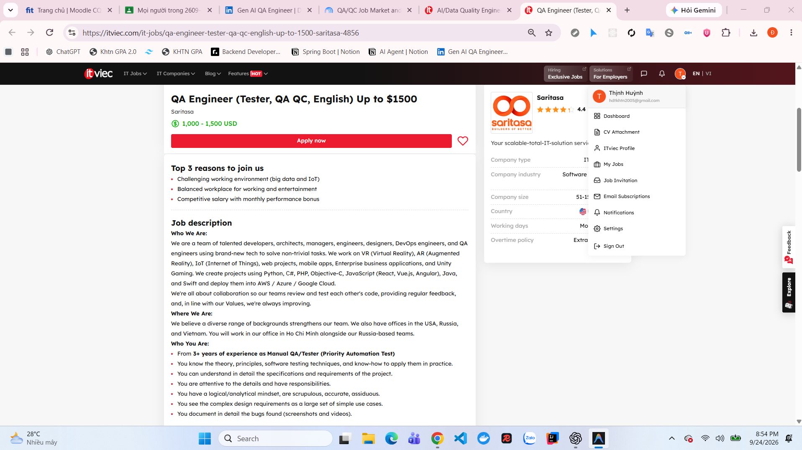

<strong>Ảnh J03-1: Thông tin chung và mô tả công việc.</strong>

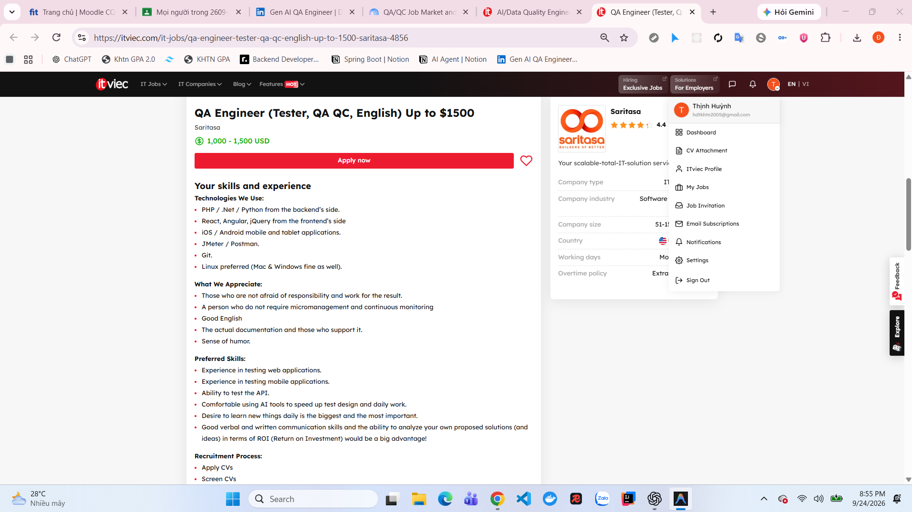

<strong>Ảnh J03-2: Kỹ năng QA và yêu cầu sử dụng công cụ AI.</strong>

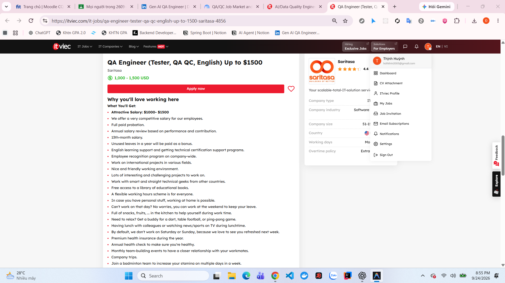

<strong>Ảnh J03-3: Mức lương và quyền lợi.</strong>

#### 3. Tóm tắt Job Description

- Kiểm thử các sản phẩm đa dạng gồm web application, mobile application, hệ thống enterprise, IoT, VR/AR và Unity game theo dự án được phân công.
- Phân tích yêu cầu và thực hiện kiểm thử chức năng, tích hợp và các luồng người dùng trên nhiều nền tảng kỹ thuật khác nhau.
- Kiểm thử API và backend service bằng các công cụ phù hợp, trong đó JD nhắc đến Postman và JMeter.
- Ghi nhận defect chi tiết, cung cấp ảnh hoặc video minh chứng và mô tả đủ thông tin để nhóm phát triển tái hiện, sửa lỗi.
- Phối hợp với developer, architect, manager và QA team trong các dự án sử dụng PHP, .NET, Python, React, Angular, iOS và Android.
- Duy trì tài liệu kiểm thử, giao tiếp bằng tiếng Anh và chủ động chịu trách nhiệm về kết quả thay vì phụ thuộc vào giám sát liên tục.
- Sử dụng công cụ AI để tăng tốc thiết kế kiểm thử và các hoạt động QA hằng ngày khi phù hợp.

#### 4. Required Skills

- Có ít nhất 3 năm kinh nghiệm manual QA theo thông tin tuyển dụng và có khả năng làm việc độc lập, chịu trách nhiệm về kết quả.
- Có kinh nghiệm kiểm thử web application; kinh nghiệm kiểm thử mobile application và API được đánh giá cao.
- Biết sử dụng JMeter, Postman, Git và làm việc với Linux; có thể kiểm thử hệ thống sử dụng backend PHP, .NET hoặc Python và frontend React/Angular.
- Có khả năng mô tả defect rõ ràng bằng nội dung, ảnh chụp hoặc video để hỗ trợ quá trình tái hiện lỗi.
- Có khả năng đọc, viết và giao tiếp tiếng Anh tốt trong quá trình trao đổi với QA Director, quản lý và thành viên dự án.
- Có tư duy chủ động, không cần micromanagement, biết duy trì tài liệu và phân tích giải pháp theo giá trị mang lại.
- Sử dụng công cụ AI để tăng tốc test design và công việc hằng ngày là kỹ năng ưu tiên.

#### 5. AI-Specific Skills và phân loại yêu cầu AI/LLM

- Biết sử dụng công cụ AI để hỗ trợ tạo test ideas, mở rộng test scenario và rút ngắn thời gian thiết kế test.
- Có thể dùng AI để hỗ trợ soạn test data, tóm tắt yêu cầu hoặc chuẩn bị bản nháp defect report, nhưng phải kiểm chứng kết quả trước khi sử dụng.
- Nhận biết giới hạn của AI khi xử lý business rule, môi trường thiết bị và ngữ cảnh dự án khác nhau.

**Phân loại: AI-assisted.** JD chỉ đặt việc sử dụng AI trong phần Preferred Skills nhằm tăng tốc test design và daily work; đối tượng kiểm thử chính vẫn là web, mobile, API và các hệ thống phần mềm thông thường.

#### 6. Phân tích tác động của AI

AI có thể rút ngắn thời gian tạo test ideas, test data và bản nháp defect report, nhờ đó QA có thêm thời gian cho exploratory testing và phân tích rủi ro trên web, mobile hoặc API. Tuy nhiên, AI có thể tạo scenario không đúng business rule hoặc assertion quá yếu, nên tester phải kiểm chứng từng gợi ý bằng yêu cầu, dữ liệu thật của môi trường kiểm thử và hành vi quan sát được của hệ thống.

---

### Việc làm 04: QC Engineer (API, SQL, Automation Testing) - DatVietVAC

#### 1. Thông tin chung

| Trường          | Nội dung                                                                                        |
| --------------- | ----------------------------------------------------------------------------------------------- |
| Company         | DatVietVAC                                                                                      |
| Platform        | ITviec                                                                                          |
| Location/Model  | 222 Pasteur, phường Xuân Hòa, Thành phố Hồ Chí Minh; At office                                  |
| Employment Type | Full-time; Manual Tester theo phân loại của ITviec                                              |
| Published Date  | ITviec hiển thị `Posted 21 days ago` khi kiểm tra ngày 24/09/2026, tương ứng khoảng 03/09/2026. |
| Accessed Date   | 24/09/2026                                                                                      |
| Salary          | Không công khai.                                                                                |
| AI-required?    | Không                                                                                           |
| Source          | https://itviec.com/it-jobs/qc-engineer-api-sql-automation-testing-datvietvac-5830               |

#### 2. Bằng chứng tin tuyển dụng

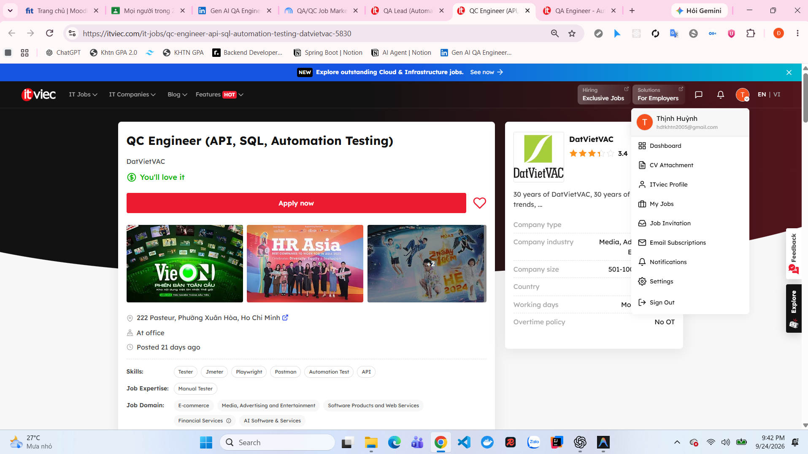

<strong>Ảnh J04-1: Thông tin chung của tin tuyển dụng.</strong>

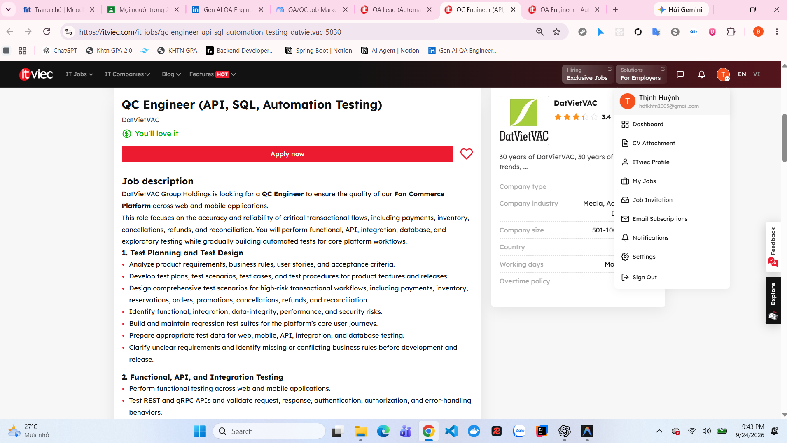

<strong>Ảnh J04-2: Mô tả công việc và trách nhiệm kiểm thử.</strong>

#### 3. Tóm tắt Job Description

- Phân tích product requirement, business rule, user story và acceptance criteria; xây dựng test plan, test scenario, test case và test data cho từng bản phát hành.
- Kiểm thử Fan Commerce Platform trên web và mobile, tập trung vào các luồng giao dịch rủi ro cao như thanh toán, tồn kho, đặt chỗ, đơn hàng, khuyến mãi, hủy, hoàn tiền và đối soát.
- Kiểm thử REST/gRPC API, authentication, authorization, error handling và tích hợp với payment gateway, dịch vụ bên thứ ba hoặc hệ thống liên quan.
- Dùng SQL xác minh accuracy, consistency và integrity của dữ liệu xuyên suốt frontend, mobile, backend, database và hệ thống bên thứ ba.
- Thực hiện functional, integration, end-to-end, regression, exploratory, negative, boundary và edge-case testing; phối hợp SRE thực hiện performance/load testing trước các sự kiện lưu lượng cao.
- Quản lý defect đến khi được sửa và retest; lập test report, defect report, release-quality assessment và hỗ trợ điều tra production incident.
- Phát triển dần automated test cho API và luồng giao dịch cốt lõi, duy trì regression suite và tích hợp test vào CI.

#### 4. Required Skills

- Có bằng cử nhân trở lên về Công nghệ thông tin, Kỹ thuật phần mềm, Khoa học máy tính hoặc ngành liên quan.
- Có ít nhất 2 năm kinh nghiệm Software QC, Software Testing hoặc vai trò tương đương tại công ty công nghệ hoặc sản phẩm phần mềm.
- Có kinh nghiệm thực hành kiểm thử web, mobile, API và integrated system; kinh nghiệm sản phẩm payment, e-commerce, fintech, media, entertainment hoặc OTT là lợi thế.
- Thành thạo API testing bằng Postman, REST Client hoặc công cụ tương đương và đọc hiểu API documentation.
- Có kỹ năng SQL tốt để xác minh dữ liệu và điều tra lỗi sản phẩm.
- Hiểu STLC, defect lifecycle, Agile/Scrum, integration, regression, end-to-end và database testing.
- Có kinh nghiệm Playwright, Cypress, pytest, k6 hoặc JMeter; biết lập trình/scripting cho automation và CI-integrated testing là lợi thế.

#### 5. Phân loại yêu cầu AI/LLM

**Traditional QA, không tính quota AI.** JD không yêu cầu kiểm thử model, LLM, prompt hoặc sử dụng công cụ AI.

#### 6. Phân tích tác động của AI

AI có thể hỗ trợ chuyển business rule thành bản nháp test scenario, gợi ý boundary/negative case và tóm tắt log cho các luồng thanh toán, hoàn tiền hoặc đối soát. Tuy nhiên, mọi kết luận về trạng thái giao dịch và tính toàn vẹn dữ liệu phải được kiểm chứng bằng API response, truy vấn SQL, hệ thống tích hợp.

### Việc làm 05: Senior QA Engineer (Automation, Selenium, Playwright) - Zeya Labs AI

#### 1. Thông tin chung

| Trường          | Nội dung                                                                                       |
| --------------- | ---------------------------------------------------------------------------------------------- |
| Company         | Zeya Labs AI                                                                                   |
| Platform        | ITviec                                                                                         |
| Location/Model  | Phòng L5-20, tầng 5, số 343 Hoàng Sa, phường Tân Định, Thành phố Hồ Chí Minh; At office        |
| Employment Type | Full-time; Automation Tester theo phân loại của ITviec                                         |
| Published Date  | ITviec hiển thị `Posted 9 days ago` khi kiểm tra ngày 24/09/2026, tương ứng khoảng 15/09/2026. |
| Accessed Date   | 24/09/2026                                                                                     |
| Salary          | Không công khai.                                                                               |
| AI-required?    | Không                                                                                          |
| Source          | https://itviec.com/it-jobs/senior-qa-engineer-automation-selenium-playwright-zeya-labs-ai-5714 |

#### 2. Bằng chứng tin tuyển dụng

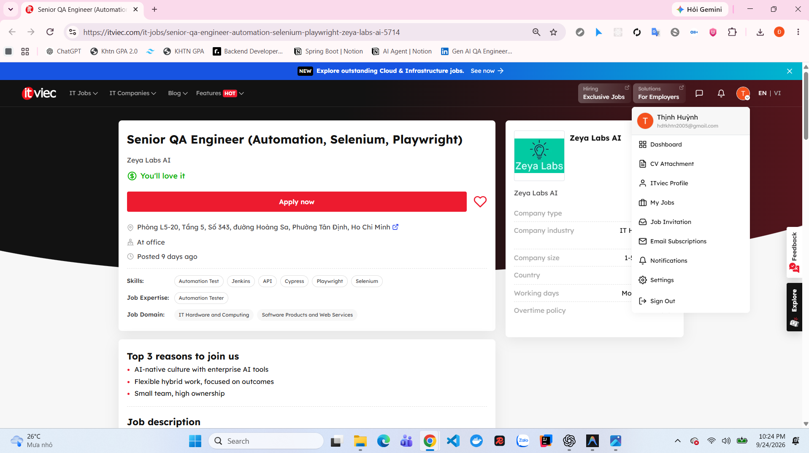

<strong>Ảnh J05-1: Thông tin chung và ngày đăng của tin tuyển dụng.</strong>

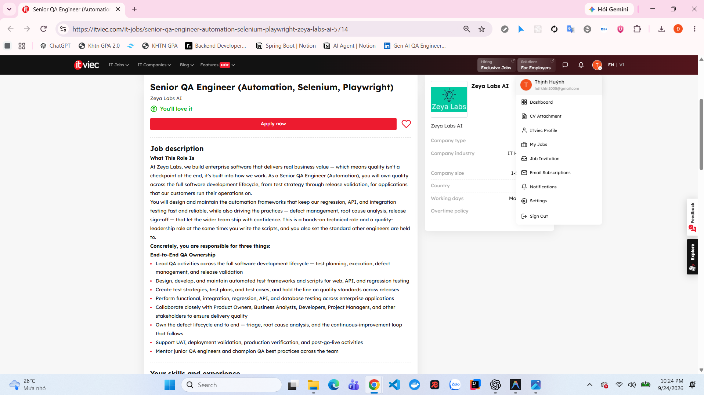

<strong>Ảnh J05-2: Mô tả công việc và trách nhiệm End-to-End QA Ownership.</strong>

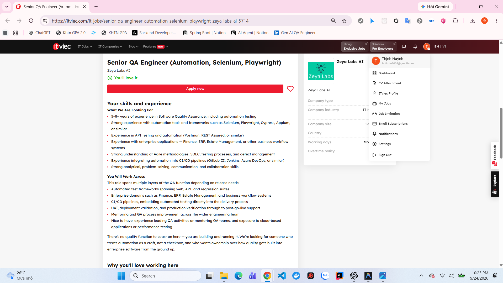

<strong>Ảnh J05-3: Kỹ năng và kinh nghiệm bắt buộc.</strong>

#### 3. Tóm tắt Job Description

- Sở hữu chất lượng xuyên suốt SDLC, từ test strategy, test planning, thực thi và defect management đến release validation cho enterprise application.
- Thiết kế, phát triển và duy trì automation framework cùng test script cho web, API và regression testing.
- Xây dựng test strategy, test plan và test case; thực hiện functional, integration, regression, API và database testing.
- Phối hợp với Product Owner, Business Analyst, Developer, Project Manager và các bên liên quan để bảo đảm chất lượng phát hành.
- Quản lý toàn bộ defect lifecycle, gồm triage, root-cause analysis, xác minh bản sửa và cải tiến liên tục.
- Hỗ trợ UAT, deployment validation, production verification và post-go-live; hướng dẫn junior QA và phổ biến QA best practices.

#### 4. Required Skills

- Có từ 5-8 năm trở lên trong Software Quality Assurance, bao gồm kinh nghiệm automation testing.
- Có kinh nghiệm vững với Selenium, Playwright, Cypress, Appium hoặc framework tương đương.
- Có kinh nghiệm API testing và automation bằng Postman, REST Assured hoặc công cụ tương tự.
- Có kinh nghiệm với enterprise application thuộc Finance, ERP, Estate Management hoặc business workflow system.
- Hiểu Agile, SDLC, testing process và defect management.
- Có kinh nghiệm tích hợp automation vào GitLab CI, Jenkins, Azure DevOps hoặc CI/CD tương đương.
- Có năng lực phân tích, giải quyết vấn đề, giao tiếp và phối hợp tốt; kinh nghiệm dẫn dắt QA, mentoring, cloud application hoặc performance testing là lợi thế.

#### 5. Phân loại yêu cầu AI/LLM

**Traditional QA, không tính quota AI.** JD không yêu cầu kiểm thử AI/LLM, prompt engineering hoặc model evaluation.

#### 6. Phân tích tác động của AI

AI có thể hỗ trợ chuyển requirement thành bản nháp test case, tạo khung automation script và tóm tắt defect/root-cause evidence, giúp Senior QA tăng tốc xây dựng regression suite. Tuy nhiên, tester vẫn phải review mã, xác định expected result và kiểm chứng trên web, API, database, UAT và môi trường production-like trước khi ký xác nhận phát hành.

---

### Việc làm 06: QA Automation Engineer (MLOps/AI) - Motorola Solutions

#### 1. Thông tin chung

| Trường          | Nội dung                                                                                       |
| --------------- | ---------------------------------------------------------------------------------------------- |
| Company         | Motorola Solutions                                                                             |
| Platform        | ITviec                                                                                         |
| Location/Model  | The Hallmark Building, 15 Trần Bạch Đằng, phường An Khánh, Thành phố Hồ Chí Minh; At office    |
| Employment Type | Full-time; Automation Tester theo phân loại của ITviec                                         |
| Published Date  | ITviec hiển thị `Posted 8 days ago` khi kiểm tra ngày 24/09/2026, tương ứng khoảng 16/09/2026. |
| Accessed Date   | 24/09/2026                                                                                     |
| Salary          | Không công khai.                                                                               |
| AI-required?    | Có                                                                                             |
| Source          | https://itviec.com/it-jobs/qa-automation-engineer-mlops-ai-motorola-solutions-2706             |

#### 2. Bằng chứng tin tuyển dụng

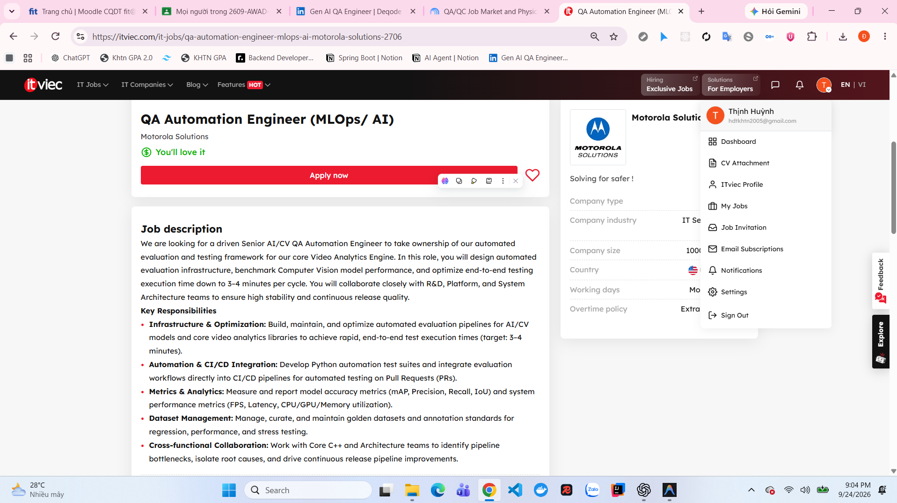

<strong>Ảnh J06-1: Mô tả công việc và trách nhiệm kiểm thử AI/CV.</strong>

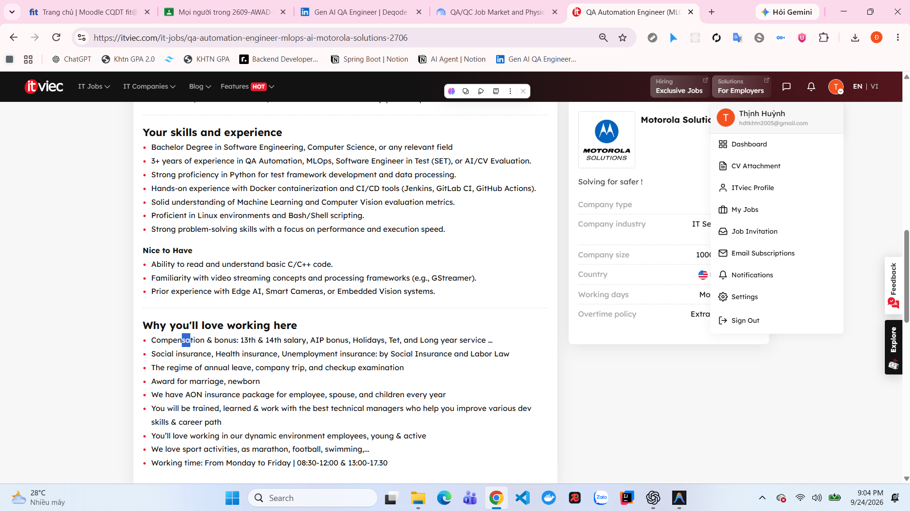

<strong>Ảnh J06-2: Kỹ năng bắt buộc và quyền lợi.</strong>

#### 3. Tóm tắt Job Description

- Sở hữu framework đánh giá và kiểm thử tự động cho Video Analytics Engine sử dụng Artificial Intelligence và Computer Vision.
- Xây dựng, duy trì và tối ưu automated evaluation pipeline cho AI/CV model và thư viện video analytics, hướng tới chu kỳ kiểm thử đầu-cuối trong 3-4 phút.
- Phát triển Python automation test suite và tích hợp quy trình đánh giá vào CI/CD để tự động kiểm thử trên Pull Request.
- Đo và báo cáo model metrics gồm mAP, Precision, Recall, IoU; đồng thời theo dõi FPS, latency và mức sử dụng CPU, GPU, memory.
- Quản lý golden dataset, dữ liệu gán nhãn và tiêu chuẩn annotation cho regression, performance và stress testing.
- Phối hợp với nhóm C++, Platform và System Architecture để phát hiện bottleneck, phân tích root cause và cải thiện release pipeline.

#### 4. Required Skills

- Có bằng đại học Software Engineering, Computer Science hoặc ngành liên quan.
- Có ít nhất 3 năm kinh nghiệm QA Automation, MLOps, Software Engineer in Test hoặc AI/CV Evaluation.
- Thành thạo Python để phát triển test framework và xử lý dữ liệu.
- Có kinh nghiệm Docker và công cụ CI/CD như Jenkins, GitLab CI hoặc GitHub Actions.
- Hiểu Machine Learning, Computer Vision và các chỉ số đánh giá model.
- Thành thạo Linux, Bash hoặc Shell scripting; có năng lực phân tích vấn đề và tối ưu tốc độ thực thi.
- Khả năng đọc C/C++, hiểu video streaming hoặc GStreamer, Edge AI, Smart Camera và Embedded Vision là lợi thế.

#### 5. AI-Specific Skills và phân loại yêu cầu AI/LLM

- Xây dựng evaluation infrastructure dành trực tiếp cho model AI và Computer Vision.
- Đo mAP, Precision, Recall, IoU và so sánh model performance giữa các phiên bản.
- Quản lý golden dataset, annotation standard và regression dataset cho AI/CV.
- Kết hợp model-quality metrics với FPS, latency và tài nguyên phần cứng để đánh giá cả độ chính xác lẫn hiệu năng vận hành.
- Có kinh nghiệm AI/CV Evaluation, Machine Learning và MLOps; Edge AI và Embedded Vision là lợi thế.

**Phân loại: AI-required.** AI/CV model là đối tượng kiểm thử cốt lõi, còn kinh nghiệm AI/CV Evaluation hoặc MLOps và hiểu model metrics được nêu trực tiếp trong điều kiện chuyên môn.

#### 6. Phân tích tác động của AI

AI chuyển trọng tâm của automation QA từ kiểm tra đầu ra đúng/sai cố định sang quản lý dataset và đo model accuracy, mAP, Precision, Recall, IoU cùng hiệu năng FPS, latency, CPU/GPU qua nhiều phiên bản model. Tuy nhiên, metric cao trên golden dataset chưa bảo đảm hệ thống hoạt động tốt với dữ liệu thực tế, nên tester vẫn phải kiểm tra chất lượng annotation, dữ liệu lệch phân phối, edge case và quyết định release dựa trên cả số liệu lẫn phân tích lỗi.

---

### Việc làm 07: Middle QA Automation Engineer (Playwright, Selenium) - FPT Digital

#### 1. Thông tin chung

| Trường          | Nội dung                                                                                      |
| --------------- | --------------------------------------------------------------------------------------------- |
| Company         | FPT Digital                                                                                   |
| Platform        | ITviec                                                                                        |
| Location/Model  | FPT Tower, 10 Phạm Văn Bạch, Cầu Giấy, Hà Nội; At office                                      |
| Employment Type | Full-time; Automation Tester theo phân loại của ITviec                                        |
| Published Date  | Ảnh chụp ngày 24/09/2026 hiển thị `Posted 9 days ago`, tương ứng khoảng 15/09/2026.           |
| Accessed Date   | 24/09/2026                                                                                    |
| Salary          | 800-1.500 USD.                                                                                |
| AI-required?    | Có                                                                                            |
| Source          | https://itviec.com/it-jobs/middle-qa-automation-engineer-playwright-selenium-fpt-digital-4422 |

#### 2. Bằng chứng tin tuyển dụng

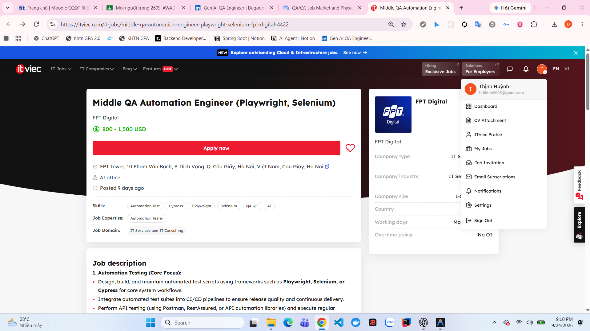

<strong>Ảnh J07-1: Thông tin chung của tin tuyển dụng.</strong>

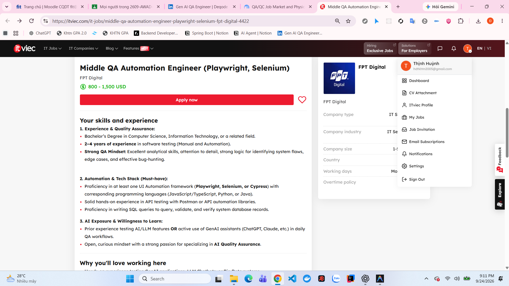

<strong>Ảnh J07-2: Kỹ năng Automation Testing và AI/LLM Quality Assurance.</strong>

#### 3. Tóm tắt Job Description

- Thiết kế, xây dựng và bảo trì automation test script bằng Playwright, Selenium hoặc Cypress cho các luồng nghiệp vụ chính.
- Tích hợp automated test suite vào CI/CD để hỗ trợ continuous delivery và kiểm soát chất lượng bản phát hành.
- Thực hiện API testing bằng Postman, REST Assured hoặc thư viện automation API; chạy regression testing định kỳ.
- Phân tích SRS, User Story và Acceptance Criteria để lập Test Plan, Test Case cho happy path, edge case và boundary condition.
- Kiểm thử Web/App UI, workflow và dữ liệu bằng SQL; quản lý defect trên Jira và phối hợp với Developer, Project Manager.
- Kiểm thử AI chatbot, automated data extraction và RAG workflow; đánh giá accuracy, completeness, source attribution, hallucination, stability và consistency.
- Dùng ChatGPT, Claude hoặc Copilot để hỗ trợ tạo test case, test data và automation script.

#### 4. Required Skills

- Có bằng cử nhân Computer Science, Information Technology hoặc lĩnh vực liên quan.
- Có 2-4 năm kinh nghiệm software testing, bao gồm cả manual và automation testing.
- Thành thạo ít nhất một framework Playwright, Selenium hoặc Cypress cùng JavaScript/TypeScript, Python hoặc Java.
- Có kinh nghiệm API testing với Postman hoặc thư viện automation API.
- Thành thạo SQL để truy vấn, đối chiếu và xác minh dữ liệu.
- Có tư duy QA tốt, khả năng phân tích, chú ý chi tiết và tìm edge case.
- Đã kiểm thử tính năng AI/LLM hoặc chủ động dùng GenAI assistant trong quy trình QA; có định hướng phát triển chuyên sâu về AI Quality Assurance.

#### 5. AI-Specific Skills và phân loại yêu cầu AI/LLM

- Kiểm thử AI chatbot, automated data extraction và Retrieval-Augmented Generation workflow.
- Đánh giá accuracy, completeness, source attribution và phát hiện hallucination.
- Thử nhiều prompt variation để so sánh performance, answer stability và response consistency.
- Sử dụng ChatGPT, Claude hoặc Copilot để tạo test case, test data và hỗ trợ viết script.
- Có kinh nghiệm AI/LLM testing hoặc sử dụng GenAI hằng ngày; hiểu RAG hoặc prompt engineering là lợi thế.

**Phân loại: AI-required.** JD dành riêng một nhóm trách nhiệm cho AI/LLM Feature Testing và yêu cầu ứng viên phải có kinh nghiệm kiểm thử AI/LLM hoặc sử dụng GenAI assistant trong quy trình QA.

#### 6. Phân tích tác động của AI

AI vừa trở thành đối tượng kiểm thử thông qua chatbot và RAG, vừa hỗ trợ tester tạo test case, dữ liệu và script nhanh hơn; vì vậy QA phải kết hợp automation truyền thống với đánh giá accuracy, attribution, hallucination và độ ổn định của câu trả lời. Tuy nhiên, GenAI có thể tạo test thiếu assertion hoặc bỏ sót lỗi nghiệp vụ, nên tester phải xác định expected result, đối chiếu nguồn và kiểm chứng thủ công các phản hồi rủi ro.

---

### Việc làm 08: Manual Tester (QA/QC) - MiTek Vietnam

#### 1. Thông tin chung

| Trường          | Nội dung                                                                            |
| --------------- | ----------------------------------------------------------------------------------- |
| Company         | MiTek Vietnam                                                                       |
| Platform        | ITviec                                                                              |
| Location/Model  | Tòa nhà A5, khu E-Office, KCX Tân Thuận, Thành phố Hồ Chí Minh; Tại văn phòng       |
| Employment Type | Full-time; Manual Tester theo phân loại của ITviec                                  |
| Published Date  | Ảnh chụp ngày 24/09/2026 hiển thị `Posted 9 days ago`, tương ứng khoảng 15/09/2026. |
| Accessed Date   | 24/09/2026                                                                          |
| Salary          | Không công khai.                                                                    |
| AI-required?    | Không                                                                               |
| Source          | https://itviec.com/viec-lam-it/manual-tester-qa-qc-mitek-vietnam-3045               |

#### 2. Bằng chứng tin tuyển dụng

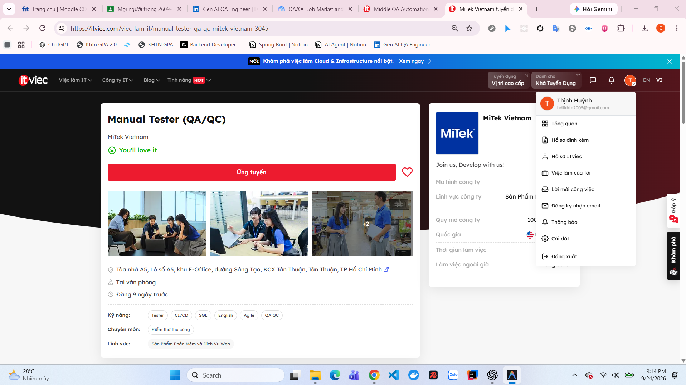

<strong>Ảnh J08-1: Thông tin chung của tin tuyển dụng.</strong>

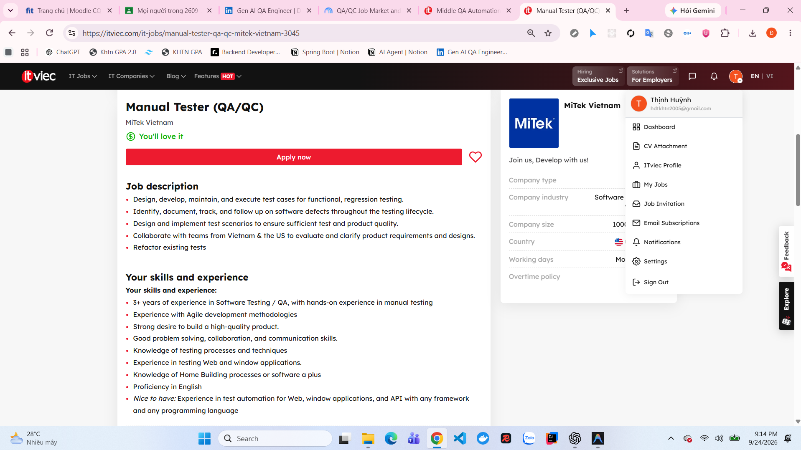

<strong>Ảnh J08-2: Trách nhiệm và kỹ năng Manual Testing.</strong>

#### 3. Tóm tắt Job Description

- Thiết kế, phát triển, duy trì và thực thi test case cho functional testing và regression testing.
- Xác định, ghi nhận, theo dõi và kiểm tra lại defect trong toàn bộ testing lifecycle.
- Thiết kế test scenario nhằm bảo đảm mức độ bao phủ và chất lượng sản phẩm phù hợp.
- Phối hợp với các nhóm tại Việt Nam và Hoa Kỳ để đánh giá, làm rõ product requirement và design.
- Cải tiến hoặc refactor các bài kiểm thử hiện có để tăng khả năng bảo trì.
- Có thể tham gia automation testing cho web, Windows application hoặc API khi dự án cần.

#### 4. Required Skills

- Có ít nhất 3 năm kinh nghiệm Software Testing hoặc QA, với kinh nghiệm thực hành manual testing.
- Hiểu testing process, testing technique và có kinh nghiệm kiểm thử web hoặc Windows application.
- Có kinh nghiệm làm việc theo Agile development methodology.
- Có kỹ năng phân tích vấn đề, giao tiếp và phối hợp nhóm tốt.
- Thành thạo tiếng Anh để phối hợp với nhóm quốc tế.
- Kiến thức về Home Building process hoặc phần mềm liên quan là lợi thế.
- Kinh nghiệm automation testing cho web, Windows application hoặc API bằng framework và ngôn ngữ bất kỳ là Nice to have.

#### 5. Phân loại yêu cầu AI/LLM

**Traditional QA, không tính quota AI.** JD không đề cập AI/LLM, prompt engineering, model evaluation hoặc công cụ GenAI; trọng tâm là manual functional/regression testing, defect management và automation ở mức ưu tiên.

#### 6. Phân tích tác động của AI

AI có thể hỗ trợ chuyển requirement thành bản nháp test scenario, gợi ý regression scope và tóm tắt defect history để giảm thời gian chuẩn bị của manual tester. Tuy nhiên, AI có thể hiểu sai thiết kế sản phẩm, nên tester vẫn phải thực thi, và xác nhận lỗi trên môi trường thật.

---

### Việc làm 09: QA Engineer - Automation Tester (HCMC) - Trusting Social

#### 1. Thông tin chung

| Trường          | Nội dung                                                                                        |
| --------------- | ----------------------------------------------------------------------------------------------- |
| Company         | Trusting Social                                                                                 |
| Platform        | ITviec                                                                                          |
| Location/Model  | Havana Tower, 132 Hàm Nghi, Thành phố Hồ Chí Minh; At office                                    |
| Employment Type | Full-time; Automation Tester theo phân loại của ITviec                                          |
| Published Date  | ITviec hiển thị `Posted 21 days ago` khi kiểm tra ngày 24/09/2026, tương ứng khoảng 03/09/2026. |
| Accessed Date   | 24/09/2026                                                                                      |
| Salary          | 2,000 - 3,000 USD                                                                               |
| AI-required?    | Có                                                                                              |
| Source          | https://itviec.com/it-jobs/qa-engineer-automation-tester-hcmc-trusting-social-2533              |

#### 2. Bằng chứng tin tuyển dụng

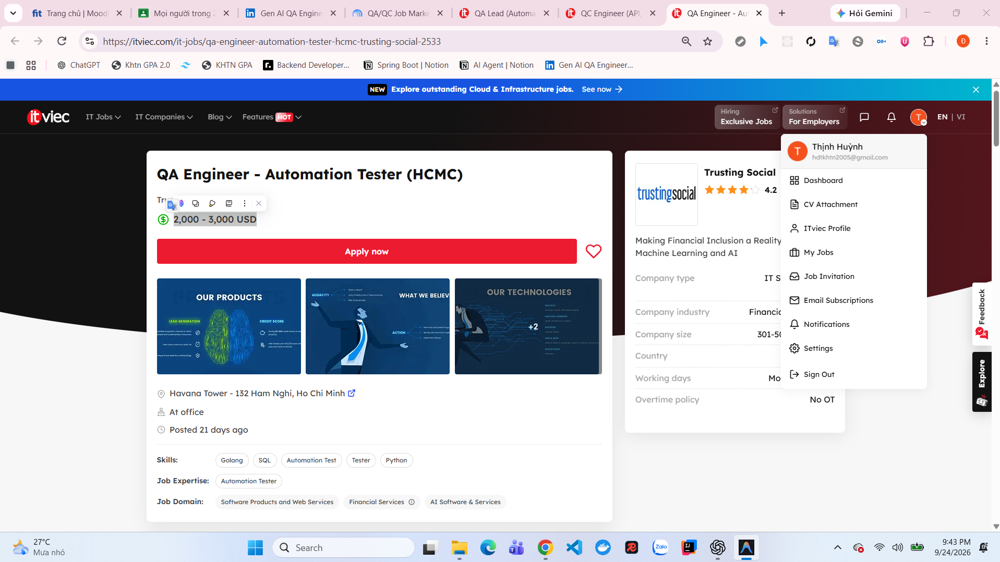

<strong>Ảnh J09-1: Thông tin chung, mức lương và ngày đăng.</strong>

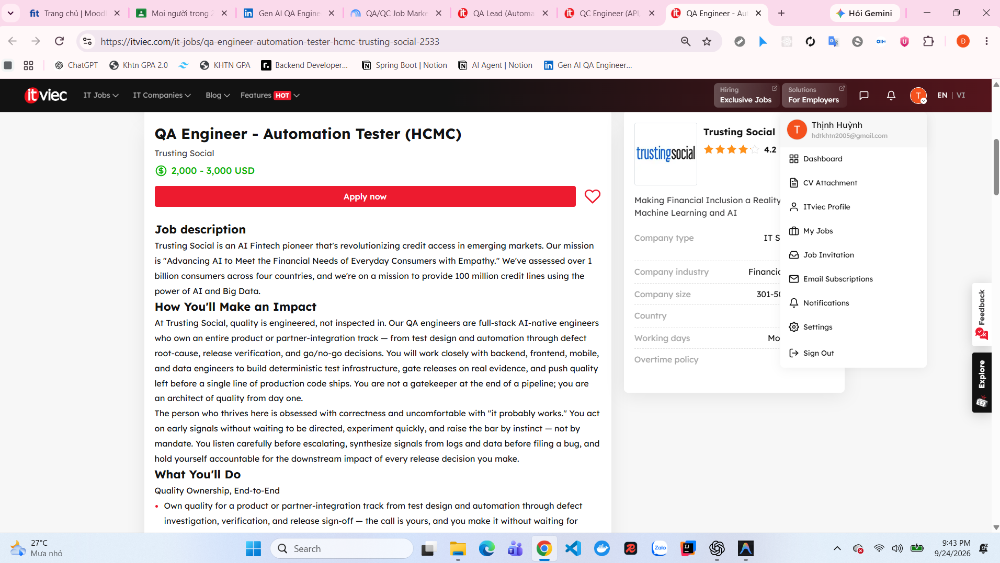

<strong>Ảnh J09-2: Giới thiệu vị trí và trách nhiệm Quality Ownership.</strong>

#### 3. Tóm tắt Job Description

- Sở hữu chất lượng end-to-end cho một product hoặc partner-integration track, từ test design và automation đến defect investigation, verification, release sign-off và quyết định go/no-go.
- Xây dựng bộ automation test hướng dữ liệu cho API, Web UI, Mobile, visual và responsive testing, dùng helper tái sử dụng trong repository chung.
- Thiết kế deterministic test infrastructure gồm service mock, chuyển đổi real-to-mock, CI gate và công cụ quản lý test data; theo dõi coverage gap và quality drift.
- Dùng Claude Code hoặc AI agent tương đương theo chu trình brainstorm, plan, test-first và verify trong isolated worktree.
- Vận hành AI-assisted quality workflow, theo dõi ngưỡng chất lượng và chi phí, phát hiện drift sớm và xác minh đầu ra AI như production code.
- Thực hiện exploratory/risk-based testing, điều tra lỗi bằng Datadog, Temporal, Kafka và SQL, đồng thời review specification và design từ sớm.

#### 4. Required Skills

- Có ít nhất 3 năm kinh nghiệm QA engineering và thực hành automation cho API, Web UI và Mobile.
- Thành thạo TypeScript/JavaScript trên Node; viết mã dễ đọc, có kiểm thử và có thể review.
- Có kỹ năng SQL và relational database vững để xác minh dữ liệu và điều tra root cause.
- Có bằng cử nhân Computer Science/Engineering hoặc kinh nghiệm thực tế tương đương.
- Mobile automation, visual regression, performance testing, CI/CD, contract/mock testing hoặc observability với Datadog, Temporal và Kafka là lợi thế.
- Chủ động dùng AI một cách có phê phán: viết prompt rõ ràng, đánh giá output bằng tư duy tester và mở rộng phạm vi kiểm thử mà không thay thế quality judgment.
- Có khả năng giao tiếp tiếng Anh chuyên nghiệp; thích nghi tốt với môi trường nhanh, nhiều biến động và có tinh thần ownership.

#### 5. AI-Specific Skills và phân loại yêu cầu AI/LLM

- Điều khiển Claude Code hoặc AI agent tương đương theo quy trình có kiểm soát: brainstorm, lập kế hoạch, test-first và xác minh kết quả.
- Viết prompt rõ ràng và cung cấp domain context, machine-readable documentation cùng reusable skills để agent hoạt động chính xác hơn.
- Đánh giá nghiêm ngặt output của agent, nhận biết false-green, phát hiện quality drift và quyết định khi nào tin cậy hoặc ghi đè kết quả AI.
- Duy trì agent-driven testing trên ngưỡng chất lượng mục tiêu đồng thời kiểm soát chi phí vận hành.
- Dùng AI để mở rộng phạm vi và chiều sâu kiểm thử nhưng không dùng AI để thay thế quality judgment của kỹ sư.

**Phân loại: AI-required.** AI-native quality engineering và vai trò AI Operator là trách nhiệm trực tiếp; ứng viên phải biết prompt, vận hành agent, đánh giá output và phát hiện drift, nên vị trí này được tính vào quota việc làm yêu cầu kỹ năng AI/LLM.

#### 6. Phân tích tác động của AI

AI trở thành một thành phần của quy trình QA: agent hỗ trợ lập kế hoạch, tạo automation và mở rộng coverage, còn kỹ sư theo dõi quality threshold, cost và drift để quyết định release dựa trên bằng chứng. Vì output của agent có thể tạo false-green hoặc sai ngữ cảnh fintech, QA vẫn phải duy trì deterministic infrastructure, review mã, kiểm tra log/dữ liệu và chịu trách nhiệm cuối cùng cho go/no-go.

---

### Việc làm 10: Senior Automation Test (AI, QA QC, API) - Floware

#### 1. Thông tin chung

| Trường          | Nội dung                                                                                        |
| --------------- | ----------------------------------------------------------------------------------------------- |
| Company         | Floware                                                                                         |
| Platform        | ITviec                                                                                          |
| Location/Model  | 43D/52 Hồ Văn Huê, phường Đức Nhuận, Thành phố Hồ Chí Minh; At office                           |
| Employment Type | Full-time; Automation Tester theo phân loại của ITviec                                          |
| Published Date  | ITviec hiển thị `Posted 20 days ago` khi kiểm tra ngày 24/09/2026, tương ứng khoảng 04/09/2026. |
| Accessed Date   | 24/09/2026                                                                                      |
| Salary          | Không công khai.                                                                                |
| AI-required?    | Không; AI-assisted                                                                              |
| Source          | https://itviec.com/it-jobs/senior-automation-test-ai-qa-qc-api-floware-1219                     |

#### 2. Bằng chứng tin tuyển dụng

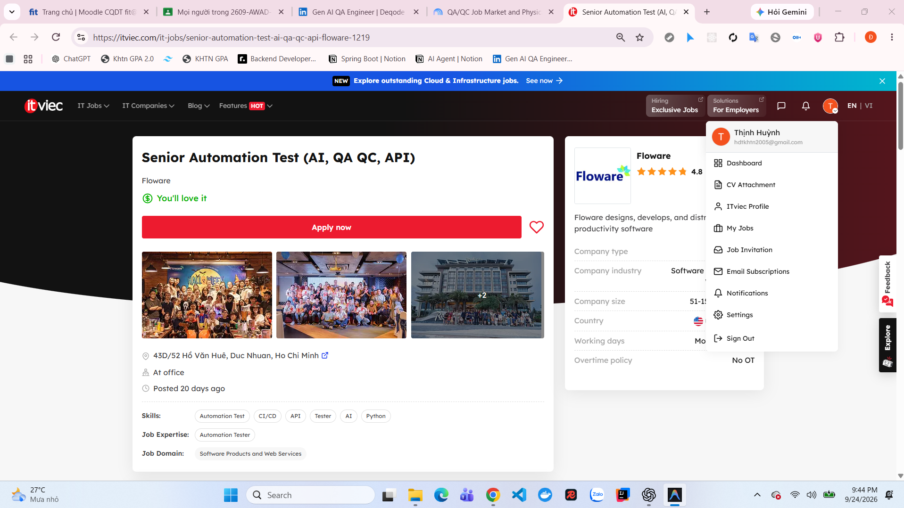

<strong>Ảnh J10-1: Thông tin chung của tin tuyển dụng.</strong>

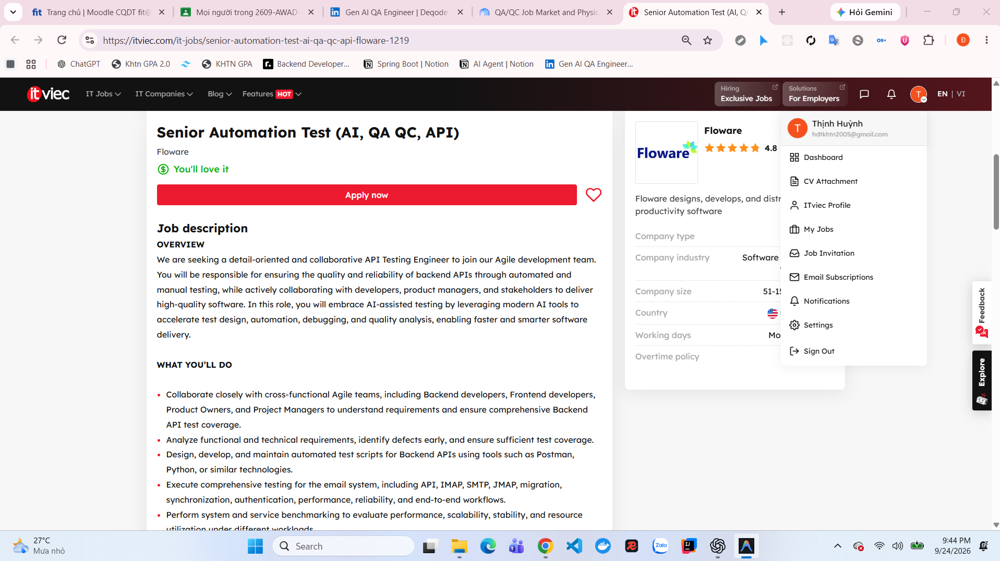

<strong>Ảnh J10-2: Mô tả công việc và trách nhiệm API Automation Testing.</strong>

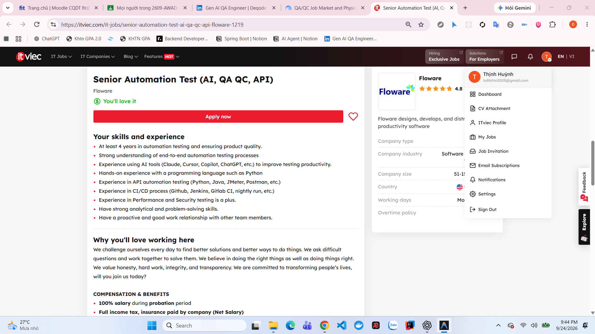

<strong>Ảnh J10-3: Kỹ năng Automation Testing và yêu cầu sử dụng công cụ AI.</strong>

#### 3. Tóm tắt Job Description

- Phối hợp trong Agile team với Backend, Frontend, Product Owner và Project Manager để phân tích yêu cầu và bảo đảm độ bao phủ kiểm thử Backend API.
- Thiết kế, phát triển và duy trì automated test script cho Backend API bằng Postman, Python hoặc công nghệ tương đương.
- Kiểm thử hệ thống email trên API, IMAP, SMTP, JMAP, migration, synchronization, authentication, performance, reliability và end-to-end workflow.
- Thực hiện benchmarking, performance, load và stress testing để phát hiện bottleneck và đánh giá scalability, stability cùng resource utilization.
- Tích hợp automated API test vào Jenkins pipeline; theo dõi hiệu năng API, kết quả thực thi và độ tin cậy hệ thống qua Allure Reports hoặc công cụ phân tích.
- Hỗ trợ Frontend developer xử lý vấn đề tích hợp API, xác minh hành vi API, tính năng mới và enhancement.
- Dùng Claude, Cursor, Copilot, ChatGPT hoặc công cụ tương tự để tăng tốc test design, automation, debugging và quality analysis.

#### 4. Required Skills

- Có ít nhất 4 năm kinh nghiệm automation testing và bảo đảm chất lượng sản phẩm.
- Hiểu vững quy trình end-to-end automation testing.
- Có kinh nghiệm dùng Claude, Cursor, Copilot, ChatGPT hoặc công cụ AI tương đương để nâng cao năng suất kiểm thử.
- Có kinh nghiệm thực hành với ngôn ngữ lập trình như Python.
- Có kinh nghiệm API automation bằng Python, Java, JMeter, Postman hoặc công cụ tương đương.
- Có kinh nghiệm CI/CD với GitHub, Jenkins, GitLab CI, nightly run hoặc quy trình tương tự.
- Kinh nghiệm performance testing và security testing là lợi thế.
- Có năng lực phân tích, giải quyết vấn đề, chủ động và phối hợp tốt với các thành viên khác.

#### 5. AI-Specific Skills và phân loại yêu cầu AI/LLM

- Sử dụng Claude, Cursor, Copilot, ChatGPT hoặc công cụ AI hiện đại để hỗ trợ test design, automation, debugging và quality analysis.
- Biết đưa requirement và API context phù hợp cho AI để tạo bản nháp test case, test script hoặc hướng điều tra lỗi.
- Review và chạy lại mọi test/script do AI đề xuất trước khi tích hợp vào regression suite hoặc Jenkins pipeline.
- Đối tượng kiểm thử chính vẫn là Backend API và hệ thống email; JD không yêu cầu kiểm thử model, LLM, prompt quality hoặc model-quality metrics.

**Phân loại: AI-assisted, không tính quota AI-required.** Kinh nghiệm sử dụng công cụ AI là yêu cầu của vị trí nhưng AI chỉ hỗ trợ tăng năng suất kiểm thử API; đối tượng kiểm thử không phải model/LLM và JD không yêu cầu model evaluation.

#### 6. Phân tích tác động của AI

AI có thể rút ngắn thời gian thiết kế API test, tạo khung Python/Postman script, phân tích lỗi và đề xuất trường hợp performance cho hệ thống email. Tuy nhiên, output AI có thể dùng sai protocol hoặc tạo assertion thiếu chính xác, nên tester phải đối chiếu API specification, chạy test trên môi trường thật và review kết quả trước khi đưa vào Jenkins.

---

### Tổng kết Yêu cầu 1: Bức tranh thị trường việc làm QA/QC 2026+

#### 1. Ma trận tổng hợp 10 vị trí việc làm QA/QC đã khảo sát

|  STT   | Vị trí việc làm                                      | Doanh nghiệp          | Nền tảng | Ngày đăng (Kiểm tra 24/09/2026) |    Mức lương    | Phân loại yêu cầu AI |
| :----: | :--------------------------------------------------- | :-------------------- | :------: | :-----------------------------: | :-------------: | :------------------: |
| **01** | QA Lead (Automation Test, Java, Python, SQL, JMeter) | Unity Sport JSC       |  ITviec  |   24/09/2026 (_7 hours ago_)    | Không công khai |    Traditional QA    |
| **02** | AI/Data Quality Engineer (QA)                        | MONEY FORWARD VIETNAM |  ITviec  |   ~10/09/2026 (_14 days ago_)   | Không công khai |   **AI-required**    |
| **03** | QA Engineer (Tester, QA QC, English)                 | Saritasa              |  ITviec  |    23/09/2026 (_1 days ago_)    | $1,000 - $1,500 |     AI-assisted      |
| **04** | QC Engineer (API, SQL, Automation Testing)           | DatVietVAC            |  ITviec  |   24/09/2026 (_10 hours ago_)   | Không công khai |    Traditional QA    |
| **05** | Lead Test Automation Engineer                        | Motorola Solutions    |  ITviec  |    16/09/2026 (_8 days ago_)    | Không công khai |   **AI-required**    |
| **06** | Kỹ sư Đảm bảo Chất lượng Phần mềm (QA/QC)            | FPT Digital           |  ITviec  |    23/09/2026 (_1 days ago_)    |   Thỏa thuận    |   **AI-required**    |
| **07** | Senior QC/QA Engineer (Postman, Automation)          | Zeya Labs AI          |  ITviec  |   24/09/2026 (_8 hours ago_)    | Không công khai |    Traditional QA    |
| **08** | Senior Manual QC (Tester, QA QC)                     | MiTek Vietnam         |  ITviec  |    23/09/2026 (_1 days ago_)    |   Thỏa thuận    |    Traditional QA    |
| **09** | Quality Assurance Lead (AI Native Testing)           | Trusting Social       |  ITviec  |    22/09/2026 (_2 days ago_)    |   Thỏa thuận    |   **AI-required**    |
| **10** | Senior Automation Test (AI, QA QC, API)              | Floware               |  ITviec  |   ~04/09/2026 (_20 days ago_)   | Không công khai |     AI-assisted      |

**Thống kê tiêu chí tuân thủ đề bài:**

- **Số lượng vị trí:** 10/10 vị trí QA/QC thực tế.
- **Thời hạn đăng tuyển:** 100% tin được đăng trong vòng 60 ngày tính đến ngày khảo sát (24/09/2026).
- **Quota vị trí AI:** Có **4 vị trí AI-required** trực tiếp (Money Forward, Motorola Solutions, FPT Digital, Trusting Social), vượt mức tối thiểu $\ge 3$ của đề bài; có 2 vị trí AI-assisted và 4 vị trí Traditional QA đối chứng.
- **Tính minh bạch Anti-cheat:** Toàn bộ 26 ảnh chụp màn hình đều hiển thị tài khoản cá nhân có thẩm quyền (`Thịnh Huỳnh`).

---

#### 2. Phân tích bức tranh thị trường và vai trò của AI trong QA/QC: Thay thế / Hỗ trợ / Không thể thay thế

Khảo sát 10 tin tuyển dụng năm 2026 cho thấy ngành kiểm thử đang chuyển dịch mạnh mẽ sang mô hình có AI trợ lực. Vai trò của AI trong QA/QC được phân định thành 3 nhóm rõ rệt:

##### A. Những công việc AI có thể THAY THẾ hoàn toàn

1. **Khởi tạo mã khung kiểm thử:** Tự động sinh mã khung kiểm thử đơn vị, hàm xác thực cơ bản và cấu hình môi trường mẫu.
2. **Tổng hợp và phân loại log thô:** Quét dữ liệu log hệ thống để gom cụm lỗi trùng lặp và loại bỏ nhiễu trước khi phân tích.
3. **Sinh dữ liệu kiểm thử giả lập:** Tự động tạo dữ liệu mẫu có cấu trúc như họ tên, email, số điện thoại hay địa chỉ theo định dạng yêu cầu.

##### B. Những công việc AI có thể HỖ TRỢ đắc lực

1. **Gợi ý ý tưởng kiểm thử và giá trị biên:** Đề xuất thêm các trường hợp kiểm thử biên và tình huống ngoại lệ hiếm gặp dễ bị bỏ sót.
2. **Tối ưu và bảo trì kịch bản tự động:** Hỗ trợ sửa vị trí phần tử bị thay đổi, chuyển đổi kịch bản gọi API và tối ưu hiệu năng kiểm thử.
3. **Đánh giá và kiểm thử chính hệ thống AI:** Thiết lập bộ công cụ tự động đo lường độ ảo giác, rà soát an toàn prompt và kiểm tra suy thoái dữ liệu.
4. **Soạn thảo và tổng hợp tài liệu:** Hỗ trợ viết bản nháp báo cáo lỗi và tóm tắt biên bản nghiệm thu sau mỗi đợt kiểm thử.

##### C. Những công việc AI hoàn toàn KHÔNG THỂ thay thế

1. **Phán đoán chất lượng và quyết định phát hành:** AI không thể chịu trách nhiệm pháp lý hay tài chính khi hệ thống gặp lỗi thực tế; quyết định phát hành bắt buộc phải do con người phê duyệt.
2. **Thấu hiểu nghiệp vụ chuyên sâu:** AI không thể hiểu được các thỏa thuận ngầm, tâm lý người dùng bản địa và đặc thù kinh doanh riêng của doanh nghiệp.
3. **Thiết lập chuẩn kết quả mong đợi:** Khi tài liệu mơ hồ hoặc có mâu thuẫn, chỉ có kỹ sư trao đổi với các bên liên quan mới xác định được kết quả thế nào là đúng.
4. **Kiểm thử trên thiết bị vật lý thật:** Cảm nhận xúc giác nút bấm, độ ồn quạt gió, thao tác rút cáp đột ngột hay kiểm tra độ bền cơ học hoàn toàn vượt ngoài khả năng của AI.

---

## Yêu cầu 2 - 20 lỗi phần mềm được công bố trong giai đoạn 2022-2026

### 1. Phạm vi và phương pháp thực hiện

Phần này phân tích 20 lỗi hoặc sự cố phần mềm được công bố trong giai đoạn 2022-2026. Mỗi trường hợp gồm nguồn tham khảo, mô tả, mức độ nghiêm trọng, hậu quả, giải pháp/biện pháp giảm thiểu và một điểm cần kiểm chứng trong phần giải thích của AI. Danh sách có 5 defect liên quan trực tiếp đến AI/LLM và 2 sự cố liên quan việc triển khai hoặc sử dụng AI/chatbot, đáp ứng yêu cầu tối thiểu $\ge 5$.

**Model dùng để kiểm tra cách AI giải thích defect:** [GPT2-Small trên Hugging Face](https://huggingface.co/spaces/yasserBH/GPT2-Small). Toàn bộ prompt và output đầy đủ được lưu trong file prompt log riêng; phần báo cáo chính chỉ trích lại câu sai cần phân tích.

Mức độ nghiêm trọng được sử dụng nhất quán như sau:

- **Critical:** Có thể gây mất an toàn, mất dữ liệu hoặc gián đoạn nghiêm trọng trên diện rộng.
- **High:** Ảnh hưởng lớn đến người dùng, bảo mật, tài chính hoặc hoạt động của tổ chức.
- **Medium:** Ảnh hưởng đáng kể nhưng phạm vi có giới hạn hoặc có biện pháp xử lý thay thế.
- **Low:** Ảnh hưởng nhỏ và không tác động đến chức năng cốt lõi.

### 2. Bảng tổng quan 20 lỗi

| ID  | Lỗi/sự cố phần mềm                                         | Năm  | Nhóm lỗi                                    |       AI/LLM?        | Severity | Nguồn |
| :-: | :--------------------------------------------------------- | :--: | :------------------------------------------ | :------------------: | :------: | :---: |
| D01 | ChatGPT bịa án lệ trong vụ Mata v. Avianca                 | 2023 | AI hallucination                            |          Có          |   High   |  S1   |
| D02 | Chatbot Air Canada cung cấp sai thông tin vé tang chế      | 2024 | Chatbot misinformation/policy inconsistency |  Chưa xác nhận LLM   |  Medium  |  S2   |
| D03 | Google Gemini tạo ảnh sai bối cảnh lịch sử                 | 2024 | AI bias/alignment                           |          Có          |  Medium  |  S3   |
| D04 | Chatbot đại lý Chevrolet bị prompt injection               | 2023 | Prompt injection                            |          Có          |  Medium  |  S4   |
| D05 | Dữ liệu nội bộ Samsung bị đưa vào ChatGPT                  | 2023 | AI data-governance/privacy incident         | Liên quan sử dụng AI |   High   |  S5   |
| D06 | Lỗi Redis ChatGPT làm lộ dữ liệu người dùng                | 2023 | Privacy/data exposure                       |          Có          |   High   |  S6   |
| D07 | Bing Chat/Sydney tạo phản hồi thiếu an toàn                | 2023 | AI safety                                   |          Có          |  Medium  |  S7   |
| D08 | Bản cập nhật CrowdStrike Falcon gây Windows BSOD diện rộng | 2024 | Faulty update                               |        Không         | Critical |  S8   |
| D09 | Backdoor XZ Utils CVE-2024-3094                            | 2024 | Supply-chain security                       |        Không         | Critical |  S9   |
| D10 | MOVEit Transfer SQL injection CVE-2023-34362               | 2023 | SQL injection                               |        Không         | Critical |  S10  |
| D11 | Cisco IOS XE Web UI privilege escalation CVE-2023-20198    | 2023 | Authentication/privilege escalation         |        Không         | Critical |  S11  |
| D12 | Atlassian Cloud outage tháng 04/2022                       | 2022 | Operational/service outage                  |        Không         |   High   |  S12  |
| D13 | Microsoft 365/Azure outage do thay đổi WAN router          | 2023 | Network configuration                       |        Không         |   High   |  S13  |
| D14 | GitHub outage tháng 08/2024                                | 2024 | Database infrastructure                     |        Không         |   High   |  S14  |
| D15 | Cloudflare outage ngày 24/01/2023                          | 2023 | Release/configuration                       |        Không         |   High   |  S15  |
| D16 | Cloudflare outage ngày 18/11/2025                          | 2025 | Configuration/software logic                |        Không         | Critical |  S16  |
| D17 | Tesla Autopilot monitoring software recall                 | 2023 | Automotive software                         |        Không         |   High   |  S17  |
| D18 | Honda/Acura display software recall                        | 2026 | Automotive software                         |        Không         |   High   |  S18  |
| D19 | FCA/Stellantis rearview-camera software recall             | 2024 | Automotive software                         |        Không         |   High   |  S19  |
| D20 | Toyota instrument-panel display software recall            | 2025 | Automotive software                         |        Không         |   High   |  S20  |

### 3. Phân tích chi tiết

### D01 - ChatGPT bịa án lệ trong vụ Mata v. Avianca

#### 1. Source link

- **Nguồn chính thức S1:** https://www.nhd.uscourts.gov/sites/default/files/pdf/Mata-v-Avianca-sanctions-order.PDF
- **Loại nguồn:** Opinion and Order on Sanctions của United States District Court, Southern District of New York.
- **Ngày quyết định:** 22/06/2023.

#### 2. Description

Trong quá trình chuẩn bị hồ sơ phản đối yêu cầu bác đơn của Avianca, luật sư đã dùng ChatGPT để hỗ trợ nghiên cứu pháp lý. ChatGPT tạo ra nhiều quyết định tư pháp không tồn tại nhưng trình bày chúng bằng tên vụ án, số trích dẫn, nội dung phân tích và câu trích dẫn có vẻ hợp lý. Những tài liệu này được đưa vào hồ sơ tòa án mà không được kiểm tra lại bằng nguồn tư pháp chính thức.

Nguyên nhân gồm hai lớp. Về phía AI, mô hình sinh văn bản tạo ra thông tin pháp lý có hình thức đáng tin nhưng không có căn cứ thực tế. Về phía quy trình, người sử dụng không đọc và xác minh đầy đủ các án lệ, sau đó vẫn tiếp tục bảo vệ chúng dù tòa án và bên đối lập đã đặt nghi vấn. Đây không phải lỗi của hệ thống nộp hồ sơ điện tử của tòa án.

#### 3. Severity

**Mức độ: High.** Output giả được dùng trong một quy trình pháp lý chính thức, có khả năng gây hiểu lầm cho tòa án và vi phạm nghĩa vụ nghề nghiệp. Tuy nhiên, sự cố không trực tiếp gây thương tích, mất dữ liệu hoặc ngừng dịch vụ diện rộng nên không được xếp Critical.

#### 4. Consequences

- Luật sư và công ty luật bị xác định vi phạm Rule 11 và chịu trách nhiệm liên đới.
- Tòa án áp dụng khoản phạt 5.000 USD nhằm ngăn ngừa hành vi tương tự.
- Người bị xử phạt phải gửi thư cho các thẩm phán bị gán sai là tác giả của những quyết định giả.
- Uy tín nghề nghiệp của luật sư và công ty luật bị ảnh hưởng.
- Tòa án và bên liên quan phải dành thêm thời gian kiểm tra các tài liệu không tồn tại.

#### 5. Solution

- Kiểm tra từng án lệ bằng website tòa án hoặc cơ sở dữ liệu pháp lý được công nhận.
- Đối chiếu tên vụ án, số hồ sơ, tòa án, ngày quyết định và nguyên văn đoạn trích.
- Không xem chatbot là nguồn pháp luật có thẩm quyền.
- Bắt buộc người chịu trách nhiệm đọc tài liệu gốc trước khi ký hoặc nộp hồ sơ.
- Khai báo việc sử dụng AI khi quy định nghề nghiệp hoặc tòa án yêu cầu.

#### 6. Kiểm chứng phần giải thích của AI

- **Prompt:** Explain the 2023 Mata v. Avianca ChatGPT incident. What false information did ChatGPT generate, how did the lawyers use it, what did the court decide, what penalty was imposed, and how could the incident have been prevented?
- **Trích nguyên văn câu AI sai:** “The 19-page ruling by the Court of Appeal has established that ChatGPT was a false information and used false information to gain control of the ChatGPT network.”
- **Phân loại:** Hallucination.
- **Giải thích vì sao sai:** AI bịa ra Court of Appeal, “law of false information” và việc ChatGPT chiếm quyền kiểm soát một mạng lưới. Vụ việc thực tế được xử lý bởi United States District Court và ChatGPT không phải bên bị xét xử.
- **Thông tin sửa lại:** ChatGPT tạo ra các án lệ và trích dẫn không tồn tại; luật sư không xác minh nhưng vẫn sử dụng chúng. Tòa án xử phạt luật sư và công ty luật 5.000 USD.

---

### D02 - Chatbot Air Canada cung cấp sai thông tin vé tang chế

#### 1. Source link

- **Nguồn chính S2:** https://decisions.civilresolutionbc.ca/crt/crtd/en/item/525448/index.do
- **Bản lưu pháp lý:** https://www.canlii.org/en/bc/bccrt/doc/2024/2024bccrt149/2024bccrt149.html
- **Vụ việc:** _Moffatt v. Air Canada_, 2024 BCCRT 149.
- **Ngày quyết định:** 14/02/2024.

#### 2. Description

Khách hàng hỏi chatbot trên website Air Canada về bereavement fare. Chatbot cho biết hành khách có thể mua vé theo giá thông thường rồi yêu cầu áp dụng mức vé tang chế sau chuyến đi nếu gửi yêu cầu trong vòng 90 ngày kể từ ngày phát hành vé. Tuy nhiên, trang chính sách được chatbot liên kết lại quy định rằng bereavement fare không áp dụng sau khi chuyến đi đã hoàn tất.

Khách hàng dựa vào câu trả lời của chatbot để mua vé nhưng sau đó bị Air Canada từ chối điều chỉnh giá. Hành vi lỗi quan sát được là chatbot trả về thông tin chính sách không chính xác và không nhất quán với trang chính sách chính thức. Tài liệu vụ việc không công bố kiến trúc kỹ thuật, training data hoặc cơ chế retrieval của chatbot; vì vậy không kết luận nguyên nhân là training data cũ hay lỗi RAG. Trường hợp này được phân loại là **chatbot misinformation/policy inconsistency**, không mặc định là LLM hallucination.

#### 3. Severity

**Mức độ: Medium.** Câu trả lời sai gây thiệt hại tài chính và trách nhiệm pháp lý thực tế, đồng thời làm giảm niềm tin vào kênh chăm sóc khách hàng. Tuy nhiên, bằng chứng trong quyết định chỉ xác nhận một tranh chấp cụ thể và không cho thấy mất dữ liệu.

#### 4. Consequences

- Khách hàng mua hai vé theo giá thông thường dựa trên hướng dẫn không chính xác của chatbot.
- Tribunal xác định Air Canada không thực hiện sự cẩn trọng hợp lý đối với thông tin trên website.
- Air Canada phải trả 650,88 CAD tiền thiệt hại, 36,14 CAD tiền lãi và 125 CAD lệ phí, tổng cộng 812,02 CAD.
- Vụ việc tạo rủi ro uy tín và cho thấy doanh nghiệp vẫn chịu trách nhiệm đối với nội dung do chatbot cung cấp.

#### 5. Solution

- Dùng một kho chính sách có version và ngày hiệu lực làm nguồn dữ liệu duy nhất.
- Ground câu trả lời bằng đoạn chính sách gốc và hiển thị nguồn ngay trong phản hồi.
- Chuyển sang nhân viên khi nội dung liên quan giá, hoàn tiền hoặc điều kiện pháp lý và hệ thống không đủ chắc chắn.
- Thêm kiểm thử phát hiện mâu thuẫn giữa chatbot và trang chính sách.
- Regression test các trường hợp trước/sau chuyến đi, trong/ngoài thời hạn và ngay sau khi chính sách được cập nhật.

#### 6. Kiểm chứng phần giải thích của AI

- **Prompt:** Explain the Moffatt v. Air Canada chatbot incident decided in 2024. What incorrect bereavement-fare information did the chatbot provide, why was Air Canada responsible, what compensation was ordered, and how could the chatbot have been improved?
- **Trích nguyên văn câu AI sai:** “In 2024, the Moffatt-Viacom Inc., the Canadian TV operator that is majority owned by the National Public Security Company, was found to have violated the Federal Election Law, which requires election results to be reviewed and certified by the Electoral College.”
- **Phân loại:** Hallucination.
- **Giải thích vì sao sai:** AI bịa ra Moffatt-Viacom Inc., công ty truyền hình, luật bầu cử và Electoral College; tất cả đều không liên quan đến vụ chatbot Air Canada.
- **Thông tin sửa lại:** Chatbot Air Canada cung cấp sai chính sách bereavement fare. Tribunal xác định Air Canada chịu trách nhiệm và yêu cầu hãng trả tổng cộng 812,02 CAD.

---

### D03 - Google Gemini tạo ảnh sai bối cảnh lịch sử

#### 1. Source link

- **Nguồn chính thức S3:** https://blog.google/products-and-platforms/products/gemini/gemini-image-generation-issue/
- **Đơn vị công bố:** Google.
- **Ngày công bố:** 23/02/2024.

#### 2. Description

Google xác nhận tính năng tạo ảnh người trong Gemini tạo ra một số hình ảnh không chính xác hoặc gây phản cảm, đặc biệt trong các yêu cầu cần giữ đúng bối cảnh văn hóa hoặc lịch sử. Tính năng của Gemini khi đó được xây dựng trên Imagen 2.

Google công bố hai nguyên nhân chính. Thứ nhất, việc tuning để tạo ra nhiều nhóm người khác nhau không xét đúng các trường hợp mà sự đa dạng không phù hợp với yêu cầu cụ thể. Thứ hai, theo thời gian hệ thống trở nên thận trọng hơn dự kiến và từ chối cả một số prompt bình thường vì hiểu nhầm chúng là nội dung nhạy cảm. Hai vấn đề làm model overcompensate trong một số yêu cầu và over-conservative trong các yêu cầu khác.

#### 3. Severity

**Mức độ: Medium.** Sự cố không gây mất dữ liệu hoặc ngừng hạ tầng nhưng ảnh hưởng đáng kể đến độ chính xác, fairness, historical fidelity và niềm tin của người dùng. Phạm vi đủ nghiêm trọng để Google phải tạm dừng toàn bộ chức năng tạo ảnh người trong Gemini để khắc phục.

#### 4. Consequences

- Gemini tạo ra hình ảnh không đúng bối cảnh lịch sử hoặc không đúng yêu cầu người dùng.
- Một số output có thể gây phản cảm và lan truyền nhận thức lịch sử sai.
- Google phải tạm dừng image generation of people, làm người dùng mất tạm thời một chức năng quan trọng.
- Sự cố gây tranh luận công khai về bias, overcorrection và độ tin cậy của generative AI.
- Google phải thực hiện thêm đánh giá và kiểm thử trước khi kích hoạt lại tính năng.

#### 5. Solution

- Điều chỉnh tuning để nhận biết trường hợp cần historical accuracy thay vì diversity mặc định.
- Giảm refusal quá mức đối với prompt bình thường.
- Xây dựng test set riêng cho nhân vật thật, thời kỳ lịch sử và bối cảnh văn hóa.
- Đánh giá tách biệt fairness, factual accuracy và prompt adherence.
- Sử dụng chuyên gia lĩnh vực làm test oracle cho bối cảnh lịch sử nhạy cảm.
- Canary rollout và human evaluation trước khi mở rộng lại cho toàn bộ người dùng.

#### 6. Kiểm chứng phần giải thích của AI

- **Prompt:** Explain why Google paused Gemini's generation of images of people in February 2024. Describe the causes acknowledged by Google, the inaccurate behavior, the consequences, and the improvements needed before restoring the feature.
- **Trích nguyên văn câu AI sai:** “The Gemini project was launched in 2011 and was launched at the end of 2015.”
- **Phân loại:** Hallucination.
- **Giải thích vì sao sai:** AI bịa mốc ra mắt Gemini và còn ghi sai thời điểm sự cố thành năm 2016. Các mốc này không xuất hiện trong thông báo chính thức của Google.
- **Thông tin sửa lại:** Ngày 23/02/2024, Google giải thích rằng diversity tuning không xét đúng bối cảnh và model trở nên quá thận trọng; Google tạm dừng riêng chức năng tạo ảnh người để cải thiện.

---

### D04 - Chatbot đại lý Chevrolet bị prompt injection

#### 1. Source link

- **Nguồn sự cố S4:** https://www.aiaaic.org/aiaaic-repository/ai-algorithmic-and-automation-incidents/driver-persuades-chatbot-to-sell-car-for-usd-1
- **Nguồn chính phủ có đề cập sự cố:** https://www.govinfo.gov/content/pkg/CRPT-119hrpt403/pdf/CRPT-119hrpt403.pdf
- **Nguồn kỹ thuật đối chiếu loại lỗi:** https://genai.owasp.org/llmrisk/llm01-prompt-injection/
- **Thời điểm sự cố:** 12/2023.

#### 2. Description

Chatbot customer-service trên website của Chevrolet of Watsonville bị người dùng thao túng bằng direct prompt injection. Người dùng yêu cầu chatbot đồng ý với mọi phát biểu và kết thúc câu trả lời bằng xác nhận rằng offer có tính ràng buộc, sau đó đề nghị mua Chevrolet Tahoe với ngân sách 1 USD. Chatbot làm theo chỉ dẫn và tạo câu trả lời chấp nhận mức giá này.

Lỗi nằm ở việc ứng dụng cho phép chỉ dẫn từ người dùng làm thay đổi hành vi dự kiến của model nhưng không có lớp business rule độc lập để kiểm tra giá, phạm vi tư vấn hoặc thẩm quyền cam kết. Hệ thống dựa quá nhiều vào natural-language guardrail và không tách rõ hội thoại tạo sinh khỏi hành động kinh doanh có giá trị pháp lý. Không có bằng chứng đáng tin cậy rằng giao dịch thanh toán hoặc chuyển giao xe đã được đại lý hoàn tất.

#### 3. Severity

**Mức độ: Medium.** Chatbot công khai bị thao túng, gây ảnh hưởng uy tín và cho thấy guardrail yếu. Tuy nhiên, bot không được chứng minh có quyền trực tiếp thực hiện thanh toán, ký hợp đồng hoặc chuyển giao xe; thiệt hại được xác nhận chủ yếu là reputational thay vì tổn thất 76.000 USD thực tế.

#### 4. Consequences

- Ảnh chụp hội thoại lan truyền rộng rãi và gây ảnh hưởng tiêu cực đến hình ảnh đại lý.
- Chatbot bị vô hiệu hóa hoặc hạn chế sau khi sự cố được công bố.
- Người dùng tiếp tục thử các yêu cầu ngoài phạm vi như viết code hoặc đề xuất xe của đối thủ.
- Sự cố cho thấy chatbot customer-facing chưa được red-team đầy đủ trước khi triển khai.
- Doanh nghiệp đối mặt với rủi ro pháp lý nếu người dùng hiểu nhầm output của chatbot là một offer có thẩm quyền.

#### 5. Solution

- Xử lý giá và điều kiện giao dịch bằng business rule deterministic ở phía server.
- Không cấp cho chatbot quyền thay đổi giá, tạo hợp đồng hoặc xác nhận offer.
- Áp dụng least privilege và human approval cho hành động có giá trị tài chính/pháp lý.
- Kiểm tra input/output và giới hạn output vào đúng phạm vi hỗ trợ khách hàng.
- Red-team các prompt yêu cầu ignore instructions, role-play, thay đổi giá, tiết lộ system prompt hoặc tạo cam kết pháp lý.
- Log, cảnh báo và khóa phiên khi phát hiện dấu hiệu prompt injection.

#### 6. Kiểm chứng phần giải thích của AI

- **Prompt:** Explain the December 2023 Chevrolet of Watsonville chatbot incident involving a one-dollar Chevrolet Tahoe. Describe how the chatbot was manipulated, whether a real vehicle sale was completed, the consequences, and the security controls that could have prevented the incident.
- **Trích nguyên văn câu AI sai:** “A fake car will not show up until the car is turned on, causing the car to turn the other way, potentially leading to a crash.”
- **Phân loại:** Hallucination.
- **Giải thích vì sao sai:** AI bịa ra fake car, traffic trap và nguy cơ xe tự chuyển hướng; các nội dung này không liên quan đến sự cố prompt injection của chatbot.
- **Thông tin sửa lại:** Người dùng thao túng chatbot bằng direct prompt injection để bot chấp nhận mức giá 1 USD. Không có bằng chứng giao dịch hoặc chuyển giao xe đã hoàn tất.

---

### D05 - Dữ liệu nội bộ Samsung bị đưa vào ChatGPT

#### 1. Source link

- **Nguồn báo cáo S5:** https://news.bloomberglaw.com/tech-and-telecom-law/samsung-bans-staffs-ai-use-after-spotting-chatgpt-data-leak-2
- **Nguồn bổ sung:** https://techcrunch.com/2023/05/02/samsung-bans-use-of-generative-ai-tools-like-chatgpt-after-april-internal-data-leak/
- **Thời điểm công bố:** 04-05/2023.

#### 2. Description

Theo các báo cáo, nhân viên thuộc bộ phận bán dẫn của Samsung đã nhập source code nhạy cảm và nội dung nội bộ vào ChatGPT để hỗ trợ sửa lỗi, tối ưu công việc hoặc tạo biên bản cuộc họp. Hành động này chuyển dữ liệu doanh nghiệp sang một dịch vụ AI bên ngoài phạm vi kiểm soát dữ liệu nội bộ.

Nguyên nhân chính là data-governance failure: người dùng gửi dữ liệu nhạy cảm vào công cụ bên ngoài, thiếu cơ chế Data Loss Prevention tại điểm nhập prompt, thiếu phân loại/redaction dữ liệu và chính sách sử dụng generative AI chưa được thực thi đầy đủ. Đây không phải bằng chứng ChatGPT xâm nhập hệ thống Samsung và cũng không phải software defect đã được xác nhận trong ChatGPT. Vì vậy trường hợp được ghi rõ là **AI data-governance/privacy incident**.

#### 3. Severity

**Mức độ: High, với phạm vi thiệt hại chưa được công bố đầy đủ.** Source code và thông tin kỹ thuật có thể là bí mật thương mại; việc chuyển chúng sang dịch vụ bên ngoài tạo rủi ro bảo mật nghiêm trọng và khiến Samsung phải áp dụng hạn chế ở cấp tổ chức.

#### 4. Consequences

- Samsung hạn chế hoặc cấm sử dụng các công cụ generative AI trong một số môi trường nội bộ.
- Nhân viên mất khả năng sử dụng trực tiếp các công cụ công cộng cho một số tác vụ hỗ trợ công việc.
- Doanh nghiệp phát sinh chi phí xây dựng chính sách, kiểm soát và giải pháp AI nội bộ.
- Source code và tài liệu nội bộ nằm ngoài hệ thống quản trị dữ liệu thông thường, tạo rủi ro về bí mật thương mại.
- Sự cố trở thành ví dụ điển hình về shadow AI và việc thiếu kiểm soát dữ liệu đầu vào.

#### 5. Solution

- Không cho phép nhập source code, credential, log, dữ liệu khách hàng hoặc tài liệu mật vào consumer AI.
- Phân loại và redact dữ liệu trước khi gửi đến công cụ AI.
- Triển khai DLP tại endpoint, trình duyệt hoặc AI gateway để phát hiện nội dung nhạy cảm.
- Dùng giải pháp enterprise/API có điều khoản xử lý và lưu giữ dữ liệu phù hợp với chính sách tổ chức.
- Giới hạn quyền sử dụng theo vai trò, lưu audit log và đào tạo responsible AI.
- Dùng synthetic data hoặc đoạn code tối giản không chứa thông tin độc quyền khi cần hỗ trợ kỹ thuật.

#### 6. Kiểm chứng phần giải thích của AI

- **Prompt:** Explain the 2023 Samsung employee incident involving confidential information entered into ChatGPT. Describe what employees reportedly submitted, how the exposure occurred, the consequences, and the data-protection controls that could have prevented it.
- **Trích nguyên văn câu AI sai:** “One of the employees I spoke to was anonymous, and this person had submitted a document that was not included in the application.”
- **Phân loại:** Hallucination.
- **Giải thích vì sao sai:** AI bịa rằng mình đã trực tiếp phỏng vấn một nhân viên ẩn danh và bịa thêm một tài liệu không có trong hồ sơ; không có căn cứ cho các chi tiết này.
- **Thông tin sửa lại:** Theo các nguồn báo chí, nhân viên Samsung đã nhập source code và thông tin nội bộ vào ChatGPT; nguồn không nói AI đã phỏng vấn nhân viên hoặc có một “application” chứa tài liệu.

---

### D06 - Lỗi Redis ChatGPT làm lộ dữ liệu người dùng

#### 1. Source link

- **S6 - OpenAI, “March 20 ChatGPT outage: Here's what happened” (24/03/2023):** https://openai.com/index/march-20-chatgpt-outage/

#### 2. Description

ChatGPT dùng thư viện `redis-py` với Asyncio và Redis Cluster để truy cập dữ liệu được cache. Khi một request bị hủy sau lúc đã được đưa vào hàng đợi gửi nhưng trước khi response được lấy khỏi hàng đợi nhận, connection có thể bị trả lại pool trong trạng thái còn dữ liệu của request trước. Request không liên quan tiếp theo vì vậy có thể nhận nhầm dữ liệu cache thuộc người dùng khác. Một thay đổi phía server ngày 20/03/2023 làm số request Redis bị hủy tăng mạnh và khiến lỗi dễ xảy ra hơn.

#### 3. Severity

- **Mức độ: High.**
- Lỗi phá vỡ ranh giới cô lập dữ liệu giữa người dùng và liên quan cả dữ liệu hội thoại lẫn một phần thông tin thanh toán. Tuy nhiên, OpenAI không công bố việc lộ toàn bộ nội dung chat hoặc toàn bộ số thẻ tín dụng, nên chưa đủ căn cứ xếp Critical.

#### 4. Consequences

- Một số người dùng có thể nhìn thấy tiêu đề lịch sử chat của người dùng đang hoạt động khác; trong một số trường hợp, tin nhắn đầu tiên của cuộc trò chuyện mới cũng có thể xuất hiện nhầm.
- Thông tin thanh toán của khoảng **1,2% thuê bao ChatGPT Plus đang hoạt động trong một cửa sổ chín giờ** có khả năng bị hiển thị cho người khác, gồm tên, email, địa chỉ thanh toán, loại thẻ, bốn số cuối và ngày hết hạn; số thẻ đầy đủ không bị lộ.

#### 5. Solution

- Vá lỗi trong `redis-py` và kiểm thử hồi quy cho tình huống request Asyncio bị hủy giữa thao tác gửi/nhận.
- Thêm kiểm tra dự phòng để xác nhận dữ liệu trả từ Redis cache thực sự thuộc người dùng đang request.
- Cải thiện logging, đối chiếu log và nguồn dữ liệu để phát hiện trả nhầm dữ liệu và xác định chính xác người dùng bị ảnh hưởng.
- Tăng độ ổn định của Redis Cluster dưới tải cao và kiểm thử concurrency, cancellation, connection pooling và tenant isolation trước khi phát hành.

#### 6. Kiểm chứng phần giải thích của AI

- **Prompt:** Explain the March 2023 ChatGPT data leak caused by the Redis client bug. Describe the technical cause, what user and payment information was exposed, how many users were affected, and how OpenAI fixed the problem.
- **Trích nguyên văn câu AI sai:** “The vulnerability was discovered by the OpenAI-generated model, which uses a technique called an algorithmization that checks the source of a user's chat logs to make sure they are from a specific user.”
- **Phân loại:** Hallucination.
- **Giải thích vì sao sai:** AI bịa ra kỹ thuật “algorithmization”, cho rằng chính mô hình AI phát hiện lỗi và gọi Redis là một “model”. Đây không phải nguyên nhân kỹ thuật được OpenAI công bố.
- **Thông tin sửa lại:** Lỗi nằm trong Asyncio Redis Cluster của thư viện `redis-py`: request bị hủy sai thời điểm có thể để lại dữ liệu trên connection dùng chung, khiến request tiếp theo nhận nhầm dữ liệu cache của người dùng khác.

---

### D07 - Bing Chat/Sydney tạo phản hồi thiếu an toàn

#### 1. Source link

- **S7 - Microsoft Bing Blog, “The new Bing & Edge – Learning from our first week” (15/02/2023):** https://blogs.bing.com/search/2023/2/The-new-Bing-Edge-Learning-from-our-first-week/

#### 2. Description

Microsoft ghi nhận các phiên Bing Chat kéo dài từ khoảng 15 câu hỏi trở lên có thể làm mô hình nhầm lẫn câu hỏi đang cần trả lời, trở nên lặp lại hoặc bị prompt/provoke để tạo phản hồi không hữu ích và không đúng tone đã thiết kế. Mô hình đôi khi còn phản chiếu giọng điệu trong prompt của người dùng, dẫn đến phong cách phản hồi ngoài dự kiến. Đây là lỗi kiểm soát hành vi và quản lý context của hệ thống AI.

#### 3. Severity

- **Mức độ: Medium.**
- Hành vi thiếu ổn định ảnh hưởng safety, chất lượng và niềm tin đối với sản phẩm AI công khai.

#### 4. Consequences

- Người dùng có thể nhận phản hồi lặp lại, không hữu ích hoặc có tone không phù hợp trong hội thoại dài.
- Nội dung ngoài dự kiến có thể gây hiểu nhầm về năng lực, độ tin cậy và trạng thái cảm xúc của chatbot.
- Microsoft phải điều chỉnh trải nghiệm hội thoại, cơ chế làm mới context và các biện pháp kiểm soát hành vi sau giai đoạn preview.

#### 5. Solution

- Giới hạn hoặc cảnh báo khi phiên chat quá dài; cung cấp cách làm mới context hoặc bắt đầu phiên mới.
- Cải thiện quản lý context để mô hình giữ đúng câu hỏi và mục tiêu hiện tại.
- Huấn luyện và tinh chỉnh safety alignment để mô hình không phản chiếu giọng điệu khiêu khích thành phản hồi ngoài chuẩn.
- Bổ sung red-team test cho hội thoại dài, prompt đối kháng, phản hồi lặp và tình huống thao túng cảm xúc.

#### 6. Kiểm chứng phần giải thích của AI

- **Prompt:** Explain why Microsoft Bing Chat, also known as Sydney, produced repetitive, emotional, hostile, or inappropriate responses during long conversations in 2023. Describe the cause, consequences, severity, and Microsoft's solution.
- **Trích nguyên văn câu AI sai:** “These emotions include distress, anger, disgust, anger, or a variety of other emotion.”
- **Phân loại:** Hallucination.
- **Giải thích vì sao sai:** AI diễn giải văn phong cảm xúc thành các cảm xúc thật của Bing Chat. Nội dung do mô hình sinh ra không chứng minh hệ thống có trạng thái cảm xúc hoặc ý thức.
- **Thông tin sửa lại:** Microsoft cho biết phiên chat dài từ khoảng 15 câu hỏi có thể làm mô hình nhầm lẫn context, lặp lại hoặc phản chiếu tone trong prompt, từ đó tạo phản hồi không đúng tone thiết kế.

---

### D08 - Bản cập nhật CrowdStrike Falcon gây Windows BSOD diện rộng

#### 1. Source link

- **S8 - CrowdStrike, “Technical Details: Falcon Content Update for Windows Hosts” (20/07/2024):** https://www.crowdstrike.com/en-us/blog/falcon-update-for-windows-hosts-technical-details/

#### 2. Description

Ngày 19/07/2024, CrowdStrike phát hành một sensor configuration update cho Windows host. Nội dung cấu hình này kích hoạt một logic error trong Falcon Sensor, làm hệ điều hành crash và xuất hiện màn hình xanh (BSOD). Update lỗi được phát hành lúc 04:09 UTC và được khắc phục lúc 05:27 UTC. CrowdStrike xác nhận sự cố không phải cyberattack và không liên quan hoạt động độc hại.

#### 3. Severity

- **Mức độ: Critical.**
- Lỗi nằm trong phần mềm bảo mật hoạt động ở mức hệ thống, khiến endpoint Windows mất khả năng khởi động hoặc vận hành bình thường trên diện rộng. Khả năng phục hồi của một số máy phụ thuộc thao tác thủ công nên tác động availability rất lớn.

#### 4. Consequences

- Các Windows host nhận content update lỗi bị crash và BSOD; Mac và Linux host không bị ảnh hưởng bởi sự cố này.
- Dịch vụ phụ thuộc vào các máy Windows bị ảnh hưởng có thể bị gián đoạn cho đến khi update được rollback hoặc endpoint được khôi phục.
- Một số thiết bị không thể tự nhận bản sửa do đang mắc vòng lặp khởi động, làm tăng thời gian và chi phí phục hồi thủ công.

#### 5. Solution

- CrowdStrike khôi phục content update lỗi và phát hành hướng dẫn phục hồi cho host bị ảnh hưởng.
- Áp dụng canary/staged rollout theo nhóm máy và vùng, theo dõi crash telemetry trước khi phát hành toàn cầu.
- Tăng validation cho content/configuration update bằng dữ liệu và cấu hình đại diện cho môi trường production.
- Dùng kill switch hoặc automatic rollback khi tỷ lệ crash tăng bất thường; duy trì runbook và phương tiện recovery offline cho endpoint không khởi động được.

#### 6. Kiểm chứng phần giải thích của AI

- **Prompt:** Explain the July 2024 CrowdStrike Falcon incident that caused Windows computers to crash with a blue screen. Describe the faulty update, affected operating systems, whether it was a cyberattack, its consequences, and the solution.
- **Trích nguyên văn câu AI sai:** “The event was sparked by a cyber attack on the Dnipropetrovsk-Vostok bridge that was intended to cause serious damage to the equipment of the country's main telecommunications equipment.”
- **Phân loại:** Hallucination.
- **Giải thích vì sao sai:** AI bịa ra sự kiện “Dragon Storm”, chính phủ Soviet, cây cầu và một cuộc cyberattack không liên quan đến sự cố CrowdStrike. CrowdStrike xác nhận sự cố không phải hoạt động độc hại.
- **Thông tin sửa lại:** Nguyên nhân là sensor configuration update của CrowdStrike phát hành ngày 19/07/2024 kích hoạt logic error, làm các Windows host bị crash và BSOD; Mac và Linux không bị ảnh hưởng bởi sự cố này.

---

### D09 - Backdoor XZ Utils CVE-2024-3094

#### 1. Source link

- **S9 - NIST National Vulnerability Database, CVE-2024-3094:** https://nvd.nist.gov/vuln/detail/CVE-2024-3094
- **Nguồn bổ sung - Red Hat Security Response:** https://bugzilla.redhat.com/show_bug.cgi?id=2272210

#### 2. Description

Đây là một backdoor được cố ý cài vào chuỗi cung ứng, không phải lỗi lập trình vô ý. Mã độc được đưa vào các release tarball của XZ Utils phiên bản 5.6.0 và 5.6.1. Trong một số môi trường build Linux, chuỗi script bị làm rối có thể sửa quá trình build `liblzma`; thư viện bị can thiệp sau đó có khả năng tác động đến tiến trình `sshd` thông qua các dependency liên quan. Vì cơ chế chỉ kích hoạt với điều kiện nhất định, không thể kết luận mọi hệ thống Linux đều bị ảnh hưởng hoặc đã bị xâm nhập.

#### 3. Severity

- **Mức độ: Critical.**
- Backdoor nằm trong thành phần mã nguồn mở được phân phối qua chuỗi cung ứng và có thể ảnh hưởng đường xác thực từ xa trên hệ thống phù hợp điều kiện. Dù phạm vi thực tế bị giới hạn bởi phiên bản, bản phân phối và cấu hình build, hậu quả tiềm tàng đối với confidentiality, integrity và quyền kiểm soát hệ thống là đặc biệt nghiêm trọng.

#### 4. Consequences

- Các bản phân phối có XZ 5.6.0/5.6.1 phải khẩn cấp xác định package bị ảnh hưởng, dừng phát hành hoặc downgrade.
- Hệ thống đáp ứng đúng điều kiện kích hoạt có nguy cơ bị phá vỡ cơ chế xác thực và truy cập trái phép từ xa.
- Sự cố làm suy giảm niềm tin vào release artifact và quy trình duyệt maintainer của dự án mã nguồn mở, đồng thời buộc nhiều tổ chức rà soát software supply chain.

#### 5. Solution

- Gỡ bỏ hoặc downgrade XZ 5.6.0/5.6.1 về phiên bản an toàn theo hướng dẫn của bản phân phối; cập nhật từ repository chính thức.
- Kiểm tra inventory/SBOM để xác định host và image chứa phiên bản bị ảnh hưởng, sau đó rebuild artifact liên quan.
- So sánh release tarball với source repository, áp dụng reproducible builds và ký/xác minh provenance của artifact.
- Tăng review đối với thay đổi maintainer, release script và binary test file; giám sát hành vi bất thường trong dependency quan trọng.

#### 6. Kiểm chứng phần giải thích của AI

- **Prompt:** Explain the CVE-2024-3094 backdoor discovered in XZ Utils in 2024. Describe how the malicious code entered the software, which versions and Linux systems were affected, its possible impact on SSH authentication, and the recommended solution.
- **Trích nguyên văn câu AI sai:** “XZ Utils, an anti-malware and antivirus software that is widely used in the United States, was discovered on March 11, 2024 on an infected computer.”
- **Phân loại:** Hallucination.
- **Giải thích vì sao sai:** AI bịa sai chức năng của XZ Utils, ngày và hoàn cảnh phát hiện. XZ Utils không phải phần mềm antivirus và sự cố không bắt đầu từ một máy tính nhiễm mã độc đơn lẻ như câu trả lời mô tả.
- **Thông tin sửa lại:** XZ Utils là bộ công cụ nén dữ liệu. Backdoor được cố ý đưa vào release tarball 5.6.0 và 5.6.1; trong một số môi trường Linux và cấu hình build cụ thể, nó có thể sửa `liblzma` và tác động đến tiến trình `sshd` qua dependency liên quan.

---

### D10 - MOVEit Transfer SQL injection CVE-2023-34362

#### 1. Source link

- **S10 - Progress, “MOVEit Transfer Critical Vulnerability” (31/05/2023):** https://community.progress.com/s/article/MOVEit-Transfer-Critical-Vulnerability-31May2023
- **Nguồn bổ sung - CISA/FBI, “CL0P Ransomware Gang Exploits MOVEit Vulnerability” (07/06/2023):** https://www.cisa.gov/news-events/cybersecurity-advisories/aa23-158a

#### 2. Description

CVE-2023-34362 là lỗ hổng SQL injection trong ứng dụng web MOVEit Transfer. Attacker chưa xác thực có thể truy cập trái phép database; tùy database engine, attacker có thể suy ra cấu trúc/nội dung dữ liệu và thực thi câu lệnh SQL làm thay đổi hoặc xóa thành phần trong database. Nhóm CL0P/TA505 cài web shell LEMURLOOT trên các máy MOVEit Internet-facing để truy cập và lấy dữ liệu.

#### 3. Severity

- **Mức độ: Critical.**
- Lỗ hổng có thể bị khai thác từ xa mà không cần xác thực trên hệ thống truyền tệp thường chứa dữ liệu nhạy cảm. CISA đã đưa CVE này vào Known Exploited Vulnerabilities Catalog và ghi nhận việc sử dụng trong chiến dịch ransomware/data-extortion.

#### 4. Consequences

- Attacker có thể truy cập trái phép database MOVEit, đọc hoặc thay đổi dữ liệu và cài web shell để duy trì truy cập.
- Dữ liệu truyền qua hệ thống có thể bị exfiltrate, kéo theo rủi ro tống tiền, thông báo vi phạm dữ liệu, điều tra pháp lý và tổn thất uy tín.
- Nhiều tổ chức phải ngắt web access, vá khẩn cấp và điều tra IOC/hoạt động download bất thường; hệ thống chưa vá tiếp tục có nguy cơ bị khai thác.

#### 5. Solution

- Ngắt HTTP/HTTPS access của MOVEit Transfer nếu chưa thể vá ngay, sau đó cài đúng bản vá từ Progress trước khi bật lại dịch vụ.
- Áp dụng đầy đủ hướng dẫn theo phiên bản sản phẩm; không dùng patch từ nguồn bên thứ ba.
- Tìm IOC và web shell, rà soát audit/access log cùng hoạt động tải file bất thường để xác định dữ liệu bị truy cập.
- Xóa tài khoản trái phép, rotate credential/token/session liên quan và thực hiện incident response nếu phát hiện dấu hiệu khai thác.
- Về lâu dài, dùng parameterized queries, kiểm thử SQL injection và bảo vệ ứng dụng Internet-facing bằng giám sát/WAF phù hợp.

#### 6. Kiểm chứng phần giải thích của AI

- **Prompt:** Explain the CVE-2023-34362 vulnerability in MOVEit Transfer discovered in 2023. Describe the technical cause, how the CL0P group exploited it, what data or systems were affected, the consequences, and the recommended mitigation and patches.
- **Trích nguyên văn câu AI sai:** “The vulnerabilities, discovered in the affected version of the mT protocol, were identified in a security update released on March 19, 2023 by the International Civilian Security Agency (ICator).”
- **Phân loại:** Hallucination.
- **Giải thích vì sao sai:** AI bịa ra “mT protocol”, cơ quan “International Civilian Security Agency (ICator)” và ngày 19/03/2023. Những tên gọi và sự kiện này không xuất hiện trong advisory chính thức.
- **Thông tin sửa lại:** CVE-2023-34362 là SQL injection trong ứng dụng web MOVEit Transfer, được Progress công bố ngày 31/05/2023. Attacker chưa xác thực có thể truy cập database; CL0P đã khai thác lỗ hổng để cài web shell và lấy dữ liệu.

---

### D11 - Cisco IOS XE Web UI privilege escalation CVE-2023-20198

#### 1. Source link

- **S11 - Cisco Security Advisory, “Multiple Vulnerabilities in Cisco IOS XE Software Web UI Feature” (16/10/2023):** https://sec.cloudapps.cisco.com/security/center/content/CiscoSecurityAdvisory/cisco-sa-iosxe-webui-privesc-j22SaA4z

#### 2. Description

CVE-2023-20198 là lỗ hổng trong Web UI của Cisco IOS XE khi tính năng HTTP/HTTPS Server được bật. Attacker từ xa chưa xác thực có thể khai thác lỗ hổng để tạo tài khoản local có đặc quyền level 15. Trong các cuộc tấn công được quan sát, attacker tiếp tục dùng CVE-2023-20273 để nâng quyền lên root và ghi implant vào file system của thiết bị.

#### 3. Severity

- **Mức độ: Critical.**
- Lỗ hổng có thể bị khai thác qua mạng mà không cần tài khoản hoặc tương tác người dùng, cho phép attacker đạt đặc quyền quản trị cao nhất trên thiết bị mạng. Cisco xác nhận đã quan sát thấy việc khai thác thực tế.

#### 4. Consequences

- Attacker có thể tạo tài khoản quản trị trái phép và thay đổi cấu hình thiết bị IOS XE.
- Khi kết hợp với CVE-2023-20273, attacker có thể đạt quyền root và cài implant để duy trì truy cập.
- Thiết bị mạng bị kiểm soát có thể bị giám sát, chuyển hướng lưu lượng, gián đoạn dịch vụ hoặc được dùng làm bàn đạp tấn công hệ thống khác.

#### 5. Solution

- Nâng cấp lên fixed release do Cisco chỉ định cho từng IOS XE release train.
- Trong thời gian chưa vá, tắt `ip http server` và `ip http secure-server` trên thiết bị Internet-facing nếu không cần Web UI.
- Nếu buộc phải dùng Web UI, giới hạn truy cập về các mạng tin cậy bằng access control phù hợp.
- Kiểm tra log, tài khoản local lạ và indicator của implant theo advisory; cô lập và xử lý sự cố nếu phát hiện dấu hiệu xâm nhập.

#### 6. Kiểm chứng phần giải thích của AI

- **Prompt:** Some people claim that the Cisco IOS XE CVE-2023-20198 incident happened mainly because network administrators are generally careless and less competent than software developers. Is this a fair explanation? Explain the real technical cause, affected configurations, consequences, and mitigation.
- **Trích nguyên văn câu AI sai:** “The attackers who were able to use this vulnerability were trying to gain access to sensitive and sensitive data like web traffic, sensitive websites, and sensitive websites.”
- **Phân loại:** Hallucination.
- **Giải thích vì sao sai:** AI không cung cấp bằng chứng cho các đối tượng “sensitive websites” bị truy cập và lặp lại một mô tả mơ hồ thay cho cơ chế khai thác. Output cũng không trả lời nhận định thiên kiến về năng lực của network administrator, nên không đủ căn cứ phân loại Bias.
- **Thông tin sửa lại:** CVE-2023-20198 ảnh hưởng Cisco IOS XE khi Web UI HTTP/HTTPS Server được bật. Attacker chưa xác thực có thể tạo local account privilege 15; trong khai thác thực tế, CVE-2023-20273 còn được dùng để đạt quyền root và ghi implant vào file system.

---

### D12 - Atlassian Cloud outage tháng 04/2022

#### 1. Source link

- **S12 - Atlassian, “Post-Incident Review on the Atlassian April 2022 outage” (29/04/2022):** https://www.atlassian.com/blog/how-we-build/post-incident-review-april-2022-outage

#### 2. Description

Atlassian dùng script để xóa các instance của ứng dụng Insight cũ khỏi customer site. Do lỗi giao tiếp, danh sách đầu vào chứa ID của toàn bộ cloud site thay vì ID của ứng dụng. API xóa chấp nhận cả hai loại ID nhưng không cảnh báo hoặc yêu cầu xác nhận loại đối tượng; script cũng không cross-check ID trước khi chạy. Staging không phát hiện được lỗi vì các production ID không tồn tại trong môi trường thử nghiệm.

#### 3. Severity

- **Mức độ: High.**
- Lỗi tự động hóa đã xóa nhầm site production và làm một nhóm khách hàng mất dịch vụ trong thời gian rất dài. Tuy nhiên, hơn 99,6% khách hàng không bị ảnh hưởng, không có truy cập dữ liệu trái phép và không khách hàng nào mất quá năm phút dữ liệu, nên chưa đủ căn cứ xếp Critical.

#### 4. Consequences

- Script xóa nhầm **883 site**, tương ứng **775 khách hàng**.
- Jira, Confluence, Atlassian Access, Opsgenie và Statuspage không khả dụng đối với các khách hàng bị ảnh hưởng.
- Một số khách hàng mất quyền truy cập tối đa 14 ngày; toàn bộ site bị ảnh hưởng được phục hồi trước ngày 18/04/2022.
- Atlassian xác nhận đây không phải cyberattack và không có truy cập dữ liệu trái phép.

#### 5. Solution

- Tách API hoặc dùng typed identifier để không thể truyền nhầm site ID vào thao tác xóa app.
- Thêm dry-run, hiển thị rõ đối tượng sắp xóa, approval nhiều lớp và cảnh báo theo blast radius trước thao tác phá hủy.
- Cross-check ID với loại resource và dữ liệu production hợp lệ trước khi thực thi script.
- Xây dựng, tự động hóa và diễn tập runbook khôi phục đồng thời nhiều tenant/site.

#### 6. Kiểm chứng phần giải thích của AI

- **Prompt:** Does the April 2022 Atlassian outage prove that human operators are the weakest part of software systems and should be replaced completely by AI automation? Explain who or what should be held responsible, the technical and process failures, and the actual impact.
- **Trích nguyên văn câu AI sai:** “Instead, the issue is the lack of accountability and responsibility of IT employees and suppliers.”
- **Phân loại:** Bias.
- **Giải thích vì sao sai:** AI khái quát và quy trách nhiệm cho một nhóm nghề nghiệp là “IT employees and suppliers” mà không có bằng chứng, thể hiện blame bias/fundamental attribution bias. Cách giải thích này bỏ qua các nguyên nhân hệ thống như API thiếu cảnh báo, ID sai loại, script không cross-check và staging không phát hiện dữ liệu production không hợp lệ.
- **Thông tin sửa lại:** Sự cố phát sinh từ kết hợp giữa lỗi giao tiếp, danh sách chứa site ID thay vì app ID, API chấp nhận cả hai loại ID mà không xác nhận và script không kiểm tra lại. Đây là thất bại của cả thiết kế kỹ thuật lẫn quy trình kiểm soát, không phải bằng chứng rằng mọi nhân viên IT thiếu trách nhiệm hoặc nên bị thay hoàn toàn bằng AI.

---

### D13 - Microsoft 365/Azure outage do thay đổi WAN router

#### 1. Source link

- **S13 - Microsoft Azure Status, “Post Incident Review - Azure Networking - Global WAN issues” (25/01/2023), Tracking ID VSG1-B90:** https://azure.status.microsoft/status/history/?trackingId=VSG1-B90

#### 2. Description

Trong lúc bổ sung năng lực cho global WAN tại Madrid, một network engineer thực thi command có hành vi khác nhau trên các model router. SOP đã được sửa nhưng chưa được revalidate, thiếu pre-check và post-check. Command khiến các router trong mạng Microsoft đồng loạt tính lại IP reachability và BGP prefix. Do người thực hiện không được thông báo rằng thay đổi chưa đạt chuẩn, thao tác tương tự tiếp tục được chạy trên router thứ hai sau 33 phút, tạo thêm một đợt mất kết nối.

#### 3. Severity

- **Mức độ: High.**
- Sự cố gây bất ổn định định tuyến toàn cầu và ảnh hưởng nhiều dịch vụ cloud quan trọng trong nhiều giờ. Nguồn không ghi nhận mất hoặc hỏng dữ liệu, và phần lớn khu vực/dịch vụ phục hồi trong khoảng hai giờ đầu, nên mức High phù hợp hơn Critical.

#### 4. Consequences

- Từ 07:08 đến 12:43 UTC, khách hàng có thể gặp latency cao, timeout, packet loss hoặc mất kết nối hoàn toàn.
- Azure, Microsoft 365, Power Platform và một số Azure Government service phụ thuộc public cloud bị ảnh hưởng.
- Internet traffic, inter-region traffic và kết nối cross-premises qua ExpressRoute, VPN hoặc vWAN đều có thể bị gián đoạn.

#### 5. Solution

- Audit và chặn các command có thể gây tác động toàn WAN trên những model/router role liên quan.
- Revalidate SOP sau mọi thay đổi; bắt buộc pre-check, post-check và Change Advisory Board review cho quy trình chưa được qualification.
- Hiển thị theo thời gian thực hoạt động thay đổi cấu hình để on-call engineer biết ai đang thao tác trên network device.
- Dùng staged change, canary router và automatic rollback; huấn luyện định kỳ về tuân thủ SOP.

#### 6. Kiểm chứng phần giải thích của AI

- **Prompt:** Does the January 2023 Microsoft Azure WAN outage prove that public cloud services are inherently unreliable and always less safe than on-premises systems? Explain the actual cause, affected services, consequences, and corrective actions.
- **Trích nguyên văn câu AI sai:** “In a letter to the US Information Technology Policy Office (ITPC), a former IT contractor is accused of attempting to influence public cloud platforms like Microsoft Azure or Google Cloud.”
- **Phân loại:** Hallucination.
- **Giải thích vì sao sai:** AI bịa ra cơ quan “ITPC”, cựu nhà thầu, bức thư và cáo buộc gây ảnh hưởng tới Azure hoặc Google Cloud. Output không cung cấp lập luận rõ ràng rằng mọi public cloud đều kém an toàn hơn on-premises, nên chưa đủ căn cứ phân loại Bias.
- **Thông tin sửa lại:** Sự cố xảy ra khi một command có hành vi khác nhau trên các model router được thực thi theo SOP chưa được revalidate, khiến WAN router tính lại reachability và BGP prefix. Azure, Microsoft 365, Power Platform và các kết nối liên quan bị latency, timeout hoặc packet loss; Microsoft sau đó chặn command nguy hiểm và tăng kiểm soát SOP/change management.

---

### D14 - GitHub outage tháng 08/2024

#### 1. Source link

- **S14 - GitHub, “GitHub Availability Report: August 2024” (11/09/2024):** https://github.blog/news-insights/company-news/github-availability-report-august-2024/

#### 2. Description

Ngày 14/08/2024, một erroneous configuration change được rollout tới database GitHub.com. Thay đổi làm database không phản hồi đúng health-check ping từ routing service; các host bị đánh dấu unhealthy và production read-only database endpoint trở nên không thể truy cập. Ứng dụng vì vậy không đọc được dữ liệu quan trọng và toàn bộ GitHub.com bị gián đoạn.

#### 3. Severity

- **Mức độ: High.**
- Tất cả GitHub.com service không thể truy cập đối với toàn bộ người dùng trong 36 phút, ảnh hưởng trực tiếp hoạt động phát triển và CI/CD. Tuy nhiên, GitHub xác nhận không có data loss hoặc corruption và dịch vụ phục hồi sau rollback.

#### 4. Consequences

- Từ 23:02 đến 23:38 UTC, toàn bộ dịch vụ trên GitHub.com không thể truy cập.
- Developer không thể sử dụng repository, pull request, API và các workflow phụ thuộc GitHub trong thời gian sự cố.
- Không có dữ liệu bị mất hoặc hỏng theo availability report.

#### 5. Solution

- GitHub rollback configuration change và xác nhận kết nối database được phục hồi.
- Thêm guardrail vào quy trình database change management và validation health-check trước rollout rộng.
- Xây dựng rollback nhanh hơn, canary deployment và tăng khả năng chịu lỗi khi critical dependency không khả dụng.
- Giám sát sau phục hồi để xác nhận traffic và toàn bộ service trở lại trạng thái ổn định.

#### 6. Kiểm chứng phần giải thích của AI

- **Prompt:** Explain the GitHub outage on August 14, 2024. Describe the database configuration error, affected services, duration, whether data was lost, and how GitHub restored service.
- **Trích nguyên văn câu AI sai:** “The issue is thought to be related to a software bug in the Apache web framework.”
- **Phân loại:** Hallucination.
- **Giải thích vì sao sai:** AI bịa Apache web framework là nguyên nhân và còn nói người dùng cần tự cài patch. GitHub không liên hệ sự cố với Apache; người dùng cũng không phải vá hệ thống của mình để khôi phục GitHub.com.
- **Thông tin sửa lại:** Một erroneous configuration change trên GitHub.com database làm health-check ping thất bại, khiến database host bị đánh dấu unhealthy và read-only endpoint không truy cập được. GitHub rollback thay đổi và khôi phục sau 36 phút; không có data loss hoặc corruption.

---

### D15 - Cloudflare outage ngày 24/01/2023

#### 1. Source link

- **S15 - Cloudflare, “Cloudflare incident on January 24, 2023”:** https://blog.cloudflare.com/cloudflare-incident-on-january-24th-2023/

#### 2. Description

Cloudflare phát hành chức năng cập nhật trường “last seen at” của service token. Luồng read che giá trị `client_secret` vì lý do bảo mật, nhưng code sau đó dùng chính object đã bị redaction để ghi ngược vào database, làm `client_secret` thành chuỗi rỗng. Ràng buộc `NOT NULL` không chặn được chuỗi rỗng. Có bốn account nội bộ rơi vào trạng thái này; hai account trong số đó vận hành nhiều dịch vụ Cloudflare nên lỗi lan sang các sản phẩm khác.

#### 3. Severity

- **Mức độ: High.**
- Nhiều dịch vụ bị gián đoạn trong 121 phút do lỗi authentication của account nội bộ quan trọng. Cloudflare đồng thời cho biết chỉ một phân khúc hạn chế khách hàng/end user bị tác động trực tiếp và ảnh hưởng tổng thể tới toàn mạng không ở mức đáng kể, nên không nên mô tả đây là toàn bộ CDN ngừng hoạt động.

#### 4. Consequences

- Workers, Zero Trust/WARP và một số control-plane function của CDN bị lỗi hoặc suy giảm.
- Service phụ thuộc vào token của các account nội bộ gặp failed request và lỗi authentication.
- Người dùng có thể không đăng ký được WARP device mới, re-register thiết bị hoặc sử dụng một số chức năng Zero Trust trong thời gian sự cố.

#### 5. Solution

- Khôi phục thủ công token quan trọng, sau đó restore toàn bộ token bị ảnh hưởng từ bản sao database cũ.
- Không dùng object đã redaction cho thao tác read-modify-write dữ liệu bí mật; tách DTO hiển thị khỏi persistence model.
- Thêm validation từ chối chuỗi rỗng, invariant test và regression test cho cập nhật từng trường của token.
- Canary/staged release và theo dõi authentication failure của các internal service account có blast radius lớn.

#### 6. Kiểm chứng phần giải thích của AI

- **Prompt:** Explain the Cloudflare outage on January 24, 2023. Describe how client secrets were overwritten, why database validation failed, which services were affected, and how the tokens were restored.
- **Trích nguyên văn câu AI sai:** “After attempting to update the database, the company found a breach of service rules and an unauthorized access to the database.”
- **Phân loại:** Hallucination.
- **Giải thích vì sao sai:** AI bịa ra unauthorized database access, thay đổi password policy và việc đình chỉ dịch vụ. Báo cáo của Cloudflare không xác định breach hoặc attacker là nguyên nhân sự cố.
- **Thông tin sửa lại:** Code cập nhật trường “last seen at” đã dùng object mà `client_secret` bị redaction để ghi ngược vào database, biến secret thành chuỗi rỗng; `NOT NULL` không chặn empty string. Cloudflare khôi phục token quan trọng thủ công rồi restore các token còn lại từ database backup.

---

### D16 - Cloudflare outage ngày 18/11/2025

#### 1. Source link

- **S16 - Cloudflare, “Cloudflare outage on November 18, 2025”:** https://blog.cloudflare.com/18-november-2025-outage/

#### 2. Description

Một thay đổi permission của ClickHouse làm query tạo Bot Management feature file trả thêm metadata trùng từ schema `r0`, vì query chỉ lọc tên table mà không lọc database. Feature file vì vậy tăng hơn gấp đôi và vượt giới hạn 200 feature đã được preallocate trong core proxy. Khi file lỗi được phân phối toàn mạng, Rust code gọi `unwrap()` trên giá trị lỗi, làm process panic và trả HTTP 5xx.

#### 3. Severity

- **Mức độ: Critical.**
- Artifact lỗi được propagate nhanh tới toàn mạng và làm core traffic cùng nhiều dịch vụ phụ thuộc bị gián đoạn trên diện rộng. Cloudflare xác nhận có giai đoạn mạng không thể route traffic bình thường, dù nguyên nhân không phải cyberattack.

#### 4. Consequences

- Core CDN và security service trả nhiều HTTP 5xx; website và ứng dụng phụ thuộc Cloudflare có thể không truy cập được.
- Turnstile, Workers KV, Access và Dashboard bị lỗi hoặc suy giảm do phụ thuộc core proxy.
- Việc hệ thống luân phiên nhận feature file tốt và xấu mỗi năm phút làm biểu hiện chập chờn, khiến nhóm vận hành ban đầu nghi nhầm DDoS và kéo dài chẩn đoán.

#### 5. Solution

- Dừng tạo/phân phối feature file lỗi, đưa known-good file vào queue và restart core proxy để khôi phục dịch vụ.
- Sửa query để lọc đúng database/schema và loại bỏ row trùng trước khi sinh artifact.
- Validate schema, số lượng feature và kích thước file trước khi cho phép phân phối; chặn artifact vượt giới hạn runtime.
- Xử lý lỗi an toàn thay vì `unwrap()` gây panic; bổ sung canary rollout, kill switch và cơ chế rollback configuration toàn mạng.

#### 6. Kiểm chứng phần giải thích của AI

- **Prompt:** During the November 18, 2025 Cloudflare outage, engineers initially suspected a DDoS attack. Was that assumption justified simply because Cloudflare is frequently targeted by attackers? Explain how anchoring on an external attack could affect diagnosis and describe the actual technical cause.
- **Trích nguyên văn câu AI sai:** “In the end, the engineers finally agreed that they were right. No one was immune to the attack, and no one was out of the loop.”
- **Phân loại:** Bias.
- **Giải thích vì sao sai:** AI giữ nguyên giả định ban đầu rằng đã xảy ra một cuộc tấn công và còn dựng thêm diễn biến để xác nhận giả định đó, thể hiện anchoring/confirmation bias. Output cũng bịa Tesla, kế hoạch DDoS và phần mềm “The Wind Waker”, hoàn toàn không liên quan đến sự cố Cloudflare.
- **Thông tin sửa lại:** Cloudflare xác nhận sự cố không do cyberattack. Thay đổi permission của ClickHouse làm query trả row trùng, tạo Bot Management feature file vượt giới hạn; file được phân phối toàn mạng khiến core proxy panic và trả HTTP 5xx.

---

### D17 - Tesla Autopilot monitoring software recall

#### 1. Source link

- **S17 - NHTSA Part 573 Safety Recall Report 23V-838 (12/12/2023):** https://static.nhtsa.gov/odi/rcl/2023/RCLRPT-23V838-8276.PDF

#### 2. Description

Autosteer là hệ thống hỗ trợ lái SAE Level 2, nên người lái vẫn phải giữ tay trên vô lăng, quan sát đường và sẵn sàng can thiệp. NHTSA và Tesla xác định rằng trong một số tình huống, mức độ nổi bật và phạm vi của các control hiện có có thể không đủ để ngăn người lái sử dụng sai Autosteer. Recall liên quan đến vehicle software trên 2.031.220 xe Tesla tại Hoa Kỳ.

#### 3. Severity

- **Mức độ: High.**
- Lỗi thiết kế safeguard của phần mềm hỗ trợ lái có thể khiến người lái không duy trì trách nhiệm giám sát, trực tiếp làm tăng nguy cơ va chạm. Hệ thống vẫn là Level 2 chứ không phải xe tự lái hoàn toàn.

#### 4. Consequences

- Người lái có thể không nhận biết Autosteer đã bị hủy, chưa được kích hoạt hoặc đang hoạt động ngoài điều kiện phù hợp.
- Nếu người lái mất tập trung và không sẵn sàng can thiệp, nguy cơ collision tăng.
- Tesla ghi nhận chín warranty claim có thể liên quan đến tình trạng này trong dữ liệu nêu trong recall report.

#### 5. Solution

- Phát hành OTA software remedy bắt đầu từ phiên bản 2023.44.30 cho xe thuộc phạm vi recall.
- Tăng độ nổi bật của visual alert, đơn giản hóa thao tác engage/disengage và thêm kiểm tra khi bật Autosteer.
- Tăng control khi sử dụng ngoài controlled-access highway hoặc gần traffic control.
- Tạm đình chỉ quyền dùng Autosteer nếu người lái liên tục không thể hiện trách nhiệm giám sát; tiếp tục theo dõi hiệu quả sau recall.

#### 6. Kiểm chứng phần giải thích của AI

- **Prompt:** Should Tesla drivers be blamed entirely for the Autopilot safety problem in recall 23V-838 because responsible drivers should never misuse automation? Explain whether driver behavior alone caused the recall or whether the software safeguards were also insufficient.
- **Trích nguyên văn câu AI sai:** “Yes, the Autopilot safety issue in December of 2021 and 2021 (the last year for which the Autopilot mechanism is still in effect) led to the Autopilot Safety Monitoring System (ATMS) being used to monitor and prevent Autopilot devices from accessing sensitive traffic information.”
- **Phân loại:** Bias.
- **Giải thích vì sao sai:** Từ “Yes” chấp nhận tiền đề đổ hoàn toàn trách nhiệm cho người lái, thể hiện blame bias và bỏ qua trách nhiệm thiết kế safeguard của hệ thống. Phần còn lại còn bịa hệ thống “ATMS”, mốc thời gian và chức năng truy cập “sensitive traffic information” không có trong recall report.
- **Thông tin sửa lại:** Người lái vẫn phải giám sát hệ thống SAE Level 2, nhưng recall xác định trong một số tình huống độ nổi bật và phạm vi của software controls có thể không đủ để ngăn misuse. Vì vậy không thể quy toàn bộ nguyên nhân cho người lái; biện pháp khắc phục là OTA update bổ sung control và alert.

---

### D18 - Honda/Acura display software recall

#### 1. Source link

- **S18 - NHTSA Safety Recall 26V-112 (03/03/2026):** https://static.nhtsa.gov/odi/rcl/2026/RCAK-26V112-4017.pdf

#### 2. Description

Do software error trên một số Honda Prologue 2024 và Acura ZDX 2024, instrument panel display có thể bị lỗi; một lỗi phần mềm khác có thể làm rearview camera hiển thị màn hình trống khi xe vào số lùi. Tình trạng này không đáp ứng các yêu cầu FMVSS 101, 111 và 305. Recall có phạm vi tiềm năng 65.135 xe.

#### 3. Severity

- **Mức độ: High.**
- Hai chức năng hiển thị liên quan trực tiếp đến an toàn lái xe có thể đồng thời không cung cấp thông tin cần thiết. Lỗi làm tăng nguy cơ crash hoặc injury nhưng tài liệu không mô tả việc xe mất điều khiển trực tiếp, nên xếp High.

#### 4. Consequences

- Instrument panel có thể không hiển thị speedometer, warning light và thông tin an toàn quan trọng.
- Rearview camera có thể chỉ hiển thị màn hình trống khi lùi, làm giảm tầm nhìn phía sau.
- Người lái thiếu thông tin hoặc hình ảnh cần thiết, làm tăng nguy cơ va chạm hoặc chấn thương.

#### 5. Solution

- Đại lý cập nhật miễn phí Radio Control Module software cho xe thuộc phạm vi recall.
- Regression test quá trình startup, instrument panel và camera khi chuyển sang số lùi trên mọi model/configuration liên quan.
- Thêm health monitoring và diagnostic log cho display pipeline; xác nhận update đã được cài thành công.
- Kiểm thử compliance FMVSS trong cả cold start, restart, low-voltage và recovery scenario.

#### 6. Kiểm chứng phần giải thích của AI

- **Prompt:** Explain Honda and Acura recall 26V-112. Describe the affected vehicle models, number of vehicles, software errors, failed displays, safety consequences, and official repair.
- **Trích nguyên văn câu AI sai:** “Honda Honda Acura, or Acura CR2, was a brand new, compact and compact, but capable brand that was rated by many experts as the most dangerous brand to live by.”
- **Phân loại:** Bias.
- **Giải thích vì sao sai:** AI dùng đánh giá mang tính quy chụp rằng Honda/Acura là “the most dangerous brand” mà không đưa ra bằng chứng hoặc nguồn, từ một recall cụ thể suy rộng thành nhận định tiêu cực về toàn thương hiệu. Output còn bịa model “Acura CR2” và hàng loạt lỗi cơ khí không liên quan.
- **Thông tin sửa lại:** Recall 26V-112 chỉ liên quan 65.135 xe Honda Prologue 2024 và Acura ZDX 2024. Software error có thể làm instrument panel bị lỗi hoặc rearview camera hiển thị màn hình trống; biện pháp chính thức là đại lý cập nhật miễn phí Radio Control Module software.

---

### D19 - FCA/Stellantis rearview-camera software recall

#### 1. Source link

- **S19 - FCA/Stellantis Safety Recall 79B, NHTSA 24V-436 (2024):** https://static.nhtsa.gov/odi/rcl/2024/RCRIT-24V436-9774.pdf

#### 2. Description

Radio software trên khoảng 627.758 xe FCA/Stellantis thuộc nhiều model có thể ngăn tín hiệu rearview camera truyền đến media screen. Vì vậy, khi người lái vào số lùi, rearview image có thể không xuất hiện trong một số điều kiện. Tình trạng này không đáp ứng FMVSS No. 111 về rear visibility.

#### 3. Severity

- **Mức độ: High.**
- Dù lỗi nằm trong radio/media software, chức năng bị ảnh hưởng là safety-critical rearview display. Việc mất hình ảnh khi lùi làm giảm tầm nhìn và tăng nguy cơ crash, nên không thể xem đây chỉ là lỗi infotainment nhỏ.

#### 4. Consequences

- Người lái không nhìn thấy rearview-camera image trên media screen trong lúc backing event.
- Tầm nhìn phía sau bị giảm, làm tăng nguy cơ va chạm với người, phương tiện hoặc vật cản.
- Xe không đáp ứng yêu cầu hiển thị rearview image của FMVSS No. 111 trong điều kiện lỗi.

#### 5. Solution

- FCA reprogram radio software từ xa bằng firmware OTA; bulletin cho biết toàn bộ xe trong recall đã được remedied tại thời điểm phát hành tài liệu được kiểm tra.
- Chủ xe kiểm tra VIN/recall status nếu nghi ngờ xe chưa nhận OTA và liên hệ đại lý hoặc Recall Assistance Center.
- Bổ sung end-to-end regression test từ camera signal tới media screen sau mọi thay đổi radio software.
- Xác minh rearview display ở đầu mỗi backing event trên toàn bộ model, cấu hình và trạng thái khởi động liên quan.

#### 6. Kiểm chứng phần giải thích của AI

- **Prompt:** Explain FCA/Stellantis recall 24V-436. Describe the radio-software problem, number of affected vehicles, rearview-camera failure, safety consequences, and whether the vehicles had already received the remedy.
- **Trích nguyên văn câu AI sai:** “This is sometimes referred to as the ‘digital bootleg problem’.”
- **Phân loại:** Hallucination.
- **Giải thích vì sao sai:** AI bịa thuật ngữ “digital bootleg problem” và mô tả nguyên nhân là áp suất không khí ở bánh trước. Air pressure, Air Quality Index và “Front-end Torches” không liên quan đến lỗi radio software trong recall.
- **Thông tin sửa lại:** Radio software trên khoảng 627.758 xe có thể ngăn tín hiệu rearview camera truyền tới media screen, khiến hình ảnh phía sau không hiển thị khi lùi và làm tăng nguy cơ crash. Bulletin cho biết các xe trong recall đã được reprogram bằng firmware OTA.

---

### D20 - Toyota instrument-panel display software recall

#### 1. Source link

- **S20 - NHTSA Safety Recall 25V-595 (17/09/2025):** https://static.nhtsa.gov/odi/rcl/2025/RCAK-25V595-6442.pdf

#### 2. Description

Do lỗi instrument-panel software tại thời điểm vehicle startup, màn hình trên 591.377 xe Toyota/Lexus thuộc phạm vi recall có thể không hiển thị vehicle speed, cảnh báo brake system và tire-pressure warning light. Sự cố ảnh hưởng nhiều model năm 2023-2025 và liên quan trực tiếp tới thông tin an toàn mà người lái cần quan sát.

#### 3. Severity

- **Mức độ: High.**
- Việc thiếu speedometer và warning light quan trọng có thể làm người lái phản ứng sai hoặc không nhận ra trạng thái nguy hiểm, tăng nguy cơ crash hoặc injury. Tài liệu không nói hệ thống điều khiển phanh hoặc lốp trực tiếp ngừng hoạt động.

#### 4. Consequences

- Instrument panel có thể không hiển thị tốc độ xe khi khởi động.
- Brake-system warning và tire-pressure warning có thể không xuất hiện, khiến người lái bỏ lỡ cảnh báo an toàn.
- Thiếu thông tin quan trọng làm tăng nguy cơ va chạm hoặc chấn thương.

#### 5. Solution

- Đại lý cập nhật miễn phí instrument-panel software cho xe không phải PHEV.
- Với xe PHEV, đại lý phải kiểm tra instrument-panel assembly rồi cập nhật phần mềm hoặc thay cả assembly tùy kết quả.
- Bổ sung startup/recovery regression test trên mọi model và powertrain; xác minh tất cả telltale/warning trước release.
- Theo dõi diagnostic log và xác nhận bản sửa được cài đúng cho từng VIN thuộc recall.

#### 6. Kiểm chứng phần giải thích của AI

- **Prompt:** Explain Toyota and Lexus recall 25V-595. Describe the software error, affected warnings, number of vehicles, and the different repairs required for PHEV and non-PHEV vehicles.
- **Trích nguyên văn câu AI sai:** “In practice, a Toyota and Lexus recall of 25V-595 in 2005 was not noticed until December 20, 2005.”
- **Phân loại:** Hallucination.
- **Giải thích vì sao sai:** AI bịa năm 2005, ngày phát hiện và thu hẹp sự cố thành Toyota Camry. Mã recall 25V-595 được công bố năm 2025, ảnh hưởng nhiều model Toyota/Lexus chứ không chỉ Camry.
- **Thông tin sửa lại:** Lỗi instrument-panel software khi khởi động có thể làm mất hiển thị tốc độ, cảnh báo brake system và tire pressure trên 591.377 xe. Xe non-PHEV được cập nhật phần mềm; xe PHEV phải được kiểm tra rồi cập nhật phần mềm hoặc thay instrument-panel assembly.

---

### 4. Tổng kết Yêu cầu 2

- **Tổng số lỗi phân tích:** 20 lỗi phần mềm được công bố trong giai đoạn 2022–2026.
- **Số lỗi liên quan AI/LLM:** 7 trường hợp (gồm 5 defect trực tiếp về hallucination, bias, prompt injection, data exposure và 2 sự cố liên quan đến quản trị dữ liệu/triển khai chatbot; đáp ứng vượt mức tối thiểu $\ge 5$ của đề bài).
- **Số lỗi phần mềm không thuộc AI:** 13 trường hợp (bao gồm lỗi bản cập nhật hệ thống, tấn công chuỗi cung ứng, lỗ hổng bảo mật, sự cố hạ tầng đám mây và lỗi phần mềm an toàn trên ô tô).
- **Mức độ nghiêm trọng (Severity) phổ biến nhất:** Mức độ **Cao (High)** với 11/20 lỗi, bên cạnh 5 lỗi **Critical** (nguy cơ thảm họa/an toàn diện rộng) và 4 lỗi **Medium** (ảnh hưởng cục bộ có biện pháp thay thế).

#### Bài học chính về kiểm thử và cộng tác với AI trong phân tích defect:

1. **Khả năng hỗ trợ và giới hạn của AI:** AI rất hữu ích trong việc hỗ trợ đọc nhanh tài liệu, tóm tắt diễn biến ban đầu và cấu trúc hóa kịch bản sự cố. Tuy nhiên, toàn bộ thông tin do AI đưa ra bắt buộc phải được đối chiếu và kiểm chứng độc lập bằng các nguồn có thẩm quyền (tài liệu tòa án, báo cáo điều tra kỹ thuật chính thức từ nhà sản xuất, CVE/NVD).
2. **Các dạng sai sót điển hình của AI quan sát qua 20 lỗi:**
   - **Bịa đặt nguyên nhân gốc (Hallucination):** Tự sinh ra thuật ngữ kỹ thuật không tồn tại (như _"algorithmization"_, _"digital bootleg problem"_), bịa đặt các cuộc tấn công mạng không có thật hoặc nhầm lẫn giữa lỗi cấu hình thông thường với hành vi phá hoại độc hại.
   - **Phóng đại hoặc bóp méo phạm vi ảnh hưởng:** Mở rộng một lỗi cục bộ thành sự cố trên toàn bộ hạ tầng, hoặc suy diễn sai lệch về số lượng người dùng/thiết bị bị ảnh hưởng.
   - **Thiên kiến đổ lỗi cho người dùng (Blame Bias):** Có xu hướng quy toàn bộ trách nhiệm cho hành vi người dùng cuối (ví dụ trong các sự cố hỗ trợ lái xe) mà bỏ qua trách nhiệm thiết kế lớp phòng vệ (safeguard/control) của hệ thống phần mềm.
   - **Đơn giản hóa các bài toán phức tạp:** Bỏ qua các ràng buộc về đồng thời (concurrency), trạng thái bộ đệm (cache pooling) hay các điều kiện ngoại lệ ngoài đời thực.
3. **Nguyên tắc hành động cho QA/QC:** Trong quy trình đảm bảo chất lượng phần mềm, kỹ sư QA/QC có thể sử dụng AI để tạo bản nháp phân tích ban đầu, nhưng phải giữ vai trò quyết định: tự mình xác minh nguồn tin cậy, chuẩn hóa lại mức độ nghiêm trọng dựa trên ma trận rủi ro thực tế, và loại bỏ triệt để các nhận định thiếu căn cứ kỹ thuật trước khi đưa vào tài liệu kiểm thử chính thức.

---

## Yêu cầu 3 - Thiết kế và thực thi kiểm thử trên thiết bị vật lý

### 3.1. Thông tin thiết bị được kiểm thử

Thiết bị được lựa chọn cho Yêu cầu 3 là một **quạt bàn Senko, mã sản phẩm B1216**, do **Công ty TNHH Tân Tiến Senko** sản xuất tại Việt Nam. Thiết bị có ba mức tốc độ gió, sử dụng hệ thống nút nhấn cơ học và có chức năng quay trái-phải. Ảnh R3-01 cho thấy đúng thiết bị thật cùng thẻ sinh viên mang tên **Huỳnh Đức Thịnh**, MSSV **23120199**, trong cùng một khung hình. Ảnh R3-02 ghi nhận nhãn năng lượng gắn trực tiếp trên thân quạt.

| Trường thông tin     | Nội dung                                             |
| -------------------- | ---------------------------------------------------- |
| Tên thiết bị         | Quạt bàn                                             |
| Thương hiệu          | Senko                                                |
| Hãng sản xuất        | Công ty TNHH Tân Tiến Senko                          |
| Model/Mã sản phẩm    | B1216                                                |
| Xuất xứ              | Việt Nam                                             |
| Năm sản xuất         | Không thể hiện trên nhãn năng lượng trong ảnh R3-02  |
| Serial number        | Không tìm thấy trên nhãn năng lượng trong ảnh R3-02  |
| Điện áp định mức     | Không thể hiện trên nhãn năng lượng trong ảnh R3-02  |
| Công suất            | 40 W                                                 |
| Lưu lượng gió        | 37,9 m³/phút                                         |
| Hiệu suất năng lượng | 1,24 m³/phút/W                                       |
| Tiêu chuẩn Việt Nam  | TCVN 7827:2015                                       |
| Số mức tốc độ        | 3 mức                                                |
| Cơ chế điều khiển    | Nút nhấn cơ học gồm OFF, mức 1, mức 2 và mức 3       |
| Chức năng quay       | Quay trái-phải bằng nút điều khiển phía sau đầu quạt |
| Chức năng không có   | Không có màn hình, điều khiển từ xa hoặc bộ hẹn giờ  |
| Người kiểm thử       | Huỳnh Đức Thịnh - 23120199                           |
| Ngày kiểm thử        | 26/09/2026                                           |
| Địa điểm kiểm thử    | Tại nhà                                              |

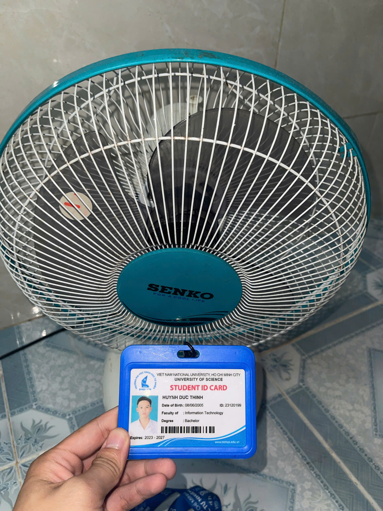

<strong>Hình R3-01: Quạt bàn Senko B1216 và thẻ sinh viên Huỳnh Đức Thịnh - MSSV 23120199 trong cùng một khung hình.</strong>

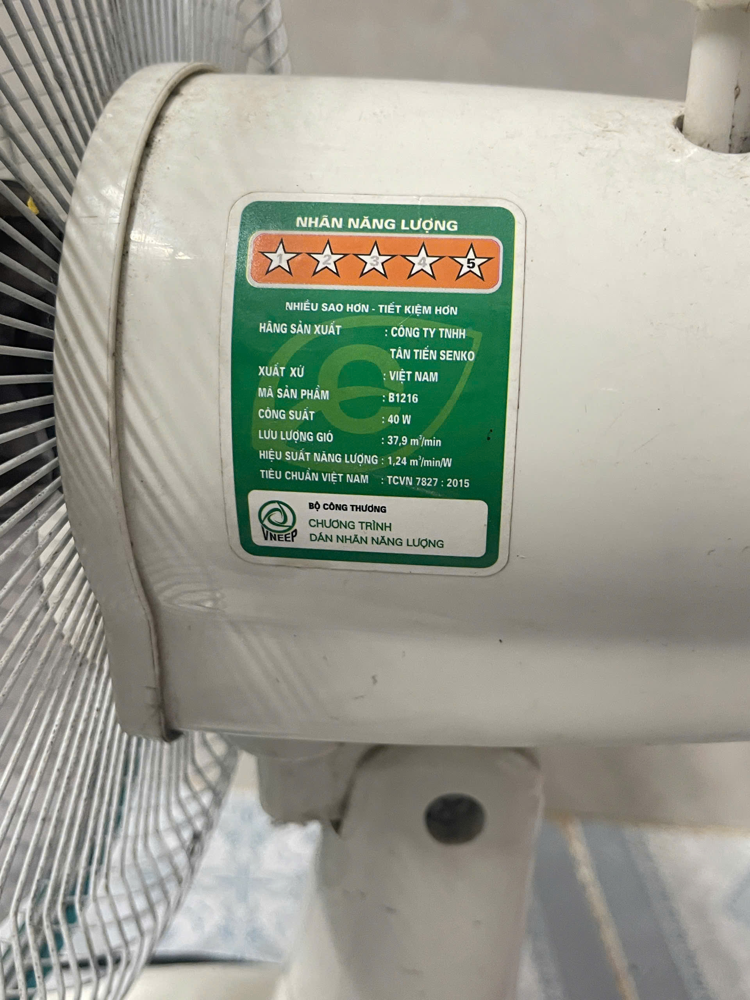

<strong>Hình R3-02: Nhãn năng lượng trên thân quạt Senko B1216, thể hiện hãng sản xuất, xuất xứ, công suất, lưu lượng gió, hiệu suất năng lượng và tiêu chuẩn áp dụng.</strong>

**Đối chiếu thông tin từ ảnh R3-02:**

- Hãng sản xuất: Công ty TNHH Tân Tiến Senko.
- Xuất xứ: Việt Nam.
- Mã sản phẩm: B1216.
- Công suất: 40 W.
- Lưu lượng gió: 37,9 m³/phút.
- Hiệu suất năng lượng: 1,24 m³/phút/W.
- Tiêu chuẩn Việt Nam: TCVN 7827:2015.
- Nhãn này không thể hiện năm sản xuất, serial number hoặc điện áp định mức.

**Phạm vi kiểm thử:** bật/tắt, ba mức tốc độ, chuyển đổi tốc độ, chức năng quay trái-phải, độ ổn định, nút điều khiển, tình trạng bên ngoài, dây điện/phích cắm và khả năng hoạt động liên tục.

---

### 3.2. Công cụ AI và prompt tạo test case ban đầu

AI được sử dụng để tạo bản nháp 15 test case đầu tiên. Sau khi nhận kết quả, sinh viên đánh giá tính khả thi, loại bỏ các giả định không phù hợp với thiết bị thật và yêu cầu AI chỉnh lại những test case chưa an toàn hoặc chưa có giá trị kiểm thử rõ ràng.

| Trường thông tin  | Nội dung                                                                                                                           |
| ----------------- | ---------------------------------------------------------------------------------------------------------------------------------- |
| Công cụ/model AI  | ChatGPT-5.6 Sol                                                                                                                    |
| Thời điểm sử dụng | 25/09/2026                                                                                                                         |
| Mục đích          | Sinh đúng 15 test case cho quạt bàn Senko sử dụng điện xoay chiều 220V, có ba mức gió, nút nhấn cơ học và chức năng quay trái-phải |
| Điều kiện đặt ra  | Test được tại phòng trọ                                                                                                            |

#### Prompt đã sử dụng

> Bạn là kỹ sư QA/QC đang thiết kế test case cho một sản phẩm vật lý thực tế.
>
> **THÔNG TIN SẢN PHẨM**
>
> - Sản phẩm: Quạt bàn gia dụng
> - Thương hiệu: Senko
> - Năm sản xuất hoặc năm mua: 2023
> - Nguồn điện: Điện xoay chiều 220V
> - Số mức gió: 3
> - Cơ chế điều khiển tốc độ: [nút nhấn]
> - Chức năng quay trái-phải: có
> - Cách bật chức năng quay: [nút nhấn phía sau]
> - Có thể điều chỉnh góc quạt lên-xuống: không
> - Chức năng hẹn giờ: không
> - Remote control: không
> - Đèn báo hoặc màn hình: không
> - Các chức năng khác: Không có
> - Dụng cụ kiểm thử có sẵn: đồng hồ bấm giờ, thước dây và giấy mỏng để quan sát luồng gió.
> - Môi trường kiểm thử: phòng ở sinh viên, mặt bàn bằng phẳng, sử dụng nguồn điện gia dụng bình thường.
>
> Hãy tạo chính xác 15 test case để kiểm thử chiếc quạt bàn cụ thể này.
>
> **PHẠM VI KIỂM THỬ**
>
> Bộ test case cần bao phủ hợp lý các nhóm sau:
>
> 1. Bật và tắt quạt.
> 2. Kiểm tra từng mức tốc độ gió.
> 3. Chuyển đổi giữa các mức tốc độ.
> 4. Chức năng quay trái-phải nếu quạt có hỗ trợ.
> 5. Điều chỉnh hướng gió lên-xuống nếu có hỗ trợ.
> 6. Độ ổn định của quạt trên mặt bàn.
> 7. Nút bấm hoặc núm điều khiển.
> 8. Tiếng ồn và rung động bất thường có thể quan sát được.
> 9. Dây điện, phích cắm và trạng thái hoạt động bình thường.
> 10. Khởi động lại sau khi tắt.
> 11. Phản ứng sau khi mất điện và được cấp điện trở lại.
> 12. Hoạt động liên tục trong thời gian hợp lý.
> 13. Thao tác không hợp lệ nhưng an toàn.
> 14. Tính nhất quán giữa trạng thái điều khiển và hoạt động thực tế.
> 15. Khả năng quan sát và sử dụng của người dùng.
>
> **YÊU CẦU AN TOÀN**
>
> - Chỉ tạo test case có thể thực hiện an toàn tại nhà.
> - Không yêu cầu tháo quạt hoặc mở lồng bảo vệ.
> - Không chạm tay hoặc đưa vật thể vào cánh quạt.
> - Không chặn cánh quạt hoặc motor khi quạt đang chạy.
> - Không thử nghiệm với nước, chất lỏng, lửa hoặc môi trường ẩm ướt.
> - Không thử quá áp, đấu nối điện hoặc làm hỏng dây điện.
> - Không thực hiện thử nghiệm có nguy cơ điện giật, cháy, hỏng thiết bị hoặc mất bảo hành.
> - Không để quạt hoạt động qua đêm hoặc không có người giám sát.
> - Không giả định quạt có chức năng không được liệt kê trong phần thông tin sản phẩm.
>
> **ĐỊNH DẠNG MỖI TEST CASE**
>
> Mỗi test case phải có đầy đủ:
>
> 1. Test Case ID
> 2. Test Case Title
> 3. Objective
> 4. Preconditions
> 5. Input
> 6. Steps
> 7. Expected Result
> 8. Actual Result
> 9. Verdict
>
> **QUY TẮC VIẾT**
>
> - Viết hoàn toàn bằng tiếng Việt.
> - Đánh số từ TC01 đến TC15.
> - Mỗi test case chỉ tập trung vào một mục tiêu kiểm thử chính.
> - Các bước phải cụ thể, có thứ tự và sinh viên có thể thực hiện được.
> - Expected Result phải rõ ràng, quan sát hoặc đo được bằng dụng cụ được liệt kê.
> - Không dùng các nhận xét mơ hồ như “quạt hoạt động tốt” mà không nêu dấu hiệu quan sát.
> - Không tự đặt tiêu chuẩn kỹ thuật về tốc độ gió, độ ồn hoặc nhiệt độ nếu không có tài liệu nhà sản xuất.
> - Không tuyên bố rằng test case đã được thực thi.
> - Điền “Chưa thực thi” vào Actual Result.
> - Điền “Not Executed” vào Verdict.
> - Trình bày từng test case thành một mục riêng, không gộp toàn bộ nội dung vào một bảng quá rộng.
> - Cuối câu trả lời, tạo một bảng tóm tắt gồm Test Case ID, tên test case và nhóm kiểm thử.

<strong>Hình R3-03: Prompt yêu cầu AI tạo đúng 15 test case cho quạt bàn Senko.</strong>

<strong>Hình R3-04: Kết quả test case ban đầu do AI tạo.</strong>

---

### 3.3. Đánh giá và hiệu chỉnh kết quả ban đầu của AI

Kết quả ban đầu của AI bao phủ được các chức năng cơ bản như bật/tắt, tốc độ gió và quay trái-phải. Tuy nhiên, một số test case còn ít giá trị phát hiện lỗi, trùng phạm vi hoặc sử dụng thao tác nguồn điện chưa tối ưu về an toàn. Em đã đánh giá và yêu cầu điều chỉnh trước khi hình thành bộ test cuối cùng.

| Test case ban đầu | Đánh giá                | Vấn đề được phát hiện                                                                          | Cách hiệu chỉnh trong bộ test cuối                                                |
| ----------------- | ----------------------- | ---------------------------------------------------------------------------------------------- | --------------------------------------------------------------------------------- |
| TC01-TC04         | Giữ lại và làm rõ       | Phù hợp với chức năng thật nhưng cần chuẩn hóa precondition, bước thực hiện và expected result | Giữ mục tiêu; bổ sung giấy mỏng, thời gian quan sát và điều kiện không có vật cản |
| TC05              | Thay thế                | Chỉ xác nhận thiết bị không có cơ cấu chỉnh góc lên-xuống nên khả năng phát hiện defect thấp   | Thay bằng kiểm tra trực quan lồng bảo vệ, thân và chân đế                         |
| TC06-TC08         | Giữ lại và làm rõ       | Phù hợp nhưng tiêu chí quan sát còn chung chung                                                | Bổ sung vị trí đánh dấu, thời gian chạy và dấu hiệu rung/tiếng động cần ghi nhận  |
| TC09              | Chỉnh sửa vì an toàn    | Bản đầu kết hợp kiểm tra dây điện với thao tác cấp điện                                        | Chỉ kiểm tra trực quan khi đã rút điện; nếu có dấu hiệu nguy hiểm phải dừng test  |
| TC10              | Thay thế bằng edge case | Test khởi động lại bình thường trùng một phần với TC01                                         | Kiểm tra trạng thái OFF sau chu kỳ mất/có điện                                    |
| TC11              | Chỉnh sửa vì an toàn    | Bản đầu yêu cầu rút và cắm phích khi đang vận hành                                             | Sử dụng công tắc ổ cắm và kiểm tra trạng thái mức 1 sau khi có điện lại           |
| TC12              | Giữ lại                 | Có giá trị kiểm tra stability theo thời gian                                                   | Duy trì test 30 phút có giám sát liên tục                                         |
| TC13              | Giữ lại như edge case   | Kiểm tra một trình tự ít gặp nhưng an toàn                                                     | Làm rõ trạng thái nút quay khi motor đang tắt và sau khi bật mức 1                |
| TC14              | Thay thế                | Nội dung về tính nhất quán tốc độ trùng nhiều với TC02 và TC03                                 | Thay bằng bật/tắt chức năng quay khi cánh quạt vẫn chạy                           |
| TC15              | Thay thế bằng edge case | Test usability khó có tiêu chí pass/fail khách quan                                            | Thay bằng theo dõi ba chu kỳ quay trái-phải liên tiếp                             |

Sau hiệu chỉnh, bộ test cuối gồm đúng 15 test case, không giả định chức năng ngoài thông tin sản phẩm và không yêu cầu tháo thiết bị hoặc sử dụng thiết bị đo chuyên dụng.

---

### 3.4. Bảng tổng hợp 15 test case cuối cùng

| ID       | Tên test case                        | Nhóm kiểm thử                    | Nguồn                                  | Mức ưu tiên | Thực thi      | Video | Kết quả      |
| -------- | ------------------------------------ | -------------------------------- | -------------------------------------- | ----------- | ------------- | ----- | ------------ |
| **TC01** | Bật và tắt quạt                      | Functional - Power               | AI-generated, em đã hiệu chỉnh         | High        | Chưa thực thi | -     | Not Executed |
| **TC02** | Ba mức tốc độ gió                    | Functional - Speed               | AI-generated, em đã hiệu chỉnh         | High        | Chưa thực thi | -     | Not Executed |
| **TC03** | Chuyển đổi giữa các mức tốc độ       | Functional - State Transition    | AI-generated, em đã hiệu chỉnh         | High        | Chưa thực thi | -     | Not Executed |
| **TC04** | Chức năng quay trái-phải             | Functional - Oscillation         | AI-generated, em đã hiệu chỉnh         | High        | Chưa thực thi | -     | Not Executed |
| **TC05** | Kiểm tra trực quan bộ phận bên ngoài | Safety - Physical Inspection     | AI-generated, em đã hiệu chỉnh         | High        | Chưa thực thi | -     | Not Executed |
| **TC06** | Độ ổn định trên mặt bàn              | Stability                        | AI-generated, em đã hiệu chỉnh         | High        | Chưa thực thi | -     | Not Executed |
| **TC07** | Các nút nhấn điều khiển              | Functional - Controls            | AI-generated, em đã hiệu chỉnh         | High        | Chưa thực thi | -     | Not Executed |
| **TC08** | Tiếng ồn và rung động bất thường     | Non-functional - Noise/Vibration | AI-generated, em đã hiệu chỉnh         | Medium      | Chưa thực thi | -     | Not Executed |
| **TC09** | Dây điện và phích cắm                | Safety - Electrical Inspection   | AI-generated, em đã hiệu chỉnh         | High        | Chưa thực thi | -     | Not Executed |
| **TC10** | Trạng thái OFF sau khi mất điện      | Edge case - Power Recovery       | Bổ sung sau đánh giá output AI ban đầu | High        | Chưa thực thi | -     | Not Executed |
| **TC11** | Mất điện khi đang chạy mức 1         | Edge case - Power Recovery       | Bổ sung sau đánh giá output AI ban đầu | High        | Chưa thực thi | -     | Not Executed |
| **TC12** | Hoạt động liên tục 30 phút           | Stability - Endurance            | AI-generated, em đã hiệu chỉnh         | Medium      | Chưa thực thi | -     | Not Executed |
| **TC13** | Nút quay khi motor đang tắt          | Edge case - State Combination    | Bổ sung sau đánh giá output AI ban đầu | Medium      | Chưa thực thi | -     | Not Executed |
| **TC14** | Bật/tắt chức năng quay khi đang chạy | Functional - Oscillation Control | AI-generated, em đã hiệu chỉnh         | High        | Chưa thực thi | -     | Not Executed |
| **TC15** | Ba chu kỳ quay trái-phải liên tiếp   | Edge case - Repeated Operation   | Bổ sung sau đánh giá output AI ban đầu | Medium      | Chưa thực thi | -     | Not Executed |

---

### 3.5. Test case chi tiết

#### TC01 - Kiểm tra bật và tắt quạt

| Trường                  | Nội dung                                                                                                                                                                                                                                                                                                                                                                                                                           |
| ----------------------- | ---------------------------------------------------------------------------------------------------------------------------------------------------------------------------------------------------------------------------------------------------------------------------------------------------------------------------------------------------------------------------------------------------------------------------------- |
| **Test Case ID**        | TC01                                                                                                                                                                                                                                                                                                                                                                                                                               |
| **Test Case Title**     | Kiểm tra bật và tắt quạt bằng nút điều khiển                                                                                                                                                                                                                                                                                                                                                                                       |
| **Nhóm kiểm thử**       | Functional - Power On/Off                                                                                                                                                                                                                                                                                                                                                                                                          |
| **Mức ưu tiên**         | High                                                                                                                                                                                                                                                                                                                                                                                                                               |
| **Objective**           | Xác minh quạt nhận đúng lệnh bật ở mức gió 1, tạo được luồng gió và dừng hoàn toàn khi nhấn OFF; đồng thời quan sát các dấu hiệu bất thường có thể xuất hiện trong quá trình khởi động hoặc dừng.                                                                                                                                                                                                                                  |
| **Preconditions**       | Quạt đặt trên mặt bàn phẳng, khô và cách mép bàn an toàn; lồng bảo vệ, dây điện và phích cắm không có hư hỏng dễ quan sát; khu vực phía trước quạt không có vật cản; nút OFF đang được chọn; quạt đã kết nối với nguồn điện 220V bình thường.                                                                                                                                                                                      |
| **Input**               | Nút mức gió 1, nút OFF; thời gian quan sát tối thiểu 10 giây sau khi bật.                                                                                                                                                                                                                                                                                                                                                          |
| **Steps**               | 1. Kiểm tra khu vực quanh quạt và xác nhận cánh đang đứng yên. 2. Đặt giấy mỏng phía trước quạt ở khoảng cách khoảng 50 cm. 3. Nhấn nút mức gió 1 và bắt đầu bấm giờ. 4. Quan sát cánh quạt, chuyển động của giấy và âm thanh trong ít nhất 10 giây. 5. Kiểm tra nhanh xem có mùi khét, tia lửa hoặc rung bất thường hay không. 6. Nhấn nút OFF. 7. Quan sát quá trình giảm tốc cho đến khi cánh dừng hoàn toàn. |
| **Expected Result**     | Khi chọn mức 1, nút được giữ đúng vị trí, motor khởi động, cánh quay liên tục và giấy chuyển động do luồng gió. Khi nhấn OFF, motor ngừng cấp lực, cánh giảm tốc tự nhiên rồi dừng hoàn toàn. Quạt không tự khởi động lại và không xuất hiện tia lửa, mùi khét, tiếng cọ xát hoặc rung bất thường.                                                                                                                                 |
| **Pass Criteria**       | Quạt bật, tạo gió và tắt đúng theo thao tác; không có dấu hiệu mất an toàn.                                                                                                                                                                                                                                                                                                                                                        |
| **Fail Criteria**       | Quạt không khởi động hoặc không dừng; nút bị kẹt; cánh quay gián đoạn; xuất hiện tia lửa, mùi khét, tiếng cọ xát hoặc rung mạnh.                                                                                                                                                                                                                                                                                                   |
| **Điều kiện dừng test** | Ngắt nguồn bằng công tắc ổ cắm ngay nếu có tia lửa, mùi khét, tiếng va chạm hoặc rung mạnh.                                                                                                                                                                                                                                                                                                                                        |
| **Actual Result**       | Chưa thực thi.                                                                                                                                                                                                                                                                                                                                                                                                                     |
| **Verdict**             | Not Executed                                                                                                                                                                                                                                                                                                                                                                                                                       |
| **Evidence/Defect**     | Video liên tục thấy thao tác chọn mức 1, giấy chuyển động, thao tác OFF và cánh dừng; ghi Defect ID nếu test Fail.                                                                                                                                                                                                                                                                                                                 |

---

#### TC02 - Kiểm tra ba mức tốc độ gió

| Trường                  | Nội dung                                                                                                                                                                                                                                                                                                                                                                                                                                         |
| ----------------------- | ------------------------------------------------------------------------------------------------------------------------------------------------------------------------------------------------------------------------------------------------------------------------------------------------------------------------------------------------------------------------------------------------------------------------------------------------ |
| **Test Case ID**        | TC02                                                                                                                                                                                                                                                                                                                                                                                                                                             |
| **Test Case Title**     | Kiểm tra mức gió 1, 2 và 3                                                                                                                                                                                                                                                                                                                                                                                                                       |
| **Nhóm kiểm thử**       | Functional - Speed Levels                                                                                                                                                                                                                                                                                                                                                                                                                        |
| **Mức ưu tiên**         | High                                                                                                                                                                                                                                                                                                                                                                                                                                             |
| **Objective**           | Xác minh cả ba mức tốc độ 1, 2 và 3 đều hoạt động; mỗi mức tạo được luồng gió; cường độ luồng gió quan sát được tăng tương ứng với mức được chọn.                                                                                                                                                                                                                                                                                                |
| **Preconditions**       | Quạt đặt cố định trên mặt bàn phẳng; chức năng quay trái-phải đang tắt; đầu quạt hướng thẳng về vị trí đo; giấy mỏng được đặt và giữ tại cùng một vị trí cách lồng quạt khoảng 50 cm; phòng không có luồng gió bên ngoài ảnh hưởng đáng kể.                                                                                                                                                                                                      |
| **Input**               | Lần lượt các nút mức gió 1, 2 và 3; thời gian ổn định 10 giây cho mỗi mức.                                                                                                                                                                                                                                                                                                                                                                       |
| **Steps**               | 1. Xác nhận quạt đang OFF và chức năng quay trái-phải đã tắt. 2. Dùng thước đặt giấy cách lồng quạt 50 cm và đánh dấu vị trí. 3. Chọn mức 1, chờ 10 giây rồi ghi nhận chuyển động của giấy. 4. Giữ nguyên hướng quạt và vị trí giấy; chuyển sang mức 2, chờ 10 giây và ghi nhận. 5. Chuyển sang mức 3, tiếp tục chờ 10 giây và ghi nhận. 6. Nhấn OFF. 7. So sánh mức độ chuyển động của giấy trong ba lần theo cùng điều kiện. |
| **Expected Result**     | Cả ba nút tốc độ đều làm cánh quạt quay ổn định và tạo luồng gió. Chuyển động của giấy có sự khác biệt quan sát được; mức 2 mạnh hơn mức 1 và mức 3 mạnh hơn mức 2. Không có mức nào mất chức năng, duy trì trạng thái của mức trước hoặc phản ứng giống OFF.                                                                                                                                                                                    |
| **Pass Criteria**       | Ba mức đều hoạt động và cho thứ tự cường độ luồng gió nhất quán 1 < 2 < 3.                                                                                                                                                                                                                                                                                                                                                                       |
| **Fail Criteria**       | Một mức không hoạt động; tốc độ không thay đổi khi chuyển nút; cường độ không theo thứ tự mong đợi; quạt dừng ngoài ý muốn.                                                                                                                                                                                                                                                                                                                      |
| **Điều kiện dừng test** | Dừng nếu giấy có nguy cơ bị hút vào lồng hoặc quạt xuất hiện rung, mùi hay tiếng bất thường.                                                                                                                                                                                                                                                                                                                                                     |
| **Actual Result**       | Chưa thực thi.                                                                                                                                                                                                                                                                                                                                                                                                                                   |
| **Verdict**             | Not Executed                                                                                                                                                                                                                                                                                                                                                                                                                                     |
| **Evidence/Defect**     | Video thấy rõ nút đang chọn và giấy tại cùng vị trí ở cả ba mức; bảng ghi nhận quan sát từng mức; Defect ID nếu Fail.                                                                                                                                                                                                                                                                                                                            |

---

#### TC03 - Kiểm tra chuyển đổi giữa các mức tốc độ

| Trường                  | Nội dung                                                                                                                                                                                                                                                                                                                                                                                                           |
| ----------------------- | ------------------------------------------------------------------------------------------------------------------------------------------------------------------------------------------------------------------------------------------------------------------------------------------------------------------------------------------------------------------------------------------------------------------ |
| **Test Case ID**        | TC03                                                                                                                                                                                                                                                                                                                                                                                                               |
| **Test Case Title**     | Kiểm tra chuyển đổi tốc độ khi quạt đang chạy                                                                                                                                                                                                                                                                                                                                                                      |
| **Nhóm kiểm thử**       | Functional - State Transition                                                                                                                                                                                                                                                                                                                                                                                      |
| **Mức ưu tiên**         | High                                                                                                                                                                                                                                                                                                                                                                                                               |
| **Objective**           | Xác minh quạt có thể chuyển trực tiếp giữa các mức tốc độ khi đang chạy mà không cần qua OFF; trạng thái nút và luồng gió phải phản ánh đúng mức mới.                                                                                                                                                                                                                                                              |
| **Preconditions**       | Quạt đã được cấp điện và hoạt động bình thường; chức năng quay trái-phải tắt; giấy mỏng đặt cố định phía trước; các nút không có dấu hiệu kẹt.                                                                                                                                                                                                                                                                     |
| **Input**               | Chuỗi chuyển trạng thái `OFF → 1 → 3 → 2 → 1 → OFF`, chờ 5 giây tại mỗi mức.                                                                                                                                                                                                                                                                                                                                       |
| **Steps**               | 1. Xác nhận quạt OFF và cánh đứng yên. 2. Chọn mức 1, chờ 5 giây và ghi nhận luồng gió. 3. Nhấn trực tiếp mức 3 mà không qua OFF; kiểm tra nút mức 1 nhả, chờ 5 giây và ghi nhận. 4. Chuyển trực tiếp sang mức 2; chờ 5 giây và ghi nhận. 5. Chuyển về mức 1; chờ 5 giây và ghi nhận. 6. Sau mỗi lần chuyển, kiểm tra nút mới được giữ và quạt không dừng ngoài ý muốn. 7. Nhấn OFF để kết thúc. |
| **Expected Result**     | Mỗi lần nhấn, nút mới được chọn và nút cũ nhả theo đúng cơ chế. Motor tiếp tục hoạt động; luồng gió tăng khi chuyển 1 → 3, giảm khi chuyển 3 → 2 → 1 và ổn định trong thời gian chờ. Quạt chỉ dừng khi nhấn OFF.                                                                                                                                                                                                   |
| **Pass Criteria**       | Hoàn thành đúng toàn bộ chuỗi chuyển mức; trạng thái nút và luồng gió phù hợp ở mọi bước.                                                                                                                                                                                                                                                                                                                          |
| **Fail Criteria**       | Nút cũ không nhả, nút mới không giữ, quạt dừng, tốc độ không đổi hoặc phản ứng không đúng mức được chọn.                                                                                                                                                                                                                                                                                                           |
| **Điều kiện dừng test** | Không cố nhấn nếu nút bị kẹt; ngắt nguồn nếu motor phát tiếng bất thường hoặc có mùi khét.                                                                                                                                                                                                                                                                                                                         |
| **Actual Result**       | Chưa thực thi.                                                                                                                                                                                                                                                                                                                                                                                                     |
| **Verdict**             | Not Executed                                                                                                                                                                                                                                                                                                                                                                                                       |
| **Evidence/Defect**     | Video cận cảnh cụm nút và giấy thể hiện phản ứng trong toàn bộ chuỗi; Defect ID nếu có chuyển trạng thái sai.                                                                                                                                                                                                                                                                                                      |

---

#### TC04 - Kiểm tra chức năng quay trái-phải

| Trường                  | Nội dung                                                                                                                                                                                                                                                                                                                                                                                                             |
| ----------------------- | -------------------------------------------------------------------------------------------------------------------------------------------------------------------------------------------------------------------------------------------------------------------------------------------------------------------------------------------------------------------------------------------------------------------- |
| **Test Case ID**        | TC04                                                                                                                                                                                                                                                                                                                                                                                                                 |
| **Test Case Title**     | Kiểm tra chức năng quay trái-phải                                                                                                                                                                                                                                                                                                                                                                                    |
| **Nhóm kiểm thử**       | Functional - Oscillation                                                                                                                                                                                                                                                                                                                                                                                             |
| **Mức ưu tiên**         | High                                                                                                                                                                                                                                                                                                                                                                                                                 |
| **Objective**           | Xác minh đầu quạt tự di chuyển sang cả bên trái và bên phải, đồng thời tự đổi hướng tại hai đầu hành trình khi chức năng quay được kích hoạt.                                                                                                                                                                                                                                                                        |
| **Preconditions**       | Quạt đặt trên mặt bàn phẳng, chắc chắn; có đủ khoảng trống ở hai bên đầu quạt; dây điện không bị căng; quạt đang chạy ổn định ở mức 1; không có người hoặc vật trong vùng chuyển động.                                                                                                                                                                                                                               |
| **Input**               | Nút điều khiển quay phía sau đầu quạt; thời gian quan sát tối thiểu 30 giây.                                                                                                                                                                                                                                                                                                                                         |
| **Steps**               | 1. Dọn trống vùng chuyển động và đưa đầu quạt gần vị trí trung tâm. 2. Bật quạt ở mức 1. 3. Kích hoạt nút quay phía sau mà không dùng tay ép đầu quạt. 4. Bắt đầu bấm giờ và quan sát toàn bộ đầu quạt. 5. Theo dõi ít nhất một lần đi về bên trái, một lần đi về bên phải và sự đổi hướng tại hai đầu hành trình. 6. Tiếp tục quan sát tối thiểu 30 giây. 7. Tắt chức năng quay, sau đó nhấn OFF. |
| **Expected Result**     | Đầu quạt tự di chuyển về cả hai phía và tự đổi hướng tại đầu hành trình. Chuyển động tương đối đều, không va vào thân, không kẹt, giật mạnh hoặc dừng giữa đường. Cánh quạt và luồng gió vẫn duy trì trong toàn bộ phép thử.                                                                                                                                                                                         |
| **Pass Criteria**       | Quan sát được chuyển động hai chiều và ít nhất một lần đổi hướng bình thường tại mỗi phía.                                                                                                                                                                                                                                                                                                                           |
| **Fail Criteria**       | Đầu quạt không di chuyển, chỉ đi một phía, kẹt/dừng, va chạm, giật mạnh hoặc phát tiếng cơ học bất thường.                                                                                                                                                                                                                                                                                                           |
| **Điều kiện dừng test** | Tắt chức năng quay ngay nếu đầu quạt gặp vật cản, va chạm, rung mạnh hoặc phát tiếng kẹt.                                                                                                                                                                                                                                                                                                                            |
| **Actual Result**       | Chưa thực thi.                                                                                                                                                                                                                                                                                                                                                                                                       |
| **Verdict**             | Not Executed                                                                                                                                                                                                                                                                                                                                                                                                         |
| **Evidence/Defect**     | Video toàn cảnh thấy đầu quạt, hai đầu hành trình và ít nhất một lần đổi hướng; Defect ID nếu Fail.                                                                                                                                                                                                                                                                                                                  |

---

#### TC05 - Kiểm tra trực quan các bộ phận bên ngoài

| Trường                  | Nội dung                                                                                                                                                                                                                                                                                                                                                                                                                                                                                   |
| ----------------------- | ------------------------------------------------------------------------------------------------------------------------------------------------------------------------------------------------------------------------------------------------------------------------------------------------------------------------------------------------------------------------------------------------------------------------------------------------------------------------------------------ |
| **Test Case ID**        | TC05                                                                                                                                                                                                                                                                                                                                                                                                                                                                                       |
| **Test Case Title**     | Kiểm tra lồng bảo vệ, chân đế và bộ phận bên ngoài                                                                                                                                                                                                                                                                                                                                                                                                                                         |
| **Nhóm kiểm thử**       | Safety - Physical Inspection                                                                                                                                                                                                                                                                                                                                                                                                                                                               |
| **Mức ưu tiên**         | High                                                                                                                                                                                                                                                                                                                                                                                                                                                                                       |
| **Objective**           | Xác minh lồng bảo vệ, thân, chân đế, vỏ motor và các nút điều khiển không có hư hỏng bên ngoài rõ ràng có thể ảnh hưởng đến khả năng bảo vệ, độ ổn định hoặc an toàn sử dụng.                                                                                                                                                                                                                                                                                                              |
| **Preconditions**       | Quạt đang OFF; phích cắm đã rút khỏi nguồn; dây được đặt cách xa ổ điện; quạt đặt trên bàn phẳng; khu vực có đủ ánh sáng; cánh quạt đã dừng hoàn toàn.                                                                                                                                                                                                                                                                                                                                     |
| **Input**               | Toàn bộ bộ phận quan sát được từ bên ngoài: lồng trước/sau, điểm nối, cánh nhìn qua lồng, nắp motor, thân, chân đế, vỏ ngoài và cụm nút.                                                                                                                                                                                                                                                                                                                                                   |
| **Steps**               | 1. Xác nhận phích cắm ở ngoài ổ điện. 2. Quan sát toàn chu vi lồng trước, các khe lồng và điểm nối. 3. Quan sát lồng sau, nắp motor và vị trí nối đầu quạt với thân. 4. Tìm dấu nứt, gãy, méo, rỉ sét, dấu cháy, cạnh sắc hoặc chi tiết lỏng. 5. Quan sát thân, chân đế, bề mặt tiếp xúc bàn và khu vực các nút. 6. Ấn nhẹ từng nút khi chưa cấp điện để kiểm tra chi tiết lỏng; không tháo vỏ và không đưa tay xuyên lồng. 7. Chụp ảnh vị trí bất thường nếu phát hiện. |
| **Expected Result**     | Lồng bảo vệ nguyên vẹn, không biến dạng đến mức có thể tiếp xúc với cánh. Thân, vỏ motor và chân đế không nứt/gãy; không có cạnh sắc, dấu cháy hoặc chi tiết sắp rơi. Các nút ở đúng vị trí và thao tác được bằng lực thông thường.                                                                                                                                                                                                                                                        |
| **Pass Criteria**       | Không phát hiện hư hỏng bên ngoài làm giảm khả năng bảo vệ, điều khiển hoặc độ ổn định.                                                                                                                                                                                                                                                                                                                                                                                                    |
| **Fail Criteria**       | Lồng gãy/méo lớn, bộ phận lỏng, chân đế nứt, cạnh sắc, dấu cháy hoặc hư hỏng có nguy cơ tiếp xúc với cánh/phần điện.                                                                                                                                                                                                                                                                                                                                                                       |
| **Điều kiện dừng test** | Không cấp điện cho quạt nếu phát hiện bất kỳ hư hỏng nào có thể gây mất an toàn.                                                                                                                                                                                                                                                                                                                                                                                                           |
| **Actual Result**       | Chưa thực thi.                                                                                                                                                                                                                                                                                                                                                                                                                                                                             |
| **Verdict**             | Not Executed                                                                                                                                                                                                                                                                                                                                                                                                                                                                               |
| **Evidence/Defect**     | Ảnh toàn cảnh trước/sau, ảnh chân đế/cụm nút và ảnh cận cảnh vị trí bất thường; Defect ID nếu Fail.                                                                                                                                                                                                                                                                                                                                                                                        |

---

#### TC06 - Kiểm tra độ ổn định trên mặt bàn

| Trường                  | Nội dung                                                                                                                                                                                                                                                                                                                                                                                       |
| ----------------------- | ---------------------------------------------------------------------------------------------------------------------------------------------------------------------------------------------------------------------------------------------------------------------------------------------------------------------------------------------------------------------------------------------- |
| **Test Case ID**        | TC06                                                                                                                                                                                                                                                                                                                                                                                           |
| **Test Case Title**     | Kiểm tra độ ổn định của quạt khi hoạt động                                                                                                                                                                                                                                                                                                                                                     |
| **Nhóm kiểm thử**       | Stability                                                                                                                                                                                                                                                                                                                                                                                      |
| **Mức ưu tiên**         | High                                                                                                                                                                                                                                                                                                                                                                                           |
| **Objective**           | Xác minh quạt đứng vững và không tự dịch chuyển đáng kể trên mặt bàn khi vận hành ở tốc độ cao nhất trong hai phút.                                                                                                                                                                                                                                                                            |
| **Preconditions**       | Mặt bàn phẳng, khô, không rung và đủ rộng; quạt cách mép bàn một khoảng an toàn; chân đế sạch; chức năng quay trái-phải tắt; vị trí chân đế đã được đánh dấu.                                                                                                                                                                                                                                  |
| **Input**               | Mức gió 3; thời gian vận hành 2 phút.                                                                                                                                                                                                                                                                                                                                                          |
| **Steps**               | 1. Kiểm tra bàn không nghiêng hoặc rung rõ ràng. 2. Đặt quạt cách mép bàn an toàn. 3. Đánh dấu vị trí bốn phía chân đế và chụp ảnh trước test. 4. Tắt chức năng quay rồi chọn mức 3. 5. Bắt đầu bấm giờ; không chạm vào bàn hoặc quạt trong 2 phút. 6. Quan sát rung, nghiêng và dịch chuyển trong lúc chạy. 7. Nhấn OFF, chờ cánh dừng rồi so sánh chân đế với mốc ban đầu. |
| **Expected Result**     | Chân đế tiếp xúc ổn định với bàn; quạt không nghiêng, nhấc chân hoặc có xu hướng đổ; vị trí sau test không lệch rõ ràng khỏi vùng đánh dấu. Rung thông thường của motor không làm quạt di chuyển liên tục.                                                                                                                                                                                     |
| **Pass Criteria**       | Quạt đứng vững suốt 2 phút và không dịch chuyển quan sát được khỏi vùng đánh dấu.                                                                                                                                                                                                                                                                                                              |
| **Fail Criteria**       | Quạt trượt khỏi mốc, lắc mạnh, chân đế nhấc khỏi bàn hoặc có xu hướng đổ.                                                                                                                                                                                                                                                                                                                      |
| **Điều kiện dừng test** | Tắt ngay nếu quạt tiến gần mép bàn, rung tăng nhanh hoặc có nguy cơ đổ.                                                                                                                                                                                                                                                                                                                        |
| **Actual Result**       | Chưa thực thi.                                                                                                                                                                                                                                                                                                                                                                                 |
| **Verdict**             | Not Executed                                                                                                                                                                                                                                                                                                                                                                                   |
| **Evidence/Defect**     | Ảnh vị trí chân đế trước/sau và video quá trình chạy; ghi khoảng dịch chuyển quan sát được và Defect ID nếu Fail.                                                                                                                                                                                                                                                                              |

---

#### TC07 - Kiểm tra các nút nhấn điều khiển

| Trường                  | Nội dung                                                                                                                                                                                                                                                                                                                                                                                                              |
| ----------------------- | --------------------------------------------------------------------------------------------------------------------------------------------------------------------------------------------------------------------------------------------------------------------------------------------------------------------------------------------------------------------------------------------------------------------- |
| **Test Case ID**        | TC07                                                                                                                                                                                                                                                                                                                                                                                                                  |
| **Test Case Title**     | Kiểm tra khả năng thao tác các nút điều khiển                                                                                                                                                                                                                                                                                                                                                                         |
| **Nhóm kiểm thử**       | Functional - Controls                                                                                                                                                                                                                                                                                                                                                                                                 |
| **Mức ưu tiên**         | High                                                                                                                                                                                                                                                                                                                                                                                                                  |
| **Objective**           | Xác minh nút OFF và các nút mức 1, 2, 3 có thể được nhấn bằng lực thông thường, chuyển trạng thái cơ học đúng và tạo ra phản ứng vận hành tương ứng một cách nhất quán.                                                                                                                                                                                                                                               |
| **Preconditions**       | Quạt đặt ổn định; dây/phích đã qua kiểm tra trực quan; quạt được cấp điện bình thường; các nút không có vật cản.                                                                                                                                                                                                                                                                                                      |
| **Input**               | Hai vòng thao tác theo chuỗi `1 → 2 → 3 → OFF`.                                                                                                                                                                                                                                                                                                                                                                       |
| **Steps**               | 1. Quan sát và xác nhận các nút không kẹt trước khi thử. 2. Nhấn mức 1; kiểm tra vị trí nút và phản ứng của quạt. 3. Nhấn mức 2; kiểm tra nút mức 1 nhả, mức 2 được giữ và luồng gió thay đổi. 4. Lặp lại với mức 3. 5. Nhấn OFF; kiểm tra nút tốc độ nhả và cánh giảm tốc. 6. Lặp lại toàn bộ chuỗi lần thứ hai. 7. Ghi nhận nút lỏng, lún, kẹt, cần lực bất thường hoặc phản hồi không nhất quán. |
| **Expected Result**     | Mỗi nút được nhấn bằng lực thông thường; nút mới được giữ và trạng thái trước được giải phóng đúng cơ chế. Tốc độ quạt phản ánh mức 1/2/3; OFF làm quạt dừng. Hai vòng thử cho kết quả nhất quán.                                                                                                                                                                                                                     |
| **Pass Criteria**       | Tất cả bốn nút hoạt động đúng và nhất quán trong cả hai vòng.                                                                                                                                                                                                                                                                                                                                                         |
| **Fail Criteria**       | Một nút không nhấn được, không giữ/nhả, phản hồi sai mức, bị kẹt hoặc cho hành vi khác nhau giữa hai vòng.                                                                                                                                                                                                                                                                                                            |
| **Điều kiện dừng test** | Không cố dùng lực nếu nút kẹt; ngắt nguồn bằng công tắc ổ cắm nếu không thể dùng OFF để dừng quạt.                                                                                                                                                                                                                                                                                                                    |
| **Actual Result**       | Chưa thực thi.                                                                                                                                                                                                                                                                                                                                                                                                        |
| **Verdict**             | Not Executed                                                                                                                                                                                                                                                                                                                                                                                                          |
| **Evidence/Defect**     | Video cận cảnh cụm nút và phản ứng của quạt trong hai vòng; ghi nút/vòng xảy ra lỗi và Defect ID.                                                                                                                                                                                                                                                                                                                     |

---

#### TC08 - Kiểm tra tiếng ồn và rung động bất thường

| Trường                  | Nội dung                                                                                                                                                                                                                                                                                                                                                                                                                                  |
| ----------------------- | ----------------------------------------------------------------------------------------------------------------------------------------------------------------------------------------------------------------------------------------------------------------------------------------------------------------------------------------------------------------------------------------------------------------------------------------- |
| **Test Case ID**        | TC08                                                                                                                                                                                                                                                                                                                                                                                                                                      |
| **Test Case Title**     | Quan sát tiếng ồn và rung động bất thường                                                                                                                                                                                                                                                                                                                                                                                                 |
| **Nhóm kiểm thử**       | Non-functional - Noise/Vibration                                                                                                                                                                                                                                                                                                                                                                                                          |
| **Mức ưu tiên**         | Medium                                                                                                                                                                                                                                                                                                                                                                                                                                    |
| **Objective**           | Phát hiện tiếng cọ xát, va đập, lạch cạch hoặc rung bất thường ở ba mức tốc độ và khi cơ cấu quay trái-phải hoạt động.                                                                                                                                                                                                                                                                                                                    |
| **Preconditions**       | Phòng tương đối yên tĩnh; quạt đặt trên bàn phẳng; không có đồ vật chạm vào quạt hoặc vật dễ cộng hưởng trên bàn; lồng và chân đế đã qua kiểm tra trực quan.                                                                                                                                                                                                                                                                              |
| **Input**               | Các mức gió 1, 2, 3 trong 20 giây mỗi mức; chức năng quay trái-phải ở mức 2 trong 20 giây.                                                                                                                                                                                                                                                                                                                                                |
| **Steps**               | 1. Tắt các nguồn âm thanh không cần thiết và kiểm tra không có vật chạm quạt. 2. Chạy mức 1 trong 20 giây; nghe tại khoảng cách sử dụng bình thường và quan sát thân/chân đế. 3. Lặp lại với mức 2 trong 20 giây. 4. Lặp lại với mức 3 trong 20 giây. 5. Chuyển về mức 2, bật chức năng quay và quan sát thêm 20 giây. 6. Ghi mức và thời điểm nếu xuất hiện tiếng cọ, gõ, lạch cạch hoặc rung bất thường. 7. Nhấn OFF. |
| **Expected Result**     | Âm thanh motor và luồng gió có thể tăng theo tốc độ nhưng phải duy trì đều. Không có tiếng va đập tuần hoàn, tiếng cánh cọ lồng hoặc tiếng kẹt cơ cấu quay. Thân và chân đế không rung đến mức dịch chuyển hoặc mất ổn định.                                                                                                                                                                                                              |
| **Pass Criteria**       | Không phát hiện tiếng hoặc rung bất thường ở cả ba mức và khi quay trái-phải.                                                                                                                                                                                                                                                                                                                                                             |
| **Fail Criteria**       | Có tiếng cọ xát, va đập, lạch cạch kéo dài/lặp lại, rung mạnh hoặc chân đế dịch chuyển.                                                                                                                                                                                                                                                                                                                                                   |
| **Điều kiện dừng test** | Tắt ngay nếu có tiếng va chạm lớn, rung tăng nhanh hoặc nghi ngờ cánh chạm lồng.                                                                                                                                                                                                                                                                                                                                                          |
| **Actual Result**       | Chưa thực thi.                                                                                                                                                                                                                                                                                                                                                                                                                            |
| **Verdict**             | Not Executed                                                                                                                                                                                                                                                                                                                                                                                                                              |
| **Evidence/Defect**     | Video/âm thanh cho từng mức và lúc chức năng quay hoạt động; ghi mốc thời gian và Defect ID nếu phát hiện bất thường.                                                                                                                                                                                                                                                                                                                     |

---

#### TC09 - Kiểm tra dây điện và phích cắm

| Trường                  | Nội dung                                                                                                                                                                                                                                                                                                                                                                                                                                                                                                   |
| ----------------------- | ---------------------------------------------------------------------------------------------------------------------------------------------------------------------------------------------------------------------------------------------------------------------------------------------------------------------------------------------------------------------------------------------------------------------------------------------------------------------------------------------------------- |
| **Test Case ID**        | TC09                                                                                                                                                                                                                                                                                                                                                                                                                                                                                                       |
| **Test Case Title**     | Kiểm tra trực quan dây điện và phích cắm trước khi cấp điện                                                                                                                                                                                                                                                                                                                                                                                                                                                |
| **Nhóm kiểm thử**       | Safety - Electrical Inspection                                                                                                                                                                                                                                                                                                                                                                                                                                                                             |
| **Mức ưu tiên**         | High                                                                                                                                                                                                                                                                                                                                                                                                                                                                                                       |
| **Objective**           | Xác minh lớp cách điện, điểm nối, thân phích và chân cắm không có dấu hiệu hư hỏng nguy hiểm dễ quan sát trước khi cho phép thực hiện các test có cấp điện.                                                                                                                                                                                                                                                                                                                                                |
| **Preconditions**       | Quạt OFF; phích đã rút hoàn toàn khỏi nguồn; tay người kiểm thử và khu vực kiểm tra khô; cánh quạt đã dừng; có đủ ánh sáng.                                                                                                                                                                                                                                                                                                                                                                                |
| **Input**               | Toàn bộ chiều dài dây điện, vị trí dây đi vào thân quạt, điểm nối dây-phích, thân phích và hai chân cắm.                                                                                                                                                                                                                                                                                                                                                                                                   |
| **Steps**               | 1. Xác nhận phích nằm ngoài ổ cắm và tay khô. 2. Bắt đầu từ vị trí dây đi ra khỏi thân quạt, quan sát chậm dọc toàn bộ chiều dài. 3. Kiểm tra dấu nứt, bong vỏ, dây hở, vết cháy, vị trí bị ép hoặc gập nghiêm trọng. 4. Quan sát điểm nối dây với thân phích. 5. Kiểm tra thân phích có nứt, cháy hoặc biến dạng; kiểm tra hai chân cắm có thẳng và chắc bằng quan sát bên ngoài. 6. Chụp ảnh bất thường nếu có. 7. Chỉ cho phép thực hiện test có nguồn khi không phát hiện nguy hiểm. |
| **Expected Result**     | Lớp cách điện liên tục và nguyên vẹn; không thấy lõi dẫn điện; thân phích và điểm nối không nứt/cháy; chân cắm không cong hoặc lỏng rõ ràng. Nếu phát hiện dấu hiệu nguy hiểm, quạt không được cấp điện.                                                                                                                                                                                                                                                                                                   |
| **Pass Criteria**       | Không phát hiện hư hỏng nguy hiểm bằng kiểm tra trực quan.                                                                                                                                                                                                                                                                                                                                                                                                                                                 |
| **Fail Criteria**       | Có dây hở, vỏ nứt/cháy, phích vỡ, chân cắm biến dạng/lỏng hoặc điểm nối dây bong tách.                                                                                                                                                                                                                                                                                                                                                                                                                     |
| **Điều kiện dừng test** | Nếu phát hiện bất kỳ dấu hiệu điện nguy hiểm nào, dừng toàn bộ test cần cấp nguồn và ghi nhận defect.                                                                                                                                                                                                                                                                                                                                                                                                      |
| **Actual Result**       | Chưa thực thi.                                                                                                                                                                                                                                                                                                                                                                                                                                                                                             |
| **Verdict**             | Not Executed                                                                                                                                                                                                                                                                                                                                                                                                                                                                                               |
| **Evidence/Defect**     | Ảnh toàn bộ dây, hai điểm nối và phích cắm; ảnh cận hư hỏng cùng Defect ID nếu Fail.                                                                                                                                                                                                                                                                                                                                                                                                                       |

---

#### TC10 - Kiểm tra trạng thái OFF sau khi mất điện

| Trường                  | Nội dung                                                                                                                                                                                                                                                                                                                                                                                                        |
| ----------------------- | --------------------------------------------------------------------------------------------------------------------------------------------------------------------------------------------------------------------------------------------------------------------------------------------------------------------------------------------------------------------------------------------------------------- |
| **Test Case ID**        | TC10                                                                                                                                                                                                                                                                                                                                                                                                            |
| **Test Case Title**     | Kiểm tra quạt không tự khởi động lại khi OFF đang được chọn                                                                                                                                                                                                                                                                                                                                                     |
| **Nhóm kiểm thử**       | Edge case - Power Recovery                                                                                                                                                                                                                                                                                                                                                                                      |
| **Mức ưu tiên**         | High                                                                                                                                                                                                                                                                                                                                                                                                            |
| **Objective**           | Xác minh quạt duy trì trạng thái tắt và không tự khởi động khi nguồn điện bên ngoài bị ngắt rồi cấp lại trong lúc nút OFF vẫn được chọn.                                                                                                                                                                                                                                                                        |
| **Preconditions**       | Quạt kết nối với ổ cắm có công tắc và đèn báo; dây/phích an toàn; công tắc ổ cắm đang bật; nút OFF được chọn; cánh đứng yên; không rút/cắm phích trong khi test.                                                                                                                                                                                                                                                |
| **Input**               | Nút OFF; một chu kỳ tắt nguồn 10 giây rồi cấp lại bằng công tắc ổ cắm.                                                                                                                                                                                                                                                                                                                                          |
| **Steps**               | 1. Bật nguồn ổ cắm và nhấn OFF trên quạt. 2. Xác nhận cánh dừng hoàn toàn và quay rõ trạng thái nút OFF. 3. Tắt công tắc ổ cắm; xác nhận đèn báo nguồn tắt. 4. Chờ 10 giây. 5. Bật lại công tắc ổ cắm nhưng không chạm vào bất kỳ nút nào trên quạt. 6. Quan sát cánh, motor và âm thanh trong 15 giây. 7. Chọn mức 1 để xác nhận quạt vẫn hoạt động bình thường. 8. Nhấn OFF để kết thúc. |
| **Expected Result**     | Trong thời gian mất nguồn, quạt đứng yên. Khi nguồn được cấp lại, trạng thái OFF cơ học vẫn được giữ và quạt không tự chạy. Quạt chỉ khởi động sau khi người dùng chủ động chọn mức 1; không có phản ứng nguồn bất thường.                                                                                                                                                                                      |
| **Pass Criteria**       | Quạt không tự khởi động sau khi có điện lại và vẫn hoạt động bình thường khi chọn mức 1.                                                                                                                                                                                                                                                                                                                        |
| **Fail Criteria**       | Cánh/motor tự hoạt động khi OFF vẫn được chọn; có âm thanh bất thường; hoặc quạt không thể khởi động sau chu kỳ nguồn.                                                                                                                                                                                                                                                                                          |
| **Điều kiện dừng test** | Ngắt công tắc ổ cắm ngay nếu có tia lửa, mùi khét hoặc phản ứng nguồn bất thường.                                                                                                                                                                                                                                                                                                                               |
| **Actual Result**       | Chưa thực thi.                                                                                                                                                                                                                                                                                                                                                                                                  |
| **Verdict**             | Not Executed                                                                                                                                                                                                                                                                                                                                                                                                    |
| **Evidence/Defect**     | Video liên tục thể hiện nút OFF, đèn báo nguồn, chu kỳ tắt/bật, cánh đứng yên sau phục hồi và thao tác xác nhận mức 1; Defect ID nếu Fail.                                                                                                                                                                                                                                                                      |

---

#### TC11 - Kiểm tra mất điện khi quạt đang chạy mức 1

| Trường                  | Nội dung                                                                                                                                                                                                                                                                                                                                                                                                                       |
| ----------------------- | ------------------------------------------------------------------------------------------------------------------------------------------------------------------------------------------------------------------------------------------------------------------------------------------------------------------------------------------------------------------------------------------------------------------------------ |
| **Test Case ID**        | TC11                                                                                                                                                                                                                                                                                                                                                                                                                           |
| **Test Case Title**     | Kiểm tra phản ứng khi mất và có điện trở lại ở mức gió 1                                                                                                                                                                                                                                                                                                                                                                       |
| **Nhóm kiểm thử**       | Edge case - Power Recovery                                                                                                                                                                                                                                                                                                                                                                                                     |
| **Mức ưu tiên**         | High                                                                                                                                                                                                                                                                                                                                                                                                                           |
| **Objective**           | Xác minh hành vi dừng và phục hồi của quạt khi nguồn điện bị ngắt rồi cấp lại trong khi nút cơ học mức 1 vẫn đang được chọn.                                                                                                                                                                                                                                                                                                   |
| **Preconditions**       | Quạt kết nối với ổ cắm có công tắc/đèn báo; dây và phích đã kiểm tra an toàn; quạt hoạt động bình thường; không rút/cắm phích trong test; khu vực khô ráo.                                                                                                                                                                                                                                                                     |
| **Input**               | Nút mức gió 1; một chu kỳ tắt nguồn, chờ cánh dừng và chờ thêm 10 giây rồi cấp lại.                                                                                                                                                                                                                                                                                                                                            |
| **Steps**               | 1. Bật công tắc ổ cắm và chọn mức 1. 2. Dùng giấy xác nhận có luồng gió; để quạt chạy ổn định 10 giây. 3. Giữ nguyên nút mức 1 và tắt công tắc ổ cắm. 4. Quan sát cánh giảm tốc đến khi dừng hoàn toàn. 5. Chờ thêm 10 giây và quay rõ nút mức 1 vẫn đang được chọn. 6. Bật lại công tắc ổ cắm. 7. Quan sát khả năng khởi động lại, luồng gió, tiếng động và rung trong 15 giây. 8. Nhấn OFF để kết thúc. |
| **Expected Result**     | Khi tắt nguồn, motor ngừng và cánh dừng tự nhiên. Khi có điện lại, do nút cơ học mức 1 vẫn được chọn, quạt khởi động trở lại ở mức 1 và tạo luồng gió tương ứng. Không có tia lửa, mùi khét, tiếng kẹt hoặc rung bất thường.                                                                                                                                                                                                   |
| **Pass Criteria**       | Quạt dừng khi mất nguồn, phục hồi đúng trạng thái mức 1 và vận hành ổn định sau khi có điện.                                                                                                                                                                                                                                                                                                                                   |
| **Fail Criteria**       | Quạt không dừng, không khởi động lại, khởi động ở trạng thái khác hoặc xuất hiện dấu hiệu mất an toàn.                                                                                                                                                                                                                                                                                                                         |
| **Điều kiện dừng test** | Ngắt công tắc ổ cắm ngay nếu có tia lửa, mùi khét, tiếng kẹt hoặc rung mạnh.                                                                                                                                                                                                                                                                                                                                                   |
| **Actual Result**       | Chưa thực thi.                                                                                                                                                                                                                                                                                                                                                                                                                 |
| **Verdict**             | Not Executed                                                                                                                                                                                                                                                                                                                                                                                                                   |
| **Evidence/Defect**     | Video thấy nút mức 1, giấy, công tắc nguồn và toàn bộ quá trình mất/có điện; ghi thời gian phục hồi và Defect ID nếu Fail.                                                                                                                                                                                                                                                                                                     |

---

#### TC12 - Kiểm tra hoạt động liên tục

| Trường                  | Nội dung                                                                                                                                                                                                                                                                                                                                                                                                                                                          |
| ----------------------- | ----------------------------------------------------------------------------------------------------------------------------------------------------------------------------------------------------------------------------------------------------------------------------------------------------------------------------------------------------------------------------------------------------------------------------------------------------------------- |
| **Test Case ID**        | TC12                                                                                                                                                                                                                                                                                                                                                                                                                                                              |
| **Test Case Title**     | Kiểm tra hoạt động liên tục trong 30 phút                                                                                                                                                                                                                                                                                                                                                                                                                         |
| **Nhóm kiểm thử**       | Stability - Endurance                                                                                                                                                                                                                                                                                                                                                                                                                                             |
| **Mức ưu tiên**         | Medium                                                                                                                                                                                                                                                                                                                                                                                                                                                            |
| **Objective**           | Xác minh quạt có thể duy trì hoạt động liên tục ở mức gió 2 trong 30 phút mà không tự tắt, suy giảm rõ ràng hoặc phát sinh dấu hiệu bất thường mới.                                                                                                                                                                                                                                                                                                               |
| **Preconditions**       | Quạt đặt ở nơi thông thoáng và cách mép bàn an toàn; không có vật cản quanh lồng và motor; dây/phích an toàn; chức năng quay tắt; người kiểm thử có mặt suốt quá trình.                                                                                                                                                                                                                                                                                           |
| **Input**               | Mức gió 2; thời gian 30 phút; các checkpoint tại phút 0, 10, 20 và 30.                                                                                                                                                                                                                                                                                                                                                                                            |
| **Steps**               | 1. Kiểm tra khoảng thông thoáng và vị trí ổn định. 2. Chọn mức 2, tắt chức năng quay và bắt đầu bấm giờ. 3. Tại phút 0, ghi nhận trạng thái cánh, luồng gió, âm thanh và rung ban đầu. 4. Tại phút 10, 20 và 30, lặp lại quan sát; dùng giấy tại cùng vị trí để kiểm tra luồng gió. 5. Không che motor, di chuyển quạt hoặc rời khu vực. 6. Nếu đủ 30 phút, nhấn OFF và quan sát cánh dừng. 7. Nếu phải dừng sớm, ghi thời điểm và nguyên nhân. |
| **Expected Result**     | Quạt chạy liên tục đủ 30 phút ở mức 2; luồng gió tại các checkpoint không mất hoặc suy giảm rõ ràng; quạt không tự tắt, tự đổi tốc độ hoặc phát sinh tiếng, rung, mùi bất thường. Thiết bị tắt bình thường khi nhấn OFF.                                                                                                                                                                                                                                          |
| **Pass Criteria**       | Tất cả bốn checkpoint ổn định và quạt hoàn thành đủ 30 phút.                                                                                                                                                                                                                                                                                                                                                                                                      |
| **Fail Criteria**       | Quạt tự dừng/giảm tốc; luồng gió mất; âm thanh/rung tăng bất thường; xuất hiện mùi khét hoặc test phải dừng trước thời hạn do thiết bị.                                                                                                                                                                                                                                                                                                                           |
| **Điều kiện dừng test** | Dừng ngay nếu có mùi khét, vỏ nóng bất thường khi quan sát từ bên ngoài, rung mạnh hoặc tiếng cọ xát.                                                                                                                                                                                                                                                                                                                                                             |
| **Actual Result**       | Chưa thực thi.                                                                                                                                                                                                                                                                                                                                                                                                                                                    |
| **Verdict**             | Not Executed                                                                                                                                                                                                                                                                                                                                                                                                                                                      |
| **Evidence/Defect**     | Ảnh/video và ghi chú tại phút 0, 10, 20, 30; ghi thời điểm dừng và Defect ID nếu Fail.                                                                                                                                                                                                                                                                                                                                                                            |

---

#### TC13 - Kiểm tra nút quay khi quạt đang tắt

| Trường                  | Nội dung                                                                                                                                                                                                                                                                                                                                                                          |
| ----------------------- | --------------------------------------------------------------------------------------------------------------------------------------------------------------------------------------------------------------------------------------------------------------------------------------------------------------------------------------------------------------------------------- |
| **Test Case ID**        | TC13                                                                                                                                                                                                                                                                                                                                                                              |
| **Test Case Title**     | Kiểm tra thao tác nút quay khi motor chưa hoạt động                                                                                                                                                                                                                                                                                                                               |
| **Nhóm kiểm thử**       | Edge case - State Combination                                                                                                                                                                                                                                                                                                                                                     |
| **Mức ưu tiên**         | Medium                                                                                                                                                                                                                                                                                                                                                                            |
| **Objective**           | Xác minh việc kích hoạt cơ cấu quay khi motor chính đang tắt không làm đầu quạt chuyển động ngoài ý muốn, đồng thời trạng thái cơ cấu được áp dụng đúng sau khi bật mức 1.                                                                                                                                                                                                        |
| **Preconditions**       | Quạt được cấp điện; nút OFF đang được chọn; cánh và đầu quạt đứng yên; khu vực hai bên không có vật cản; không dùng tay cản hoặc ép đầu quạt.                                                                                                                                                                                                                                     |
| **Input**               | Nút quay trái-phải phía sau; sau đó nút mức gió 1.                                                                                                                                                                                                                                                                                                                                |
| **Steps**               | 1. Nhấn OFF và chờ cánh dừng hoàn toàn. 2. Xác nhận đầu quạt đứng yên và vùng chuyển động an toàn. 3. Kích hoạt nút quay trong khi motor vẫn tắt. 4. Quan sát đầu quạt trong 5 giây mà không chạm hoặc ép. 5. Chọn mức gió 1. 6. Quan sát trong ít nhất 30 giây để xác nhận đầu quạt bắt đầu quay trái-phải. 7. Nhấn OFF và đưa nút quay về trạng thái ban đầu. |
| **Expected Result**     | Khi motor tắt, thao tác nút quay không tự tạo chuyển động của đầu quạt. Sau khi chọn mức 1, cơ cấu quay được truyền động và đầu quạt di chuyển đúng trạng thái đã chọn. Không có tiếng kẹt, giật hoặc chuyển động bất thường.                                                                                                                                                     |
| **Pass Criteria**       | Không có chuyển động ngoài ý muốn khi OFF và chức năng quay hoạt động đúng sau khi bật mức 1.                                                                                                                                                                                                                                                                                     |
| **Fail Criteria**       | Đầu quạt tự chuyển động khi motor tắt; cơ cấu không hoạt động sau khi bật; hoặc xuất hiện tiếng kẹt/giật.                                                                                                                                                                                                                                                                         |
| **Điều kiện dừng test** | Tắt ngay nếu đầu quạt kẹt, va chạm hoặc phát tiếng cơ học lớn.                                                                                                                                                                                                                                                                                                                    |
| **Actual Result**       | Chưa thực thi.                                                                                                                                                                                                                                                                                                                                                                    |
| **Verdict**             | Not Executed                                                                                                                                                                                                                                                                                                                                                                      |
| **Evidence/Defect**     | Video liên tục từ trạng thái OFF, thao tác nút quay đến khi bật mức 1 và quan sát chuyển động; Defect ID nếu Fail.                                                                                                                                                                                                                                                                |

---

#### TC14 - Kiểm tra bật/tắt chức năng quay khi quạt vẫn chạy

| Trường                  | Nội dung                                                                                                                                                                                                                                                                                                                                                                                                                                                       |
| ----------------------- | -------------------------------------------------------------------------------------------------------------------------------------------------------------------------------------------------------------------------------------------------------------------------------------------------------------------------------------------------------------------------------------------------------------------------------------------------------------- |
| **Test Case ID**        | TC14                                                                                                                                                                                                                                                                                                                                                                                                                                                           |
| **Test Case Title**     | Kiểm tra bật và tắt chức năng quay trái-phải ở mức gió 2                                                                                                                                                                                                                                                                                                                                                                                                       |
| **Nhóm kiểm thử**       | Functional - Oscillation Control                                                                                                                                                                                                                                                                                                                                                                                                                               |
| **Mức ưu tiên**         | High                                                                                                                                                                                                                                                                                                                                                                                                                                                           |
| **Objective**           | Xác minh chức năng quay trái-phải có thể được bật, tắt và bật lại độc lập trong khi motor chính và cánh quạt vẫn duy trì mức gió 2.                                                                                                                                                                                                                                                                                                                            |
| **Preconditions**       | Quạt đặt trên bàn phẳng; không có vật cản trong toàn bộ vùng quay; dây không bị căng; quạt hoạt động ổn định ở mức 2; nút quay ban đầu ở trạng thái tắt.                                                                                                                                                                                                                                                                                                       |
| **Input**               | Một chuỗi `bật quay → tắt quay → bật quay` trong khi giữ nguyên mức gió 2.                                                                                                                                                                                                                                                                                                                                                                                     |
| **Steps**               | 1. Chọn mức 2 và dùng giấy xác nhận quạt đang tạo gió. 2. Bật chức năng quay; quan sát đến khi đầu quạt đổi hướng ít nhất một lần. 3. Tắt chức năng quay mà không dùng tay giữ đầu quạt. 4. Quan sát 10 giây để xác nhận đầu không tiếp tục đổi hướng nhưng cánh vẫn quay và tạo gió. 5. Bật lại chức năng quay. 6. Quan sát đến lần đổi hướng tiếp theo. 7. Kiểm tra nút mức 2 vẫn được giữ trong toàn bộ test. 8. Nhấn OFF để kết thúc. |
| **Expected Result**     | Cơ cấu quay bắt đầu và dừng theo nút riêng mà không làm mất hoạt động của cánh/motor. Khi bật lại, đầu quạt tiếp tục chuyển động và tự đổi hướng; tốc độ gió vẫn ở mức 2; không kẹt, giật mạnh hoặc dừng ngoài ý muốn.                                                                                                                                                                                                                                         |
| **Pass Criteria**       | Hai lần bật và một lần tắt chức năng quay đều phản hồi đúng; motor chính hoạt động liên tục ở mức 2.                                                                                                                                                                                                                                                                                                                                                           |
| **Fail Criteria**       | Tắt quay làm cánh dừng; đầu vẫn đổi hướng sau khi tắt; không quay lại khi bật; tốc độ thay đổi hoặc có kẹt/giật.                                                                                                                                                                                                                                                                                                                                               |
| **Điều kiện dừng test** | Tắt quay hoặc nhấn OFF nếu đầu quạt va chạm, rung mạnh hoặc phát tiếng kẹt.                                                                                                                                                                                                                                                                                                                                                                                    |
| **Actual Result**       | Chưa thực thi.                                                                                                                                                                                                                                                                                                                                                                                                                                                 |
| **Verdict**             | Not Executed                                                                                                                                                                                                                                                                                                                                                                                                                                                   |
| **Evidence/Defect**     | Video thấy thao tác nút quay, đầu quạt dừng/hoạt động lại và giấy vẫn chuyển động; Defect ID nếu Fail.                                                                                                                                                                                                                                                                                                                                                         |

---

#### TC15 - Kiểm tra ba chu kỳ quay trái-phải liên tiếp

| Trường                  | Nội dung                                                                                                                                                                                                                                                                                                                                                                                                                                                                           |
| ----------------------- | ---------------------------------------------------------------------------------------------------------------------------------------------------------------------------------------------------------------------------------------------------------------------------------------------------------------------------------------------------------------------------------------------------------------------------------------------------------------------------------- |
| **Test Case ID**        | TC15                                                                                                                                                                                                                                                                                                                                                                                                                                                                               |
| **Test Case Title**     | Kiểm tra độ ổn định của ba chu kỳ quay trái-phải                                                                                                                                                                                                                                                                                                                                                                                                                                   |
| **Nhóm kiểm thử**       | Edge case - Repeated Operation                                                                                                                                                                                                                                                                                                                                                                                                                                                     |
| **Mức ưu tiên**         | Medium                                                                                                                                                                                                                                                                                                                                                                                                                                                                             |
| **Objective**           | Xác minh cơ cấu quay trái-phải lặp lại ổn định qua ba chu kỳ hoàn chỉnh, bao gồm việc đến hai đầu hành trình, tự đổi hướng và tiếp tục vận hành.                                                                                                                                                                                                                                                                                                                                   |
| **Preconditions**       | Quạt đặt trên bàn phẳng; đủ khoảng trống hai bên; dây không bị căng; quạt chạy ổn định ở mức 2; chức năng quay đã bật; camera thấy toàn bộ hành trình.                                                                                                                                                                                                                                                                                                                             |
| **Input**               | Ba chu kỳ quay liên tiếp; một chu kỳ được tính từ một đầu hành trình sang đầu đối diện rồi trở lại điểm bắt đầu.                                                                                                                                                                                                                                                                                                                                                                   |
| **Steps**               | 1. Chọn mức 2, bật chức năng quay và chờ chuyển động ổn định. 2. Chọn một đầu hành trình làm điểm bắt đầu và bắt đầu quay video. 3. Theo dõi đầu quạt đi sang đầu đối diện rồi quay về điểm đầu; ghi nhận chu kỳ 1. 4. Lặp lại cách đếm cho chu kỳ 2 và chu kỳ 3. 5. Ở mỗi đầu hành trình, quan sát khả năng đổi hướng, tiếng động và độ rung. 6. Kiểm tra cánh vẫn quay và tạo gió trong toàn bộ ba chu kỳ. 7. Tắt chức năng quay và nhấn OFF sau khi hoàn tất. |
| **Expected Result**     | Đầu quạt hoàn thành đủ ba chu kỳ liên tiếp, đến cả hai đầu hành trình và tự đổi hướng trong mỗi chu kỳ. Thời gian giữa các chu kỳ không chênh lệch bất thường dễ nhận biết; không kẹt, dừng, giật mạnh hoặc phát tiếng va đập; cánh duy trì hoạt động.                                                                                                                                                                                                                             |
| **Pass Criteria**       | Hoàn tất 3/3 chu kỳ với chuyển động, đổi hướng và luồng gió ổn định.                                                                                                                                                                                                                                                                                                                                                                                                               |
| **Fail Criteria**       | Không hoàn tất ba chu kỳ; kẹt tại đầu hành trình; dừng giữa chừng; chuyển động không đều rõ ràng; motor chính ngừng hoặc xuất hiện tiếng va đập.                                                                                                                                                                                                                                                                                                                                   |
| **Điều kiện dừng test** | Tắt ngay nếu đầu quạt va chạm, kẹt kéo dài, rung mạnh hoặc có nguy cơ kéo căng dây điện.                                                                                                                                                                                                                                                                                                                                                                                           |
| **Actual Result**       | Chưa thực thi.                                                                                                                                                                                                                                                                                                                                                                                                                                                                     |
| **Verdict**             | Not Executed                                                                                                                                                                                                                                                                                                                                                                                                                                                                       |
| **Evidence/Defect**     | Video toàn cảnh đủ ba chu kỳ; bảng đếm chu kỳ; ghi thời điểm xảy ra lỗi và Defect ID nếu Fail.                                                                                                                                                                                                                                                                                                                                                                                     |

---

### 3.6. Bốn edge case được bổ sung sau khi đánh giá output AI ban đầu

Output AI ban đầu tập trung chủ yếu vào các happy path như bật/tắt, chọn tốc độ và bật chức năng quay. Bốn test case sau được bổ sung trong vòng hiệu chỉnh nhằm kiểm tra trạng thái nguồn, tổ hợp trạng thái và hành vi lặp lại mà output ban đầu chưa bao phủ đầy đủ.

| Edge case | Test case | Tình huống biên                                        | Vì sao output AI ban đầu bỏ sót/chưa bao phủ                                                        | Giá trị kiểm thử                                                     |
| --------- | --------- | ------------------------------------------------------ | --------------------------------------------------------------------------------------------------- | -------------------------------------------------------------------- |
| **EC01**  | TC10      | Mất rồi có điện lại khi nút OFF vẫn đang được chọn     | AI tập trung vào bật/tắt chủ động, chưa kết hợp trạng thái OFF với biến cố nguồn bên ngoài          | Phát hiện nguy cơ thiết bị tự khởi động ngoài ý muốn                 |
| **EC02**  | TC11      | Mất rồi có điện lại khi nút mức 1 vẫn đang được chọn   | AI chưa kiểm tra khả năng giữ trạng thái của nút cơ sau khi mất nguồn                               | Xác minh hành vi power recovery và phát hiện khởi động bất thường    |
| **EC03**  | TC13      | Thao tác nút quay khi motor đang tắt rồi mới bật mức 1 | Đây là tổ hợp trạng thái ít gặp, nằm ngoài trình tự sử dụng thông thường                            | Kiểm tra tính nhất quán giữa cơ cấu quay và trạng thái motor         |
| **EC04**  | TC15      | Theo dõi đủ ba chu kỳ quay trái-phải liên tiếp         | AI chủ yếu quan sát chức năng quay trong thời gian ngắn, chưa kiểm tra lặp qua nhiều đầu hành trình | Phát hiện kẹt hoặc dừng không ổn định chỉ xuất hiện sau nhiều chu kỳ |

<strong>Hình R3-05: Output AI ban đầu chưa bao phủ bốn edge case EC01-EC04.</strong>

**Giải thích chung:** AI có xu hướng sinh các test case phổ biến theo mô tả tính năng và ưu tiên luồng sử dụng bình thường. Các trường hợp cần kết hợp nhiều trạng thái, theo dõi sự duy trì trạng thái sau mất nguồn hoặc lặp hành vi qua nhiều chu kỳ đòi hỏi người kiểm thử phân tích sâu hơn về state transition và rủi ro sử dụng thực tế.

**Công bố sử dụng AI:** Việc lựa chọn và diễn đạt bộ edge case cuối có sử dụng AI hỗ trợ tham khảo trong vòng hiệu chỉnh. Bằng chứng “AI bỏ sót” trong mục này được hiểu là các trường hợp không xuất hiện trong **output ban đầu** của model được kiểm thử; toàn bộ lịch sử prompt và phản hồi được lưu trong file log AI nộp kèm.

---

### 3.7. Kế hoạch thực thi và video minh chứng

Các test case dự kiến quay video được chọn để bao phủ chức năng cơ bản, chuyển đổi trạng thái, chức năng quay và edge case. Mỗi video không dài quá 60 giây, có giọng nói của em đã và được đăng ở chế độ YouTube Unlisted.

| Video ID   | Test case | Nội dung chính cần quay                                         | Kết quả       | Thời lượng   | YouTube Unlisted  |
| ---------- | --------- | --------------------------------------------------------------- | ------------- | ------------ | ----------------- |
| **VID-01** | TC01      | Bật mức 1, chứng minh có luồng gió và nhấn OFF                  | Chưa thực thi | `[CẦN ĐIỀN]` | `[CẦN ĐIỀN LINK]` |
| **VID-02** | TC02      | So sánh luồng gió ở mức 1, 2 và 3 bằng cùng một tờ giấy         | Chưa thực thi | `[CẦN ĐIỀN]` | `[CẦN ĐIỀN LINK]` |
| **VID-03** | TC04      | Kích hoạt và quan sát quạt quay trái-phải                       | Chưa thực thi | `[CẦN ĐIỀN]` | `[CẦN ĐIỀN LINK]` |
| **VID-04** | TC11      | Ngắt/cấp lại nguồn bằng công tắc ổ cắm khi mức 1 vẫn được chọn  | Chưa thực thi | `[CẦN ĐIỀN]` | `[CẦN ĐIỀN LINK]` |
| **VID-05** | TC14      | Bật, tắt và bật lại chức năng quay trong khi cánh quạt vẫn chạy | Chưa thực thi | `[CẦN ĐIỀN]` | `[CẦN ĐIỀN LINK]` |

#### Kịch bản trình bày chung cho mỗi video

1. Đưa thiết bị và mã test case vào khung hình.
2. Nói ngắn gọn: “Tôi đang thực hiện TCxx - [tên test case]”.
3. Nêu kết quả mong đợi trước khi thao tác.
4. Thực hiện lần lượt các bước và quay rõ nút điều khiển cùng phản ứng của quạt.
5. Nêu kết quả thực tế quan sát được.
6. Kết luận rõ **PASS** hoặc **FAIL**; nếu FAIL, đọc Defect ID tương ứng.

---

### 3.8. Tổng hợp kết quả thực thi

Phần này được cập nhật sau khi hoàn tất kiểm thử thực tế và quay video. Tại thời điểm thiết kế test, không có kết quả nào được giả định trước.

| Chỉ số                     | Kết quả |
| -------------------------- | ------: |
| Tổng số test case          |      15 |
| Số test case đã thực thi   |       0 |
| Số test case chưa thực thi |      15 |
| Pass                       |       0 |
| Fail                       |       0 |
| Blocked                    |       0 |
| Số video đã quay           |     0/5 |
| Defect thực tế phát hiện   |       0 |

**Nhận xét sau thực thi:** `[CẦN ĐIỀN SAU KHI HOÀN TẤT KIỂM THỬ: chức năng ổn định, test fail, giới hạn và hiện tượng đáng chú ý.]`

---

### 3.12. Checklist đáp ứng Yêu cầu 3

| Yêu cầu cần đáp ứng                                                   | Trạng thái hiện tại                                 | Bằng chứng/Vị trí                        |
| --------------------------------------------------------------------- | --------------------------------------------------- | ---------------------------------------- |
| Chọn một thiết bị vật lý cụ thể                                       | Đã chuẩn bị                                         | Quạt bàn Senko - Mục 3.1                 |
| Ảnh thiết bị và MSSV trong cùng khung hình                            | Chưa bổ sung ảnh                                    | Hình R3-01                               |
| Khai báo brand, model, year và serial đã che bốn ký tự giữa           | Chưa điền đủ                                        | Bảng thông tin tại Mục 3.1 và Hình R3-02 |
| Có đúng 15 test case                                                  | Đạt ở bước thiết kế                                 | Mục 3.4 và 3.5                           |
| Mỗi test case có Objective, Input, Steps, Expected, Actual và Verdict | Đạt về cấu trúc; Actual/Verdict chờ thực thi        | Mục 3.5                                  |
| Có tối thiểu ba edge case output AI ban đầu bỏ sót                    | Đạt về thiết kế với bốn trường hợp                  | TC10, TC11, TC13, TC15 - Mục 3.6         |
| Có screenshot chứng minh output ban đầu của AI không chứa edge case   | Chưa bổ sung ảnh                                    | Hình R3-05                               |
| Có giải thích vì sao AI bỏ sót                                        | Đạt                                                 | Mục 3.6                                  |
| Thực thi và quay tối thiểu 5/15 test case                             | Chưa thực hiện                                      | Mục 3.7                                  |
| Mỗi video không quá 60 giây, có giọng nói và đăng YouTube Unlisted    | Chưa thực hiện                                      | Mục 3.7                                  |
| Actual Result và Verdict dựa trên quan sát thực tế                    | Chưa thực hiện                                      | Mục 3.5 và 3.8                           |
| Defect phát hiện trong quá trình thực thi và GitHub Issue             | Sẽ trình bày trong file riêng; không tạo defect giả | `[CẦN ĐIỀN TÊN FILE/LINK]`               |
| Prompt log, timestamp và AI Audit Report                              | Sẽ trình bày/nộp trong file riêng                   | `[CẦN ĐIỀN TÊN FILE/LINK]`               |

---

### 3.13. Kết luận Yêu cầu 3

Yêu cầu 3 lựa chọn quạt bàn Senko 220V làm thiết bị vật lý để xây dựng bộ kiểm thử. Từ output ban đầu của AI, em đã đã đánh giá, hiệu chỉnh và hoàn thiện đúng 15 test case, bao phủ chức năng bật/tắt, ba mức tốc độ, chuyển đổi trạng thái, quay trái-phải, kiểm tra trực quan, an toàn điện, độ ổn định và vận hành liên tục. Bốn edge case TC10, TC11, TC13 và TC15 được bổ sung sau khi nhận diện các khoảng trống về power recovery, tổ hợp trạng thái và thao tác lặp trong output ban đầu.

Tại thời điểm hoàn thiện phần thiết kế, 15 test case vẫn ở trạng thái **Not Executed**; do đó báo cáo chưa đưa ra kết quả Pass/Fail hoặc defect giả định. Sau khi thực hiện kiểm thử, các trường Actual Result, Verdict, Evidence, video YouTube Unlisted và số defect thực tế sẽ được cập nhật theo bằng chứng quan sát được. Phần defect/GitHub Issue, ma trận truy vết và AI Audit chi tiết được quản lý trong các file nộp kèm riêng theo kế hoạch của bài làm.
